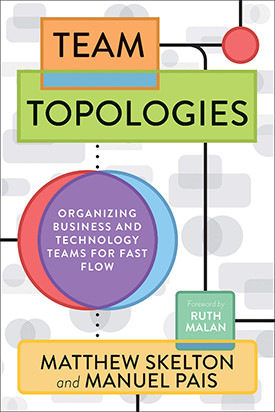

[Conway’s law](http://www.melconway.com/Home/Conways_Law.html) is a topic that has been around for some time and we are reminded of its’ importance in our daily work.

> „Any organization that designs a system (defined broadly) will produce a design whose structure is a copy of the organization's communication structure.”

Basically, it means that an organization will deliver a product, that mirrors the organization’s internal communication structure. But what does it mean and how does it influence us? Even though Conway law itself sounds enigmatic, it has a huge impact on the teams in our organization and their work results.

## Conway's Law - Theoretical example

Let’s assume, we run a company that has various departments tackling different segments of the car market: 

* Personal cars
* Small delivery trucks
* Big delivery trucks
* Construction vehicles 

Departments belong internally to the same company, but they have separate teams, management, financing and defined KPIs. They focus only on growth in their respective market segments, have clearly defined goals and scope of work.

This kind of organizational structure will inefficiently solve problems or create solutions that require cooperation between different departments (e.g. improving effectiveness of engines). Planning meetings, goals definitions, the involvement of people – all of this will be much more difficult because it will require synchronization of groups, which don’t have common deadlines, plans, capabilities.

Additionally, with this kind of structure, improvements will not happen at all, or not enough emphasis will be put on them. You may even observe, that departments reinvent the wheel and hear complaints about insufficient cooperation. Everyone will be defending their responsibilities and putting blame on others.

## Conway's law - software world

Conway’s law has a very strong influence on IT solutions and products. Eric Raymond, the co-founder of Open Source Initiative, described in [Jargon](http://catb.org/~esr/jargon/html/C/Conways-Law.html), that: „If you have four groups working on a compiler, you'll get a 4-pass compiler.”  That is a description of a simple observation:

* There are separate groups that have to cooperate,
* During the discussion, they define their conditions and requirements,
* These needs are transferred into their modules as interfaces in the code.

Conway’s law justifies pressure on the creation of [cross-functional teams](https://agileforall.com/org-structure-software-architecture-and-cross-functional-teams/), and supports [DevOps](https://devops.com/what-can-conways-law-teach-us-about-devops/) culture. The more people in a team with a wider spectrum of solution solving skills, the fewer dependencies from other teams and unnecessary delays. Everything can be enclosed in the same room – analysis, implementation, testing, deployment and maintenance.

There is a lot of talk about Conway’s Law, when it comes to [microservices](https://martinfowler.com/articles/microservices.html#OrganizedAroundBusinessCapabilities). Incorrect division of people into teams will result in communicational problems, which will then translate into the created solution. Additionally, team autonomy can be mention as one of the common problems. Teams will be affecting each other, which at the end will be copied into architecture – the created system will be tightly-coupled.

## Conway’s Law – practical examples

2 interesting examples can be found in the literature, that describes exceptionally well Conway’s law in practice.

Microsoft has [analyzed and described](https://www.microsoft.com/en-us/research/wp-content/uploads/2016/02/tr-2008-11.pdf) how its organizational structure has contributed to the number of bugs and perceived quality of Vista OS. Based on actual data, it was proven, that complicated structure and unclear decision process negatively influenced the delivered operating system. 

Another excellent material is the [scientific paper](http://www.hbs.edu/faculty/Publication%20Files/08-039_1861e507-1dc1-4602-85b8-90d71559d85b.pdf?lipi=urn:li:page:d_flagship3_pulse_read;Jt69%2BCqYSgSZqq23lkSrbA%3D%3D) from Harvard Business School. It describes how different organizational structures influence software structures. Open-source-based organizations tend to create loosely-coupled software, which is also how they operate on a daily basis. Close-sourced organizations work in a more coupled way and it tends to create software with a higher number of interconnections.

There are also other, less formal materials like:

- [mail to Microsoft employees](https://news.microsoft.com/2018/03/29/satya-nadella-email-to-employees-embracing-our-future-intelligent-cloud-and-intelligent-edge/) from Saya Nadella describing structure changes driven by Conway’s Law, or 
- [document](https://assets.publishing.service.gov.uk/media/57a08da640f0b652dd001abc/Usability-issues-in-website-design.pdf) of Nigel Beyan describing how organization structure influences website structure of the organization.

## Conway's Law - my example

I have also experienced Conway’s Law very much in my professional life. Hence my research on this topic.

In one of my previous projects, there was an employee, that theoretically should have had a low influence on the system – he was supposed to assist when deploying the system to the production environment. Unfortunately, he was outside of the project structure and he had a different Project Manager. We had no options to influence and convince this person to change his vision to be compatible with the created solution.

The person forced us to come up with a solution that fitted his vision. At the same time, we weren’t able to create a system that was required – every change had to be approved by this person. It resulted in big implementation issues and many additional work hours spent on rework and adjustments of the system.

## Conway's Law - influence on the organization

If the structure of an organization meets business needs theoretically it doesn’t do any harm. The problem begins when the structure of the organization doesn’t match the problems the organization wants to solve. Then:

* Making any decision will require making multiple other decisions in multiple different groups
* Communication through many groups, layers and hierarchy will be very slow and inefficient. 
* Communication and translation errors will occur, which may cause that messages won’t be delivered to the recipient
* All kind of rules, procedures and political nuances will be a barrier to make decisions and strategic changes
* Fear of change will make people keep their habits. In their opinion, it may lead to the loss of power and position in the organization.

Instead of supporting adjustments to solve problems properly, the organization structure will rather defend itself from any change.

## Conway's Law - reasons behind

Conway’s law is not a law in a strict sense – it can’t be proven as a physical law. But there are many reasons, why people may act according to this law:

 *   [Communication limitations](https://getlighthouse.com/blog/developing-leaders-team-grows-big/) – it is impossible for a large group to communicate effectively. We create abstractions, in form of groups and teams, that work as one bigger organism.
 *   [Misaligned incentives](https://medium.com/nick-tune-tech-strategy-blog/misaligned-incentives-fuel-organizational-dysfunctions-a67a3ed03890) - they push people from colaborating to solve the problem towards securing their own situations.
 *   [Group cohesiveness](https://en.wikipedia.org/wiki/Group_cohesiveness) and [Groupthinking](https://en.wikipedia.org/wiki/Groupthink) – psychological syndrome, resulting in groups making decisions together, that at times might be irrational.
 *   [Tribalism](https://en.wikipedia.org/wiki/Tribalism) – feeling of being close within the group we identify with – This inborn atavism makes it easier for us to accept solutions close to our surroundings and to compete with opposing groups.
 *   [Cognitive load theory](https://en.wikipedia.org/wiki/Cognitive_load) – there is a limit of information that we can work with. Working in a group will make people focus on internal knowledge and filter information from outside of the group.
 *   Cognitive biases like [Not invented here](https://en.wikipedia.org/wiki/Not_invented_here), [IKEA effect](https://en.wikipedia.org/wiki/IKEA_effect), [Stereotype](https://en.wikipedia.org/wiki/Stereotype), [Déformation professionnelle](https://en.wikipedia.org/wiki/D%C3%A9formation_professionnelle), [Collective narcissism](https://en.wikipedia.org/wiki/Collective_narcissism)

Psychological mechanisms cause that it is easier to work in terms of the everyday environment. We don’t want to cross the boundaries that we are put into.

All of this makes the creation and implementation of solutions between different groups much more difficult than it could have seemed in the beginning.

## How can you get away from Conway's Law?

You can't 😉 but the law is worth taking into account when defining the structure of our organization. Work WITH the law, rather than AGAINST it. This kind of action is the so-called [inverse Conway maneuver](https://www.thoughtworks.com/radar/techniques/inverse-conway-maneuver).

Inverse Conway maneuver suggests preparing organization structure in such a way, that fits the organization’s needs. So you shouldn’t force people into cooperation – that will almost certainly not work, because of the issues described previously. Rather, you should focus on a division of people, so the work could be done inside a single structure.

In this area I can recommend you the book [“Team Topologies”](https://www.amazon.com/Team-Topologies-Organizing-Business-Technology/dp/1942788819/) which presents [4 different ways of structuring the teams](https://teamtopologies.com/key-concepts) and [3 different ways of cooperating between teams](https://teamtopologies.com/key-concepts):

Based on these different structures and cooperations models you can find a more applicable way to organize your teams. It will help organize around business problems better than before. 

Additionally, it is worth mentioning a book by Sriram Narayan [“Agile IT Organization Design”](https://www.amazon.com/gp/product/0133903354) which describes how to create and organize larger company structures.

Sriram's distinction in [activity-oriented](https://martinfowler.com/bliki/ActivityOriented.html) and [outcome-oriented](https://martinfowler.com/bliki/OutcomeOriented.html) teams reveals a lot of insights when it comes to creating well-performing teams.

A very interesting example of such a maneuver was given by Simon Wardley in his [series of tweets](https://twitter.com/swardley/status/1087511545091899392?lang=en).

Silos organization had problems with adjusting to changes – some people inside silos were pro, some were against changes. The decision was made to split the organization according to work stability. This allowed people to work in cross-function teams, focusing on their goals and realization of them in the most suitable way for them.

In IT organizations, such a split can be realized by the creation of the so-called [Center of Excellence](https://www.cio.com/article/3020409/business-process-management/7-it-centers-of-excellence-that-drive-organizational-productivity.html). This team will be focused on testing new solutions, often in stages not suitable to be used in mass-production. Further on the center will share results of the work with the rest of the company, interested in more stable solutions.

## Change, change, change

Unfortunately, even the best organizational structure will not protect us from changes that time brings. A business may change, the market may change, competition may change. Change might happen internally as well – an organization can take up new, additional activities or expand beyond current capabilities. Each of these situations makes the current structure transition from optimal to counterproductive.

GCHQ in their document [GCHQ: Boiling Frogs](https://github.com/gchq/BoilingFrogs/blob/master/GCHQ_Boiling_Frogs.pdf) describes why proper adjusting to changing business realities is so important these days. ‘Big Bang’ changes take too much time and don’t deliver. It’s needed to quickly test new ideas, make mistakes and learn from them.

Changes are so rapid, that organizations that don’t evolve and adapt will stay too long in their niche. And this niche will eventually disappear.

## Spotify Fallacy – why you shouldn't copy the structure

A common mistake in building your organization is to copy another company's structure without analyzing what capabilities it provides. And above all, without analyzing which business context the structure evolved from and what kind of culture the business operates in.

Many companies copied [Spotify’s organizational structure](https://blog.crisp.se/wp-content/uploads/2012/11/SpotifyScaling.pdf), but they haven’t checked the business reality around Spotify. Many aspects make Spotify’s structure possible to implement: [Scandinavian social culture](https://zenexmachina.wordpress.com/2017/07/25/why-spotifys-agile-patterns-work-and-why-you-shouldnt-copy-them/), [agile culture](http://blog.kevingoldsmith.com/2014/03/14/thoughts-on-emulating-spotifys-matrix-organization-in-other-companies/), [business context](https://medium.com/the-ready/how-to-build-your-own-spotify-model-dce98025d32f). It took 3 years to implement structural change in Spotify. But others want to have an instant implementation of organizational structure - yesterday we worked in an old way, today we work in a new way. However, it doesn’t work like this.

## Elements of a good structure

Below you will find some basic elements, that are worthwhile considering when creating organizational structure:

* Business goal
* Autonomy
* Amount of connections and dependencies
* Types of social and cultural groups 
* General organization culture
* Possible bottlenecks
* Opportunity for a business change

Of course, this list is not complete, rather it's rather scratching the surface. A lot about heuristics, regarding how to structure your teams or organization, can be found on [Nick Tune's blog](https://medium.com/nick-tune-tech-strategy-blog/primary-sociotechnical-design-heuristics-5aa164b3e876). Nick uses the word ‘heuristic’ on purpose – there are no good and bad choices here. All principles are just guidelines – they can, but not necessarily will secure a more effective organizational structure.

## Summary

Creating and managing an organization’s structure is a very difficult task. Often, resistance is met and every change significantly influences the organization. However, it is important to understand that we are not able to solve all the problems at once. There is no such thing as a perfect organizational structure. An organizational structure that solves problems of today, may not solve problems of tomorrow, so it may need to be updated.
This is a brief description of a big and comprehensive subject. I hope I was able to convince you to get your attention and make you more interested in this area of knowledge 😊