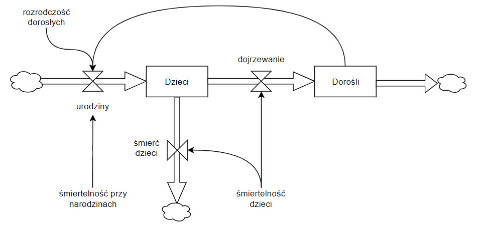
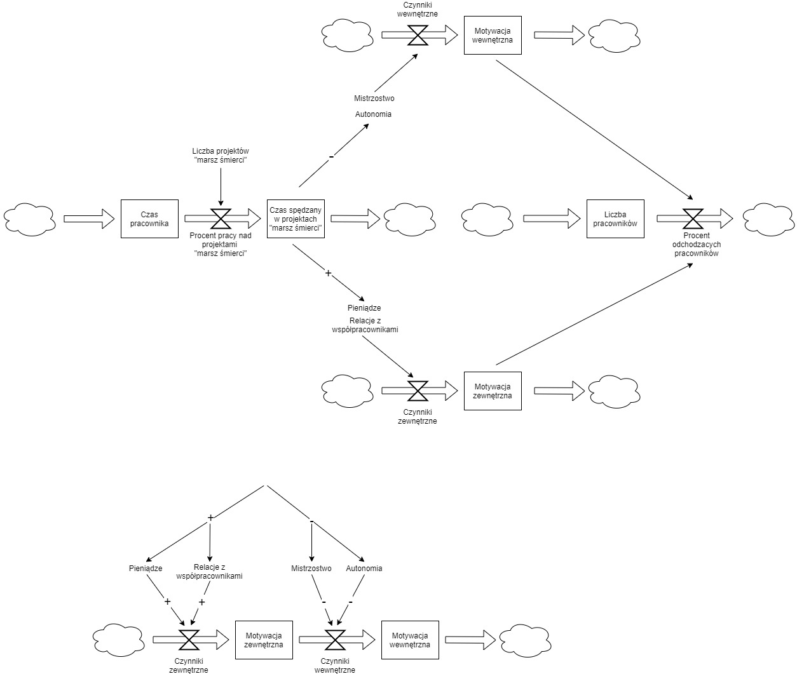

Wszystkie narzędzia zostały zebrane w [Narzędzia pracy konsultanta - podsumowanie](/2020/02/04/narzeasdasddzia-pracy-konsultanta-podsumowanie)

## Diagram zapasów i przepływów
Diagramy zapasów i przepływów (stocks and flows diagrams) to ciekawe narzędzie do wizualizowania połączonych ze sobą mechanizmów i obszarów. Na ich podstawie możemy wyciągać szerokie wnioski: w jaki sposób pracują nasze systemy informatyczne, jak działają zespoły, organizacje czy całe ekosystemy. Dzięki nim, zaczynamy dostrzegać skomplikowaną rzeczywistość.

**Niestety, przeważnie myślimy w kategoriach liniowych** - jeśli mamy akcję, to pojawi się również reakcja. Często wydaje nam się, że wystarczy proste działanie by uzyskać wyniki. Nie widzimy "zestawu naczyń połączonych", który wpływa na ostateczne rezultaty. W takich sytuacjach nasza próba rozwiązania problemu może go jeszcze bardziej skomplikować.

Diagram zapasów i przepływów składa się z:
-  **Zapas** (stock) - zgromadzona wartość (fizyczna np. pieniądze, bądź niematerialna np. wiedza), w danym momencie czasu. Jest zmieniana przez przepływy.
-  **Przepływ** (flow) - zmiana wartości w wybranym zapasie przez dany okres czasu.
-  **Natężenie przepływu** (flow rate) - regulacja siły z jaką działa przepływ. Na natężenie mogą wpływać zapasy i inne czynniki zewnętrzne.
-  **Chmura** (cloud) - źródło przepływu lub jego zakończenie.
-  **Połączenie** (link) - wpływ poszczególnych komponentów diagramu na siebie wzajemnie, które je wzmacnia bądź osłabia. Czasami dodaje się dodatkowy opis wskazujący rodzaj oddziaływania.

### Diagram populacji
Wyżej pokazany jest uproszczony diagram populacji:
- mamy 2 zapasy: Dzieci i Dorosłych
- na urodziny dzieci wpływa ilość dorosłych - mamy tutaj sprzężenie zwrotne wzmacniające (im więcej dorosłych tym więcej dzieci)
- dodatkowo na urodziny wpływają dwie dodatkowe siły - rozrodczość dorosłych oraz śmiertelność przy narodzinach
- jednocześnie nie wszyskie dzieci stają się dorosłymi - część umiera w trakcie dojrzewania

Powyższy diagram tłumaczy kilka ciekawych faktów:
- w dawnych czasach rozrodczość była wysoka, ale śmiertelność noworodków i dzieci również - populacja rosła wolno
- postęp medycyny zmniejszył śmiertelność, więc pętla zwrotna spowodowała "wykładniczy" wzrost ludności
- w ostatnich latach rozrodczość spadła (kraje Zachodu) - przyrost populacji spowolnił pomimo dużej liczby osób dorosłych

**Diagram dostosowujemy do naszego przypadku** - powyżej został pominięty cały obszar śmiertelności dorosłych, bo w tym przypadku po prostu nie był nam potrzebny. Im więcej chcemy pokazać tym więcej komponentów dodajemy do diagramu. Musimy pamiętać o czytelności, więc pokazujemy tylko kluczowe aspekty potrzebne do naszych dyskusji.

Więcej na temat diagramów zapasów i przepływów można przeczytać w genialnej książce [Thinking in Systems](https://www.goodreads.com/book/show/3828902-thinking-in-systems) Donatelli Meadows.

## Przykład wykorzystania
Najlepszy mi znany przykład wykorzystania diagramów w praktyce pokazał Sebastian Gębski w swojej prezentacji [Kaizen Driven Development](https://youtu.be/mvGYSMZfWro?t=1337). Przedstawił on w jaki sposób można dokonać analizy rekrutacji developerów Elixira w Warszawie. Na tej podstawie jego zespół zobaczył jakie są ich obecne wąskie gardła i mógł podjąć lepszą decyzję jak usprawnić proces rekrutacyjny.

Ja wykorzystałem diagramy zapasów i przepływów by wytłumaczyć koledze menadżerowi dlaczego "z dnia na dzień" zwolniło się u niego kilkanaście osób w różnych zespołów. Osoby te w teorii zarabiały niezłe pieniądze oraz były bardzo poważane w firmie. Nie wystarczyło to jednak by zatrzymać te kluczowe osoby w zespołach. Wszystko bazowało na [zasad motywacji Pinka](https://www.goodreads.com/book/show/6452796-drive):

- w firmie pojawiało się coraz więcej projektów typu ["marsz śmierci"](https://www.goodreads.com/book/show/54259.Death_March)
- to oczywiście powodowało, że ludzie spędzali w nich więcej czasu niż w normalnych projektach
- to początkowo budowało motywację zewnętrzną:
	- pieniądze - zespół był nagradzany za pracę nad takimi trudnymi projektami + brał nadgodziny by dostarczać projekty na czas
	- poważanie w firmie - w ramach tej walki projektowej osoby były szeroko chwalone w firmie jako eksperci od trudnych zadań
- niestety **w dalszej perspektywie to zniszczyło motywację wewnętrzną pracowników**
	- mistrzostwo - przez ciągłe gaszenie pożarów zespół nie miał  czasu się uczyć i doskonalić
	- autonomię - wszystko było podporządkowane dowiezieniu "marszów śmierci", nie było żadnej swobody pracy
- **wpływ motywacji wewnętrznej był opóźniony** w stosunku do motywacji zewnętrznej
	- na początku stan obu zapasów motywacji był podobny
	- przy pierwszych trudnych projektach motywacja zewnętrzna rosła szybko (premie zachęcały do pracy), a motywacja wewnętrzna spadała wolno (tłumaczono sobie, że to tylko chwilowa sytuacja)
	- im sytuacja trwała dłużej tym trudniej było zwiększyć motywację zewnętrzną (bonusy przestawały działać), motywacja wewnętrzna zaś spadała coraz bardziej (nic nie świadczyło, że sytuacja się odmieni)
- ostatecznie motywacja wewnętrzna była tak niska, że motywacja zewnętrzna nie była w stanie jej przeciwdziałać i ludzie zaczęli się masowo zwalniać.

Mając tak pokazany system motywacji w firmie można było bezpośrednio zobaczyć współdziałające siły, które z opóźnieniem negatywnie wpłynęły na sytuację całej firmy.

## Dlaczego warto?
Ten rodzaj diagramów pozwalaja wizualizować naprawdę złożone koncepty, ukazywać pętle zwrotne, balansujące i wzmacniające, opóźnienia, korekty i wiele innych. Możemy opisywać w jaki sposób pracujemy, pokazywać wąskie gardła, wskazywać problemy i możliwe rozwiązania.

Dzięki diagramom zapasów i przepływów **łatwiej jest uniknąć płytkiego myślenia w stylu akcja -> reakcja**. Mamy ukazaną pełną sytuację i widzimy o wiele więcej połączeń. System w którym pracujemy staje się widoczny, a więc można na temat niego dyskutować i podejmować decyzje.
