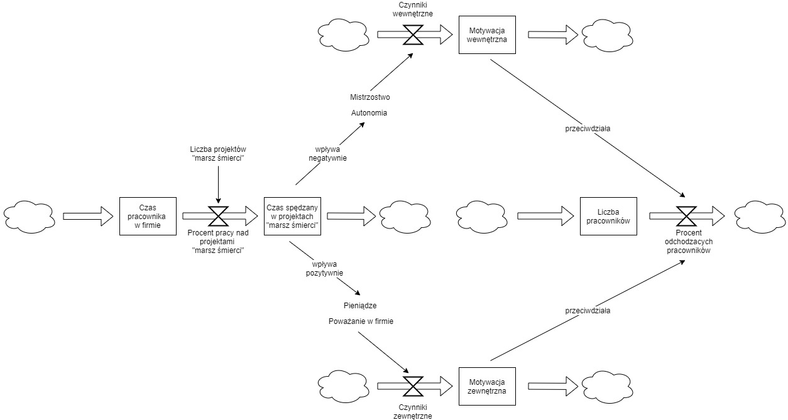

Wszystkie narzędzia zostały zebrane w [Narzędzia pracy konsultanta - podsumowanie](/2020/02/04/narzeasdasddzia-pracy-konsultanta-podsumowanie)

## Diagram zapasów i przepływów
Diagramy zapasów i przepływów (stocks and flows diagrams) to ciekawe narzędzie do wizualizowania połączonych ze sobą mechanizmów i obszarów. Na ich podstawie możemy wyciągać wnioski o tym, w jaki sposób pracują zespoły, działają organizacje czy całe ekosystemy. Zaczynamy dostrzegać skomplikowaną rzeczywistość.

Niestety, przeważnie myślimy w kategoriach liniowych - mamy akcję więc będzie również reakcja. Często wydaje nam się, że wystarczy proste działanie by uzyskać wyniki. Nie widzimy "zestawu naczyń połączonych", który wpływa na ostateczne rezultaty. W takich sytuacjach nasza próba rozwiązania problemu może go jeszcze bardziej skomplikować.

// zdjecie diagramu z sieci

Diagram zapasów i przepływów składa się z:
-  Zapas (stock) - zgromadzona wartość, w danym momencie czasu. Jest zmieniana przez przepływy.
-  Przepływ (flow) - zmiana wartości w wybranym zapasie przez dany okres czasu.
-  Natężenie przepływu (flow rate) - regulacja siły z jaką działa przepływ. Na natężenie mogą wpływać zapasy i inne czynniki zewnętrzne.
-  Chmura (cloud) - źródło lub zakończenie przepływu. Zwykle używane by zademonstrować obszary spoza modelu.
-  Połączenie (link) - wpływ na siebie poszczególnych elementów diagramu. Często dodaje się do niego +/- by wskazać na rodzaj oddziaływania (wzmacnianie lub osłabianie).

Za pomocą takich diagramów można analizować jak działa system, opisywać obszary naszej pracy, pokazywać wąskie gardła i inne.

Diagramy zapasów i przepływów pozwalają wizualizować naprawdę złożone koncepty, ukazywać pętle zwrotne, balansujące i wzmacniające, opóźnienia, korekty i wiele innych. Dzięki nim system nad którym pracujemy staje się widoczny, a więc można na temat niego dyskutować i podejmować decyzje.

Więcej na temat diagramów zapasów i przepływów można przeczytać w genialnej książce [Thinking in Systems](https://www.goodreads.com/book/show/3828902-thinking-in-systems) Donatelli Meadows.

## Przykład wykorzystania
Najlepszy mi znany przykład wykorzystania diagramów w praktyce pokazał Sebastian Gębski w swojej prezentacji [Kaizen Driven Development](https://youtu.be/mvGYSMZfWro?t=1337). Przedstawił on w jaki sposób można dokonać analizy rekrutacji developerów Elixira w Warszawie. Na tej podstawie jego zespół zobaczył jakie są ich obecne wąskie gardła i mógł podjąć lepszą decyzję jak usprawnić proces rekrutacyjny.

Ja wykorzystałem diagramy zapasów i przepływów by wytłumaczyć koledze menadżerowi dlaczego "z dnia na dzień" zwolniło się u niego kilka osób w zespole. Zespół w teorii zarabiał świetne pieniądze, oraz mocno się zżył. Nie przeszkodziło to jednak w odejściu kluczowych członków zespołu. Wszystko bazowało na [zasad motywacji Pinka](https://www.goodreads.com/book/show/6452796-drive):

- w firmie pojawiało się coraz więcej projektów typu ["marsz śmierci"](https://www.goodreads.com/book/show/54259.Death_March)
- to oczywiście powodowało, że ludzie spędzali w nich więcej czasu niż w normalnych projektach
- to początkowo budowało motywację zewnętrzną:
	- pieniądze - zespół był nagradzany za pracę nad takimi trudnymi projektami + brał nadgodziny by dostarczać projekty na czas
	- relacje - w ramach tej walki projektowej osoby w zespole bardzo mocno się zżyły tworząc paczkę przyjaciów
- niestety w dalszej perspektywie to zniszczyło motywację wewnętrzną pracowników
	- mistrzostwo - przez ciągłe gaszenie pożarów zespół nie miał  czasu się uczyć i doskonalić
	- autonomię - wszystko było podporządkowane dowiezieniu "marszów śmierci", nie było żadnej swobody pracy
- sama motywacja wewnętrzna znikała wolniej niż motywacja zewnętrzna (dlaczego?)
- to powoduje, że ludzie początkowo zadowoleni z podstawowych motywatorów, będą uciekać z tego zespołu / organizacji. 

Diagramy pozwoliły zwizualizować ważne aspekty pracy organizacji: klientów, czas projektowy, pieniądze poszczególnych działów oraz ich siłę. Na tej podstawie dało się zauważyć, że mamy dwie siły, które działają przeciwstawnie i ich działania się niwelują. Powodowało to, że żadne działanie w ramach obecnego stanu nie mogło poprawiać sytuacji.

## Dlaczego warto?
Dzięki diagramom zapasów i przepływów łatwiej jest uniknąć płytkiego myślenia w stylu akcja -> reakcja, bo mając zwizualizowaną naszą sytuację widzimy o wiele więcej połączeń. To z kolei daje nam lepsze zrozumienie miejsca w którym się aktualnie znajdujemy i ukazuje problemy, które były przed nami ukryte.
