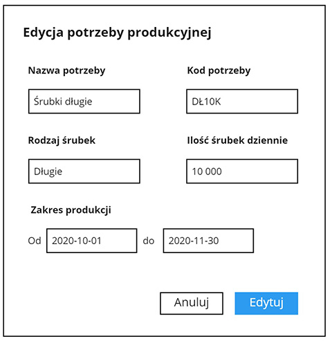
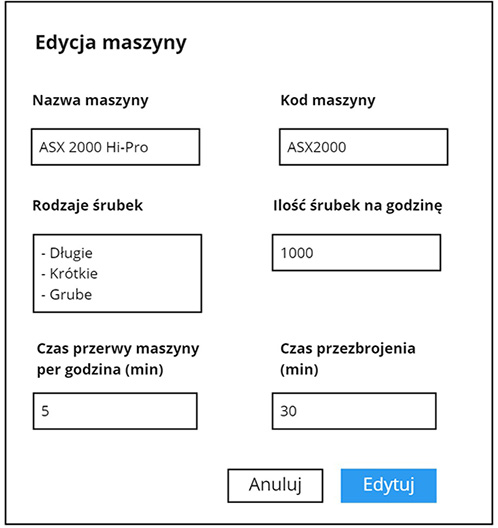
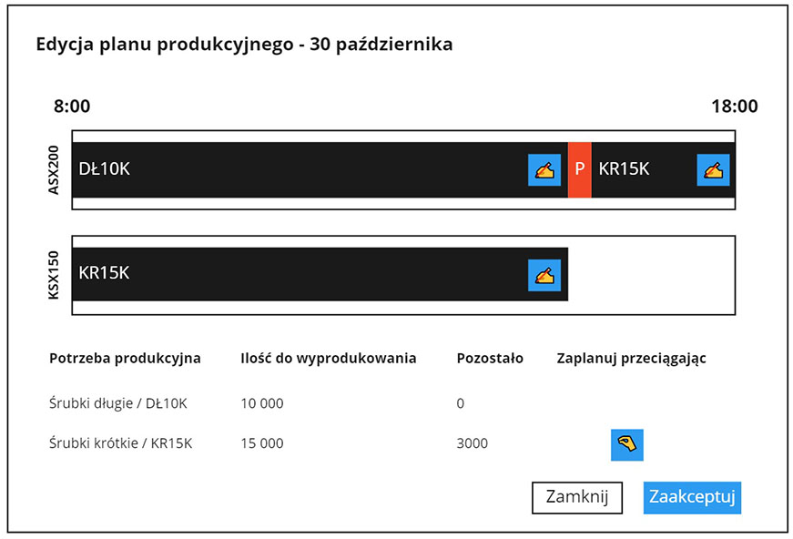
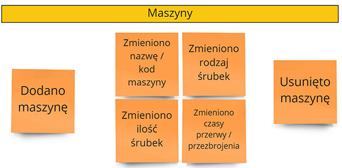
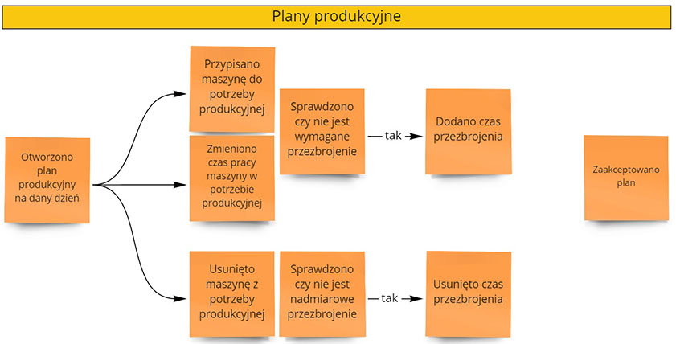
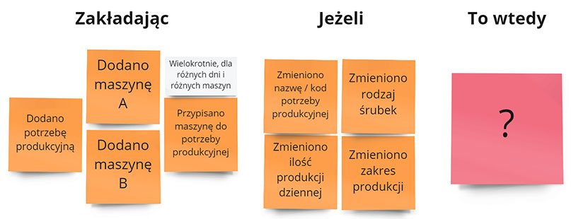
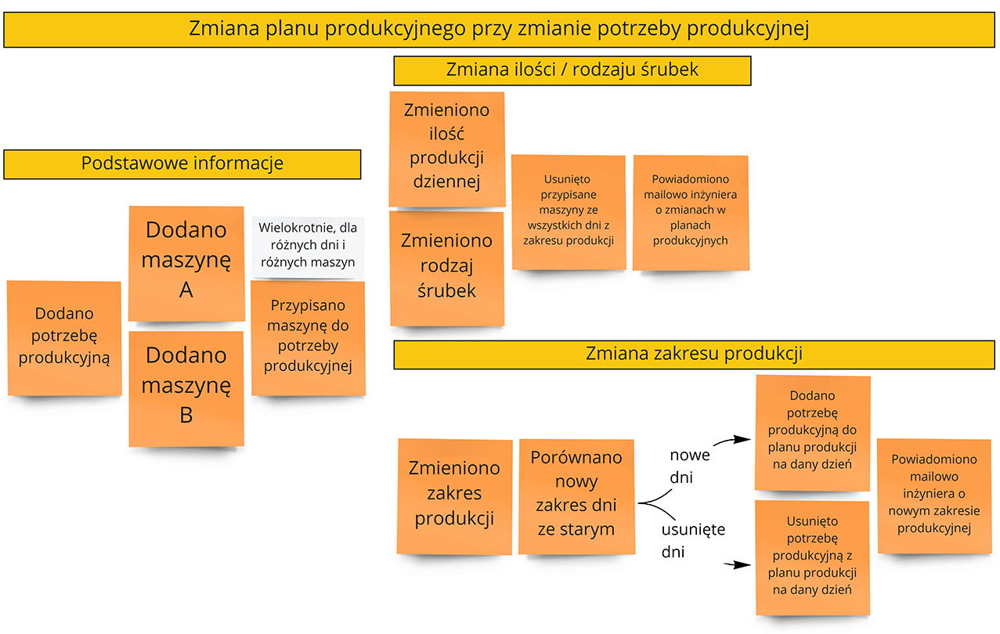
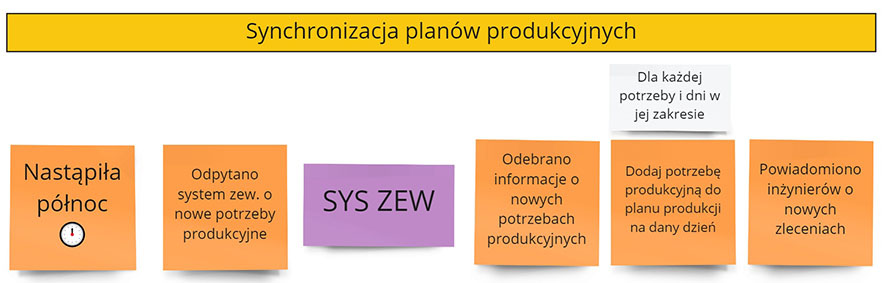
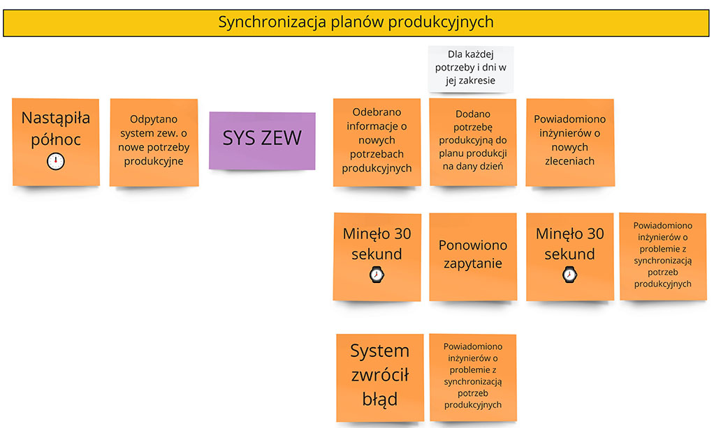

Przeprowadzając ostatnie [warsztaty zdalne](/szkolenia-i-warsztaty/event-storming) zauważyłem poraz kolejny, że makiety nie działają tak jak powinny. Proste scenariusze biznesowe są świetnie zwizualizowane, z kolejnymi ekranami do przeklikania. Przechodzisz przez taki system i masz wrażenie, że wszystko działa jak powinno.

Niestety makiety rzadko kiedy biorą pod uwagę czas i jego sposób oddziaływania na system:
- procesy mogą się dziać równolegle
- proces A może trwać tak długo, że wpłynie to na proces B
- proces A może trwać tak szybko, że proces B go nie zauważy
- proces A może wystąpić na różnych etapach procesu B inaczej na niego oddziaływując
 
Najczęściej tego rodzaju sytuacje **wyłapujemy dopiero na produkcji - gdy koszt ich obsługi jest olbrzymi** i powoduje poważne problemy dla naszych klientów.

Problemem nie są tutaj poszczególne makiety a właściwie same makiety jako sposób opisu systemu. Tego rodzaju scenariusze są prawie nie do zrealizowania w narzędziach graficznych. Wobec czego **pracując w oparciu o makiety nie zauważymy tych sytuacji**. A w taki sposób jest przygotowywanych większość spefycikacji systemów.

## Proces oparty na makietach

Załóżmy, że naszym obszarem biznesowym jest produkcja śrubek. Mamy następujące procesy:

- Dział sprzedaży tworzy potrzebę produkcyjną np. 10 000 śrubek dziennie od 1 października do 30 listopada
- Te potrzeby tworzą nam dzienne partie do wyprodukowania
- Osobno zarządzamy maszynami produkcyjnymi - ich mocą produkcyjną, rodzajem śróbek i czasami przerw lub przezbrojenia
- Na podstawie partii do produkcji i maszyn tworzymy i akceptujemy plan produkcyjny

Dalej możemy mieć procesy planowania zakupów półproduktów i wysyłki.

Makiety dla tego procesu mogą wyglądać następująco:

Dwie pierwsze makiety są dość oczywiste - określamy naszą potrzebę produkcyjną i parametry maszyny. Na ostatniej makiecie dzieje się nieco więcej. Potrzebujemy zaplanować pracę maszyn w taki sposób, aby wspólnie wyprodukowały śróbki określone przez potrzeby produkcyjne. Do każdej maszyny możemy przydzielić partie produkcyjne. Pomiędzy partiami dla różnych śróbek widzimy czas wymagany na przezbrojenie maszyny.

## Problemy makiet
Dość oczywisty problem, który nie wynika z makiet, to jak zmiana potrzeby produkcyjnej wpływa proces planowania produkcji:
- Czy w ogóle można takie potrzeby produkcyjne modyfikować po zaplanowaniu produkcji? 
- W którym momencie istnienia planu możemy to zrobić? 
- Jeśli zezwalamy na zmianę to czy usuwamy cały plan czy go inteligentnie zmieniamy?

Dalej mamy kwestie samych maszyn. Makieta nie pokazuje jak modyfikacja parametrów maszyny oddziaływuje na produkcję. A możemy tutaj znaleźć kolejne problemy. Na przykład:
- Czy można zmienić moc produkcyjną maszyny lub rodzaj produkowanych produktów? Jak to wpływa na nasz plan? 
- Co jeśli maszyna nie może produkować rodzaju śróbek, które są juz zaplanowane?
- Czy zmiana przerwy maszyny powinna być realizowana natychmiastowo (bo inaczej mamy większą szansę na awarię) czy jednak wymusić to tylko dla nowych planów (bo nie jest to zmiana kluczowa)? 
- Kto podejmuje taką decyzję?

Dla czytelności pominę kolejną warstwę pytań o wpływie zmiany potrzeby produkcyjnej czy maszyny na plan zakupowy i wysyłki. Problemy stają się coraz trudniejsze do rozwiązania. Najgorsze zaś jest to, **że makiety nie pozwalają łatwo odkrywać takich problemów.** Patrząc na system przez makiety nie widać złożoności procesów, różnych zapętleń, sprzeczności.

Moją hipotezą jest, że **makiety nie są pierwszą techniką jaką powinniśmy wybierać** pracując nad przenoszeniem procesów biznesowych do systemów informatycznych. Makiety są z natury statyczne. Nie pomagają nam zadawać kluczowych pytań o procesy biznesowe, które są oparte o czas. A to te procesy później kształtują działanie systemu.

## Modelowanie czasowe
O wiele łatwiej jest tego rodzaju problemy odkryć wcześnie stosując Event Storming i modelowanie czasowe. Opowiadał o tym Mathias Verraes w swojej post-itowej prezentacji na konferencji GOTO:


Mając nasze procesy na tablicy możemy połączyć równoległe procesy by wzbudzić kolejne pytania:
- Czy proces A może wystąpić równolegle do B?
- Co się powinno dziać w takiej sytuacji?
- Jak system powinien to komunikować użytkownikowi?
- Czy pożądana zmiana powinna zachodzić automatycznie czy manualnie?

**Takie pytania będą się pojawiały naturalnie pracując przy pomocy Event Stormingu** ponieważ sama technika zachęca do ich zadawania. Stworzenie nowej sytuacji wymaga tylko przeniesienia kilku karteczek - jest to proste i szybkie. Czas jest tutaj bezpośrednio widoczny na tablicy co nam daje szersze spojrzenie na nasz proces.

To z kolei ułatwi nam zauważenie nowych problemów i nieobsługiwanych warunków. Sam system stanie się odporniejszy na przypadki brzegowe. Jesteśmy w stanie podjąć decyzję czy obsługujemy ten przypadek technicznie, czy rozwiążemy go na zasadzie białkowej "a tego nie klikaj" 😀

## Modelowanie czasowe w procesie produkcji
Załóżmy że mamy podstawowe procesy biznesowe rozpisane w formie następujących karteczek:

Możemy wtedy przesunąc poszczególne kartki obok siebie i zapytać się np. jak zmiana planowania pracy wpływie na potrzebę produkcyjną? Wykorzystując spolszczoną notację Given / When / Then:

Przypadek ze zmianą nazwy / kodu jest trywialny. Za to pozostałe przypadki już mogą mieć dla nas istotne konsekwencje. Dyskutując z osobami biznesowymi i rozpratrując różne za i przeciw możemy dojść do następującego scenariusza:

Jesteśmy w stanie odkrywać skomplikowane sytuacje za pomocą prostych karteczek. To pozwala budować odporniejsze systemy i rozwiązywać te problemy jeszcze na etapie analizy, a nie podczas budowania systemu. Albo podczas działania produkcyjnego systemu, gdy klient do nas dzwoni że coś nie działa 😉

## Modelowanie procesów niewidocznych dla użytkowników
Event Storming świetnie się również sprawdza w modelowaniu procesów, które są uruchamiane cyklicznie, a przy których nie ma styku człowiek. Z racji rozwoju informatycznego te sytuacje są coraz częstsze. Mamy coraz więcej systemów, które muszą się ze sobą kontaktować i wymieniać informacje.

Załóżmy, że chcielibyśmy codziennie uruchomić pobieranie danych o planowanej produkcji z dodatkowego systemu. **Makiety nie pomogą nam zamodelować takiego procesu.** Większość takich procesów jest opisywana słownomuzycznie w dokumentacji, najczęściej bardzo podstawowo. Z Event Stormingiem można taki proces świetnie pokazać - poniżej proces synchronizacji potrzeb produkcyjnych:

Dzięki temu możemy również obsłużyć negatywne ścieżki związane z kontaktem z systemem zewnętrznym:

## Podsumowanie
Event Storming jest jedną z pierwszych technik jakie wybieram podczas pracy nad wymaganiami biznesowymi. Natychmiastowo pozwala odnaleźć dziury w procesach i się nimi zająć. Nie jest to technika do wszystkiego, ale w zauważalnie pozwala obniżyć ilość problemów przy przenoszeniu procesów do systemów informatycznych.

Jeśli zainteresował Cię ten temat to polecam moje **[warsztaty z Event Stormingu](/szkolenia/event-storming)** lub pozostałe posty z tego tematu:

 *   [Event Storming – Narzędzie usprawniające pracę organizacji](/2018/12/10/event-storming-narzedzie-usprawniajace-prace-organizacji/)
 *   [Event Storming – Mapowanie ograniczeń](/2019/02/22/event-storming-mapowanie-ograniczen/)
 *   [Event Storming – Co dalej?](/2019/01/26/event-storming-co-dalej/)