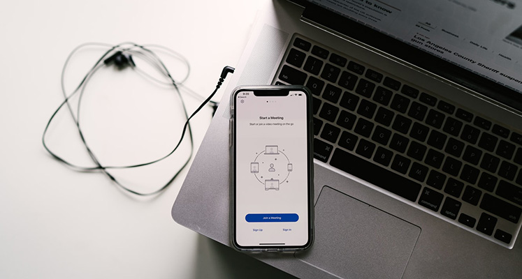
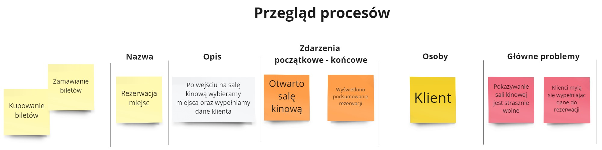
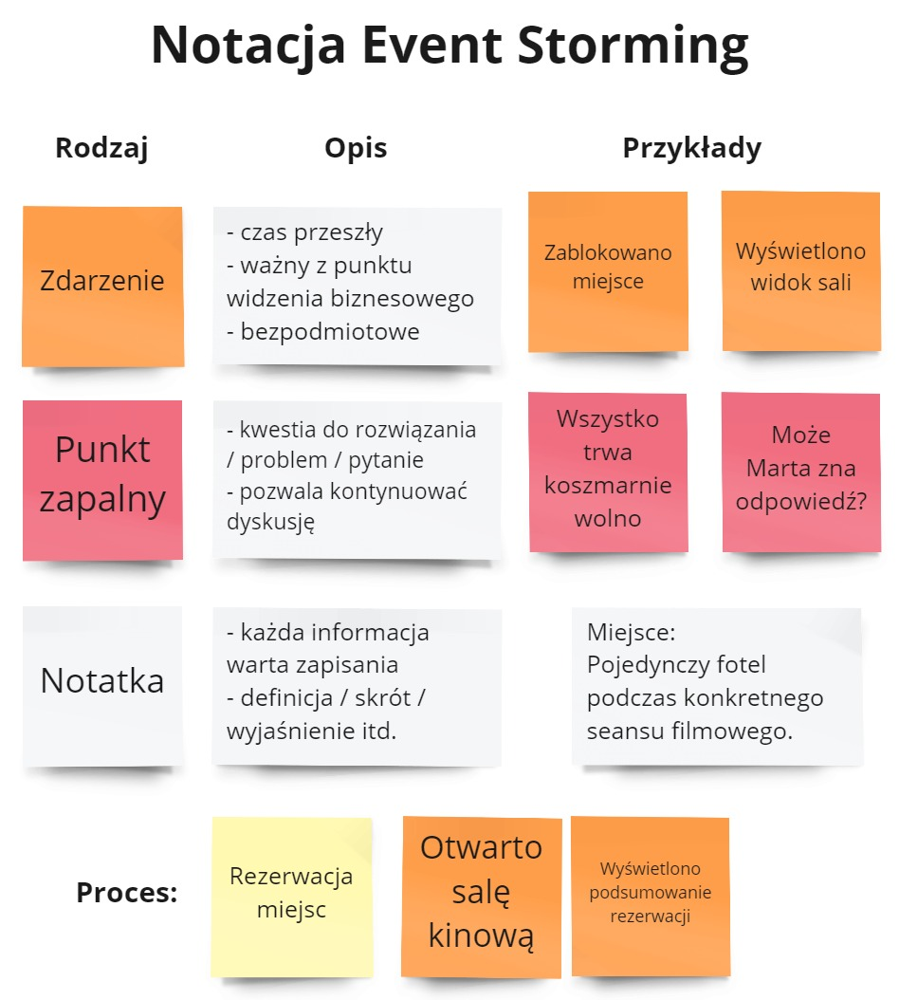
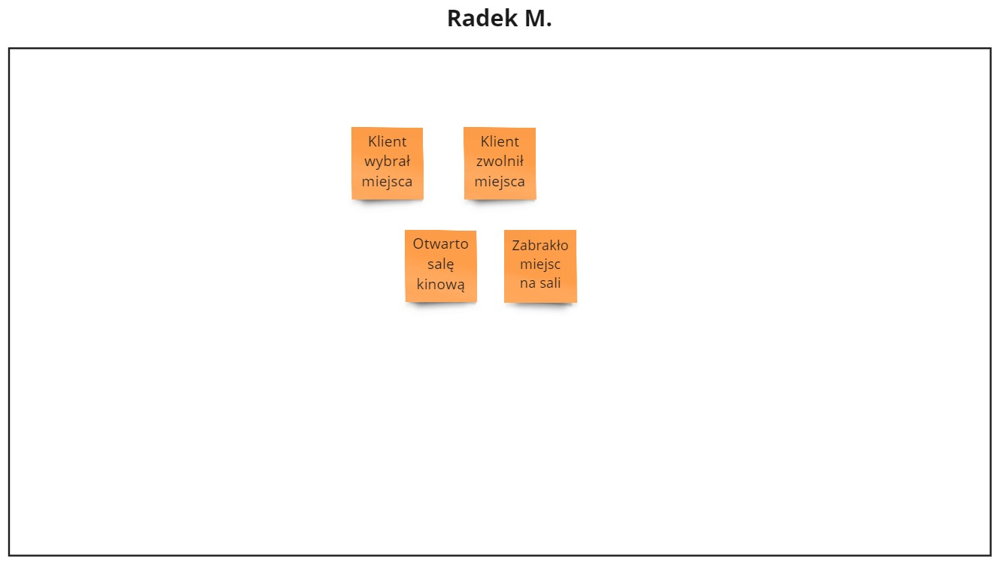
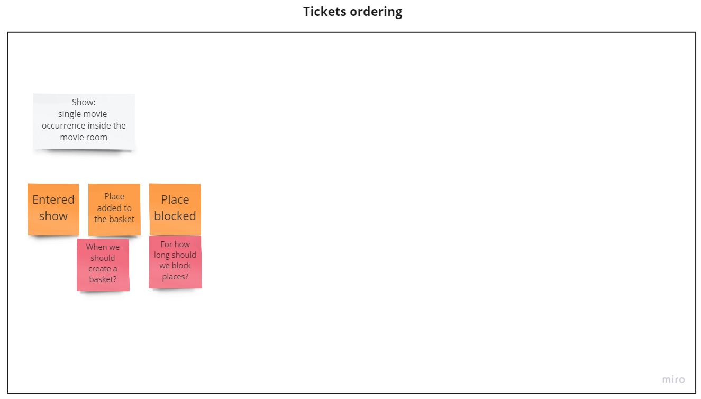
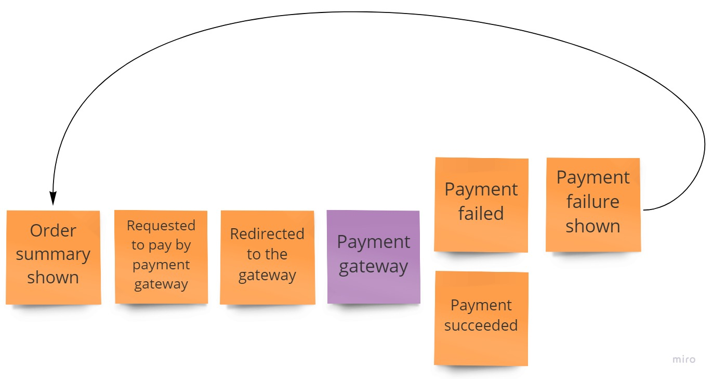
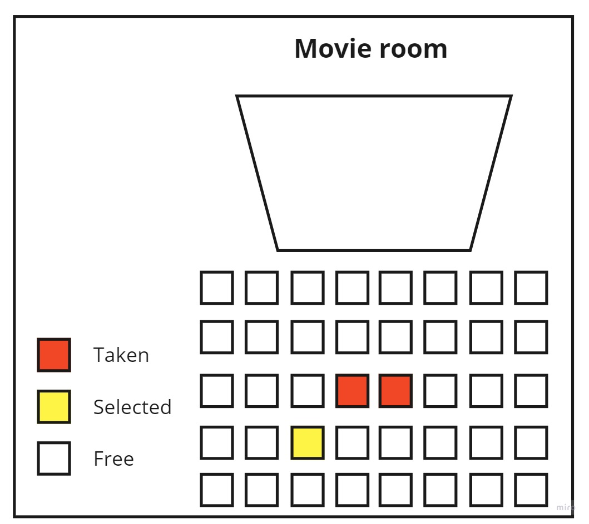
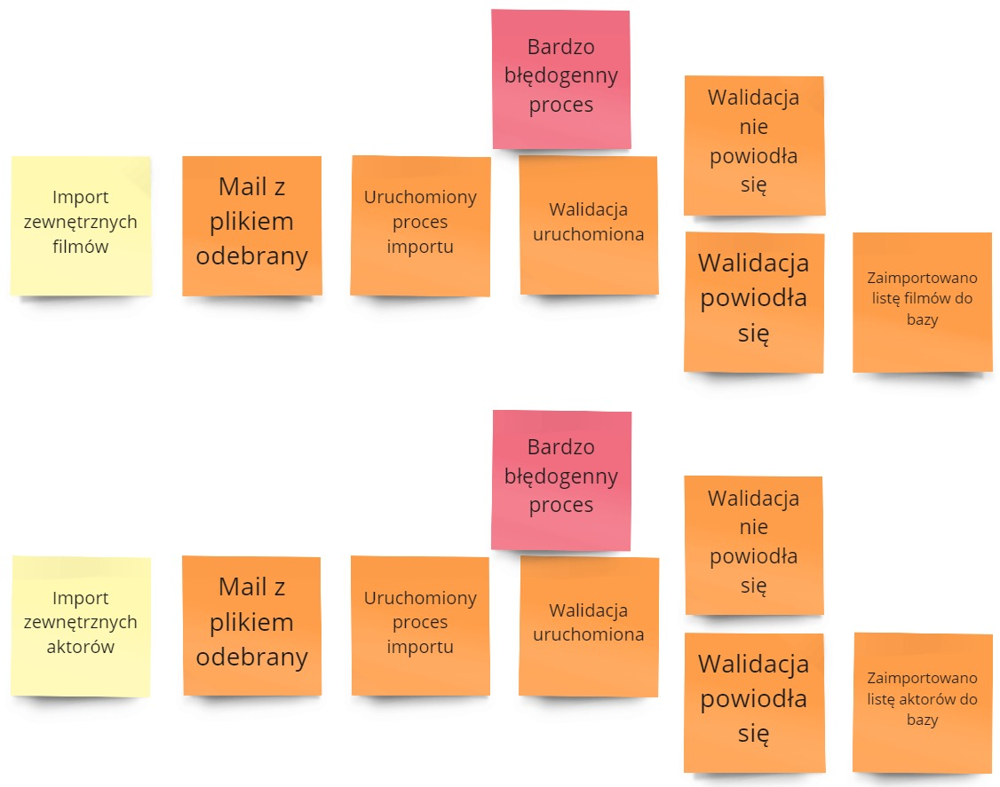
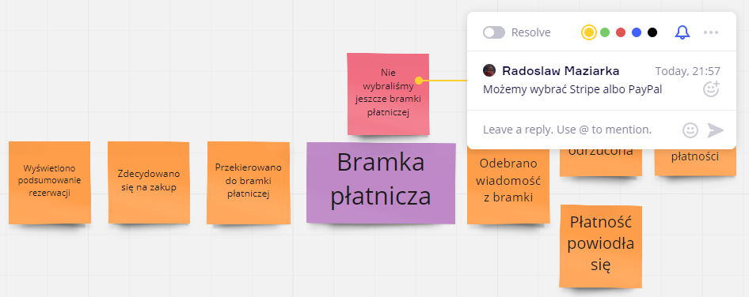

Mamy kolejną falę epidemii wirusa. Ponownie wszystkie warsztaty na miejscu zostały anulowane. Postanowiłem więc przetłumaczyć [mój artykuł](/2020/03/29/event-storming-remotely-tips-and-tricks/) z poprzedniego lockdownu, o tym jak przeprowadzać warsztaty Event Storming (i nie tylko) przez internet. Powinien wam pomóc rozpocząć przygodę ze zdalną pracą nad procesami, dopóki sytuacja się nie poprawi.

## Event Storming zdalnie - czy to w ogóle możliwe?

Rozpocznę od bardzo ważnej kwestii - nie da się przeprowadzić warsztatów tak jak się to robiło do tej pory, jedynie zmieniając formę pracy ze ściany w firmie na ścianę wirtualną. Kilka kwestii nie będzie działało tak jak dotychczas:

- Nie można mówić w tym samym czasie - podczas sesji nastanie ogromny szum.
- Wasze rozmowy mogą się skupiać tylko na jednym obszarze, a to zmniejsza efektywność.
- Podczas sesji przez Internet trudniej jest zachować ciągłą uwagę i skupienie. Uczestnicy bardzo łatwo się rozpraszają. Nikt ich nie powstrzyma przed otwarciem konta mailowego w drugiej zakładce.
- Prowadzenie warszatu jest o wiele trudniejsze. Nie widzisz reakcji uczestników, ich zachowania, mowy ciała. Nie możesz zareagować tak szybko jak podczas warszatów na miejscu.
- Sesje zdalne nie mogą trwać całego dnia. Siedzenie przez 8 godzin jest niemożliwe.

Mając to na uwadze **musisz podejść do zdalnego Event Stormingu inaczej**.

## Przygotowanie warsztatu zdalnego

Tak jak zwykły warsztat, ten zdalny również wymaga właściwego przygotowania.

### Krótsze sesje

Twoi uczestnicy nie będą w stanie skupić się na warsztacie przez cały dzień. Przygotuj krótsze sloty czasowe, najlepiej 1h - 2h, na których maksymalnie skoncentrujecie się na celach spotkania.

Jeśli masz wystarczająco dużo czasu, staraj się nie planować więcej niż 2 sesje na dzień. Są one niesłychanie męczące i trzecia / czwarta sesja nie będą już tak efektywne jak poprzednie.

### Zaplanuj sesje

Każda sesja powinna mieć swój zakładany rezultat jaki zostanie osiągnięty podczas sesji. Podobnie jak ze spotkaniami, nie ma nic gorszego niż sesja bez zdefiniowanego celu.

Ten cel powinien podczas warsztatu pomagać Ci koordynować grupą i prowadzić ich w określonym kierunku. Dla sesji Event Stormingu może być to np. opisanie początkowego procesu albo znalezienie największej ilości problemów w już opisanym procesie.

### Przygotuj miejsce pracy

Kiedy wiesz co chcesz osiągnąć z sesji, przygotuj odpowiednio miejsce pracy. Nie chcesz spędzać cennego czasu uczestników na krzątaniu się po tablicy wirtualnej. Wszystko powinno być gotowe do pracy od pierwszej chwili trwania sesji.

### Za wczasu wyślij zaproszenia

Przeczytanie zaproszenia i wewnętrznych instrukcji zajmuje chwilę czasu. Jeśli wyślesz je 15 minut przed warsztatem to nie ma możliwości by się z nimi zapoznać. Prześlij je więc kilka dni przed warsztatem, aby uczestnicy mogli się do nich zastosować.

Wewnątrz zaproszenia powinna być szczegółowa informacja o tym jak się połączyć do sesji, jakiego narzędzia będziecie używać, jaka jest agenda itd. Warsztaty zdalne potrzebują wyższego poziomu bezpieczeństwa psychologicznego - z tego powodu [lepiej napisać więcej niż mniej](https://blog.arkency.com/2016/10/overcommunication-is-required-for-async-slash-remote-work/).

### Zaproszenia do Miro

Używam [Miro](https://miro.com) do zdalnej pracy grupowej. Jest to tablica wirtualna, gdzie możesz dodawać karteczki i dodatkowe informacje. Jeśli chciałbyś jej użyć to na początku musisz zadbać, aby każdy został zaproszony do twojej grupy na Miro. Dlatego też wyślij każdemu uczestnikowi zaproszenie i poproś o potwierdzenie czy widzi tablicę. Zaoszczędzisz czas na początku sesji.

## Rozpoczęcie warsztatu

Jest kilka ważnych punktów wartych zapamiętania podczas rozpoczynania sesji.

### Włączone kamery

Poproś swoich uczestników aby uruchomili kamery. Stworzy to bardziej przyjazną atmosferę i potwierdzi, że po drugiej stronie są rzeczywiste osoby. Uczestnicy będą bardziej zaangażowani i chętni do pomocy, gdy będą widzieć siebie nawzajem.

Dodatkowo, pomoże to Tobie upewniać się, czy uczestnicy właściwie pracują nad zadaniami. Będziesz mógł zauważyć, że osoby nie skupiają się na zadaniach i postarać się temu zaradzić.

### Wprowadzenie do tablicy wirtualnej

Miro jest bardzo przyjaznym użytkownikowi narzędziem. Jednak jak wszystko, wymaga pewnego doświadczenia aby używać go efektywnie. Dlatego też przeprowadź krótkie wprowadzenie do tablicy wirtualnej na początku warsztatu. Pokaż w jaki sposób dodawać kartki na tablicę, jak je przesuwać, dodawać komentarze czy zaznaczać wiele kartek. Może to trwać tylko 5 minut, ale będzie to czas dobrze poświęcony.

Takie ćwiczenia można również przeprowadzić w formie gry. Często uczestnicy się nie znają więc na początku warsztatu można poprosić ich o przedstawienie się w formie kartek, dodając kilka słów o sobie, swoim zawodzie czy swoim hobby.

### Wprowadzenie do warsztatu

Jeśli uczestnicy mają styczność z daną techniką po raz pierwszy(szczególnie jeśli jest to ich pierwszy Event Storming) warto być szczególnie opisowym przy wyjaśnianiu mechaniki warsztatu. Podczas startu sesji wyjaśniaj każdy krok, każdą karteczkę którą dodajesz. Pytaj się otwarcie uczestników czy mają jakieś pytania, bądź wątpliwości co do zasad.

Na początku trzeba też przypomnieć wszystkim cel warsztatu. Niekiedy podczas takiej rozmowy okazuje się, że ten cel nie jest oczywisty dla wszystkich i takie wprowadzenie pozwala uniknąć niepotrzebnego zamieszania. Czasami również otwiera to dyskusję w sprawie zmiany celu danej sesji, gdy pojawia się coś ważniejszego.

**Spotkania zdalne są szczególnie narażone na pomyłki** - trudniej jest zobaczyć po uczestnikach, że coś nie gra. Im bardziej zrozumiałe będzie wprowadzenie, tym lepszy rezultat uzyskasz.

### Ustaw minutnik

Kiedy dajesz zadanie swoim uczestnikom ustaw minutnik, który uświadomi im, że mają ograniczoną ilość czasu. Zwiększy to skupienie i efektywność samej sesji.

Możesz użyć [minutnika](https://miro.com/marketplace/countdown/) zapewnianego przez Miro, jeśli posiadasz wyższą wersję samej usługi. Fizyczny minutnik również działa - twoim dodatkowym zadaniem będzie informowanie uczestników ile czasu im pozostało. Na jednej z mojej sesji wykorzystałem [odgłos kukułki](https://www.youtube.com/watch?v=d1WcxRaMmIM) by oznaczać koniec sesji. Było to ciekawym rozwiązaniem by nieco rozweselać zgromadzonych na spotkaniu.

## Plan na Event Storming

Kiedy omówiliśmy podstawy, wróćmy do Event Stormingu.

Podczas standardowego warsztatu procesy są odkrywane samoistnie. W warsztatach internetowych takie podejście nie uda się. Aby przeprowadzić zdalny Event Storming należy zastosować podejście "Dziel i Zwyciężaj" - wybierać kolejne procesy do opisania, aby na końcu wykonać syntezę całości procesu.

Wybór pierwszego procesu warto przemyśleć w szerszym gronie. Możesz rozpocząć od początku (najprościej) albo wybrać ten, który jest dla Ciebie najbardziej wartościowy, bądź na nim najbardziej skupiają się twoi klienci. Wybór niewłaściwego procesu może skończyć się sesją, po której uczestnicy uznają, że stracili czas.

### Przegląd procesów

W pewnych przypadkach warto przed sesjami Event Stormingu poświęcić jedną sesję aby wykonać “Przegląd procesów”. Jest to technika, w której zbierzesz informacje o istniejących / planowanych procesach. Może to wyglądać następująco:

1. Każdy uczestnik spisuje na kartkach nazwy procesów w swoim obszarze.
2. Wtedy pytasz się pierwszej osoby, aby przeniosła najważniejszy proces na "Przegląd procesów".
3. Każdy pozostały uczestnik szuka kartki, która odpowiada kartce przesuniętej przez pierwszą osobę. Wybieracie najlepszą nazwę na ten proces.
4. Pytasz się o opisanie w jednym zdaniu procesu. Następnie spisujesz zdarzenia rozpoczynające i zamykające proces. Kończysz dodając osoby zaangażowane w proces i najważniejsze problemy. Problemy możecie dodawać równolegle.
5. Wykonujesz punkty 1-4 aż opiszesz wszystkie procesy.

Powinieneś skończyć z czymś podobnym do:

Podczas tej sesji nie musisz być bardzo precyzyjny - w kolejnych sesjach uzyskasz głębszą wiedzę i lepiej podzielisz / opiszesz procesy. Jednak mimo to, ta technika da Ci zrozumienie jak wygląda biznes i pozwoli szybciej wystartować.

## Zdalny Event Storming

Gdy proces, któremu poświęcisz sesję jest wybrany, można rozpocząć nad nim pracę. 

### Legenda

Tak jak w przypadku zwykłych warsztatów, rozpocznij od przedstawienia legendy Event Stormingu. Jeśli jest to pierwsze zetknięcie uczestników z tą techniką to staraj się nie odkrywać całej notacji od początku. Utrudnisz im start, ponieważ pokażesz zbyt wiele elementów naraz. Lepiej jest wprowadzać stopniowo, dopiero jak jest taka potrzeba.

Na instrukcji również warto pokazać zdarzenia ograniczające daną sesję - gdzie zaczyna się dany proces a gdzie się kończy. Nie jest to sztywna instrukcja, ale pomaga uczestnikom zawęzić ich obszar zainteresowań. W rezultacie sesja jest bardziej skupiona na swoim celu.

### Prywatne obszary pracy

Następnym krokiem jest oczywiście rzucanie karteczek. **Tutaj warto zrobić odstępstwo od standardowego warsztatu i nie rzucać ich od razu na wspólny obszar.** Pozwoli to uczestnikom skupić się na swoim postrzeganiu procesu zamiast podpatrywać co rzucają koledzy i koleżanki. Poproś więc uczestników aby wrzucali wszystkie zdarzenia na swoje prywatne obszary pracy. 

Aby przyśpieszyć tą część możesz zastosować [Bulk Mode](https://help.miro.com/hc/en-us/articles/360017572054-Sticky-Notes) aby wpisać naraz kilka / kilkanaście kartek (dzięki [Maciek](https://twitter.com/mczerpinski) za podzielenie się tą poradą!). Jedna uwaga odnośnie tego trybu - nie zobaczysz kartek uczestników dopóki nie skończą. Tu ujawnia się jedna z zalet włączonych kamer, ponieważ będziesz mógł zauważyć, że ktoś jest w trakcie pisania.

Uczestnicy nie muszą wpisywać swoich kartek w poprawnej kolejności, ponieważ na to przyjdzie czas później. Musisz jednak im to zakomunikować, bo chęć by to zrobić na wirtualnej tablicy jest wyższa niż normalnie. Pomaga również ograniczenie czasu - w przypadku standardowego procesu 10 minut powinno wystarczyć by wszystko opisać.

### Organizacja procesu

Kiedy zbierzesz wszystkie informacje na prywatnych obszarach nadchodzi pora by je połączyć. Do tego warto wykorzystać dedykowany, wspólny obszar. 

Poproś swoich uczestników, aby przenieśli pierwszą (w ich mniemaniu) kartkę procesu z prywatnych obszarów na początek wspólnego obszaru. Pojawią się różne nazwy, czasem nawet różne zdarzenia. Wybierz najlepsze razem z zespołem. Jeśli pojawiają się pytania bądź wątpliwości to wykorzystaj czerwony Punkt Zapalny. W przypadku nowych definicji wykorzystaj białą kartkę by opisać je dokładnie.

Kiedy ustalicie początek, przejdź do kolejnych zdarzeń krok po kroku. Zapytaj się uczestników co się dzieje dalej. W miarę postępu czasu proces będzie osiągał coraz większą spójność.

**Podczas standardowego warsztatu szybciej osiągniesz wymagany rezultat.** Niestety ograniczenia zdalnego warsztatu uniemożliwiają wygodną pracę równoległą nad procesem. Tutaj praca idzie wolniej, ale w mojej ocenie dokładniej. Na koniec każdego warsztatu mamy większą zgodność co do opisywanego procesu.

### Następne kroki

W ramach dodawania kolejnych zdarzeń możesz przedstawić dodatkową notację - zewnętrzne systemy, persony, usprawnienia itd. Dobrym momentem jest tutaj bezpośrednie pytanie od uczestnika "Jak pokazać XYZ?". Można również przeprowadzić dodatkowe przejście po procesie, nastawione np. tylko na usprawnienia.

Na samym końcu zapytaj się uczestników czy nie ma dodatkowych informacji, które warto dodać na tablicę, gdy widzą już całość procesu. Nie wszystko jest widoczne od razu. Często trzeba zobaczyć całoś,ć by uzmysłowić sobie pewne problemy lub możliwości. 

Ze spotkań warto wychodzić z konkretnymi akcjami do wykonania. Szczególnie, jeśli masz dużo Punktów Zapalnych. W takich sytuacjach możesz wykorzystać [Action Point](/2019/07/22/event-storming-rozszerzenie-notacji-action-point/), w którym opiszesz kto ma zająć się jakimś problemem - rozwiązać go poza warsztatem bądź zorganizować dodatkowe spotkanie w jego sprawie.

Po kilku sesjach Event Stormingu możesz przeprowadzić kolejną, już na wyższym poziomie. Wtedy zbierzesz dostępne informacje by dokonać ich syntezy i znaleźć luki pomiędzy procesami.

## Możliwości zdalnego Event Stormingu

Jest kilka kwestii, które są trudniejsze w standardowym warsztacie, ale w miarę proste w przypadku warsztatu zdalnego:

### Strzałki

Strzałki łączą konkretne kartki ze sobą, a więc prościej jest pokazać przejścia pomiędzy nimi. Jeśli przeniesiesz kartkę, to strzałka również się przesunie.

### Wizualizacja

Zdalnie o wiele lepiej jest pokazać o co Ci chodzi. Mamy łatwiejszą możliwość zmiany kolorów, kształtów, bądź wklejania całych obrazków.

### Kopiowanie podprocesów

Kiedy widzisz, że poszczególne podprocesy są podobne możesz w prosty sposób stworzyć ich kopię.

### Dodatkowe informacje

Wirtualne tablice są świetnymi narzędziami by pokazywać dodatkowe informacje, które byłyby mylące podczas zwykłej sesji. W Miro mamy:
- tagi / emoji, które możemy dodać do karteczek
- dodatkowe ikony
- komentarze i odpowiedzi
- hiperłącza do zewnętrznych zasobów

## Podsumowanie

Event Storming zdalny to warsztat jednocześnie bardzo podobny do zwykłego warsztatu, a jednak skrajnie odmienny. Rezultaty osiągamy wolniej, trudniej jest o porozumienie, czasem zamieszanie podczas sesji nie pozwala nam kontynuować prac. Musisz przygotować się na kompletnie inne doświadczenie.

Jednocześnie, warsztaty zdalne są dobrym zamiennikiem w czasach, kiedy grupa nie może się spotkać w jednym miejscu. Stosując pewne zasady możesz przeprowadzić sesję, w której współdzielisz wiedzę, rozwiążesz nieścisłości oraz ustalisz wspólną wersję procesu. Co najlepsze - będziesz mieć gotowy rezultat, który da się w szybki sposób przeszukiwać oraz traktować jako dokumentację. Jest to zdecydowanie warte spróbowania 😊

Jeśli zainteresował Cię ten temat to polecam moje **[warsztaty z Event Stormingu](/szkolenia/event-storming)** lub pozostałe posty z tego tematu:

 *   [Event Storming – Narzędzie usprawniające pracę organizacji](/2018/12/10/event-storming-narzedzie-usprawniajace-prace-organizacji/)
 *   [Event Storming – Modelowanie czasu](/2020/10/20/event-storming-modelowanie-czasu/)
 *   [Event Storming – Co dalej?](/2019/01/26/event-storming-co-dalej/)
