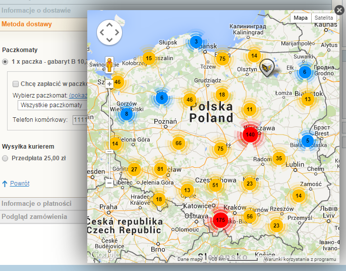
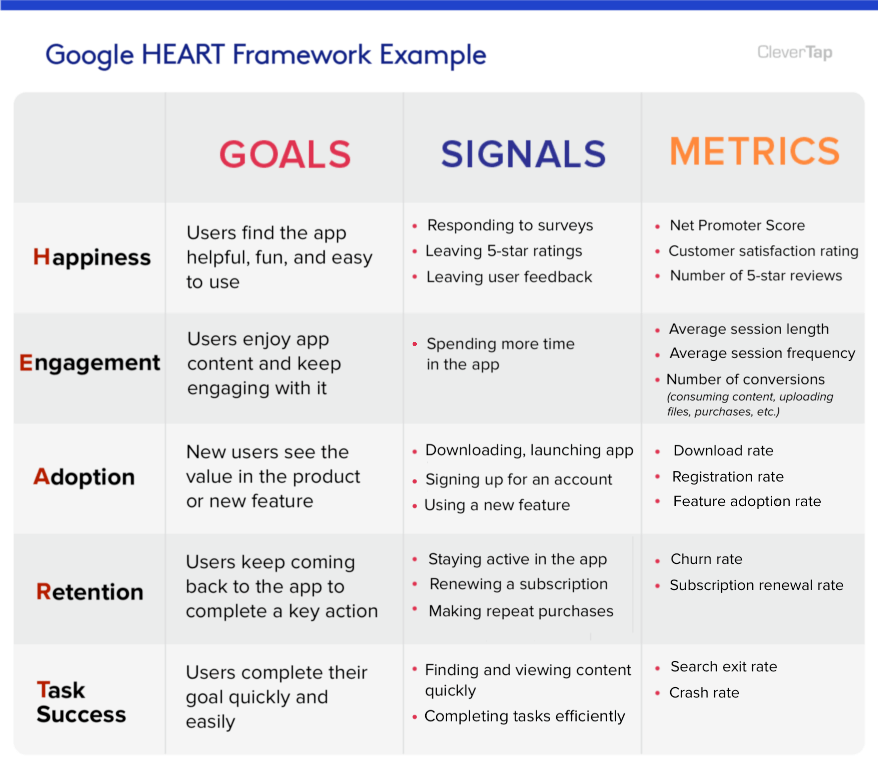
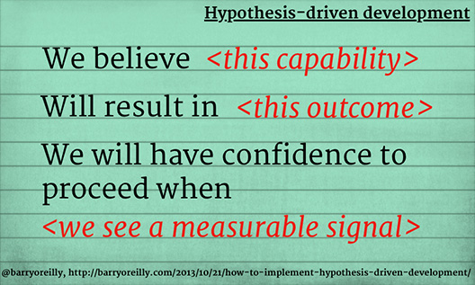
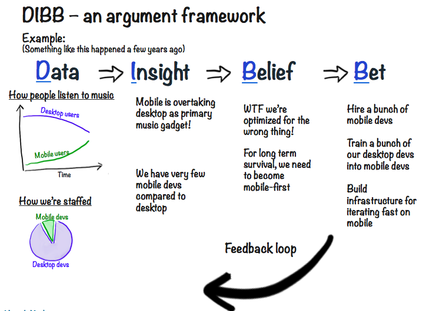
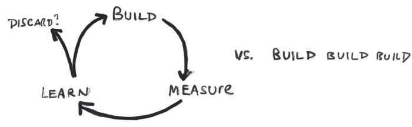

Przez ostatnie pół roku byłem bezpośrednio zaangażowany w tworzenie produktów cyfrowych - kontakty z użytkownikami, testy i sprawdzanie pomysłów, szybkie pętle zwrotne, itd. Dało mi to pewne przemyślenia, którymi chciałbym się z wami podzielić. Lista punktów:
- [Różnica pomiędzy Co i Jak](/roznica-pomiedzy-co-i-jak)
- [Dostarczanie to tylko połowa sukcesu](/dostarczanie-to-tylko-polowa-sukcesu)
- [Definicja sukcesu](/definicja-sukcesu)
- [Wszystko jest hipotezą](/wszystko-jest-hipoteza)
- [Dostarczanie a nauka](/dostarczanie-a-nauka)

## Różnica pomiędzy Co i Jak
Kiedy myślimy o nowej funkcji w naszym systemie to chcemy dostarczyć klientom konkretną możliwość. Jeśli produktem jest sklep internetowy to taką funkcją dla klienta może być np. wybór paczkomatu do którego dostarczymy paczkę. To jest ta prosta część.

Trudniejszą jest zdefiniowanie jak chcemy tą funkcję zrealizować. Jak poszukacie w Google [istnieją setki sposobów wyboru paczkomatu przez klienta](https://shorturl.at/dhrDT):
- część bazuje na wpisanym adresie w formularzu, 
- część na danych z przeglądarki, 
- część generuje mapy z wizualizacjami. 

"Najlepsze" z nich posiadają ogromną listę paczkomatów i szukaj sobie kliencie tego właściwego:

https://forum.shoper.pl/topic/4655-dostawy-paczkomaty-mapa/

Prosty przykład, ale pokazuje różnicę:
- **Co chcemy dostarczyć** - jaką możliwość będzie miał użytkownik.
- **Jak to będzie działać** - jaki proces użytkownik będzie musiał zrealizować aby tą możliwość osiągnąć.

Zwykle mamy kilka(dziesiąt) możliwych Jak dla danego Co. **Wybranie właściwego Jak jest trudne i przeważnie nie udaje się za pierwszym razem.** Nie mamy odpowiednich danych, nie znamy świetnie potrzeb klientów, bazujemy na własnych przeczuciach. Wybieramy opcję, która nam najbardziej pasuje.

**Ostatecznie my możemy być zadowoleni z dostarczonej funkcji, ale może to nie być to czego oczekiwali nasi klieci.** Wtedy, albo akceptujemy smutny stan rzeczy, albo zmieniamy to co stworzyliśmy i ponownie sprawdzamy reakcję klientów.

## Dostarczanie to tylko połowa sukcesu
Powyższe pokazuje, że udostępnienie danej funkcji klientom to zaledwie początek drogi. Trzeba jeszcze zebrać informacje jak ta funkcja wpłynęła na proces - zarówno ilościowe:
- wykorzystanie danej funkcji
- zmiana ilości klientów, którzy zrealizowali proces
- konkretne zdarzenia na których funkcja bazuje

jak i jakościowe bezpośrednio od klientów:
- jak reagują na nową funkcję
- czy ją rozumieją, czy wiedzą jak z niej korzystać
- czy spełnia ona ich potrzeby
- jakich potrzeb nie spełnia

**Dopiero na podstawie informacji zwrotnych możemy ocenić, czy dana funkcja rzeczywiście realizuje potrzeby klientów.** Przepiękna mapa paczkomatów, którą dostarczyliśmy, może  akurat dla naszych klientów być zbyt skomplikowana. Woleliby automatyczne podpowiadanie najbliższego miejsca odbioru.

https://www.smartmage.pl/paczkomaty/

Jeśli nie mamy żadnych informacji od klientów to w jaki sposób potwierdzimy, że to co dostarczyliśmy naprawdę przynosi wartość? A niestety łatwo zapomnieć o tym i skupić się jedynie na dostarczaniu.

## Definicja sukcesu
Niestety, samo zbieranie danych jest jednak niewystarczające. Łatwo jest gromadzić nowe informacje. 
Powstały nawet różne frameworki, które pozwalają w bardziej konkretny sposób definiować i mierzyć określone wskaźniki - [AARRR](https://medium.com/@ms.mbalke/aarrr-framework-metrics-that-let-your-startup-sound-like-a-pirate-ship-e91d4082994b), [RARRA](https://www.ptengine.com/blog/rarra-focus-on-retention-metrics-to-exponentially-grow-your-business), [HEART](https://clevertap.com/blog/google-heart-framework/) i inne nietypowe akronimy. 

https://clevertap.com/blog/google-heart-framework/

Wszystkie metody podane powyżej to jedynie środki do celu. **Ocena czy nasza realizacja spełnia pokładane w niej założenia to już wyższy poziom problemu.** Zadajmy sobie pytanie: czy wzrastające wykorzystanie funkcji jest OK, jeśli jednocześnie: 
- klienci dużo czasu poświęcają na daną funkcję, lub
- maleje liczba wykorzystujących inne ważne funkcje, lub
- zmniejsza się zadowolenie klientów, lub
- mamy więcej klientów, ale mniej kończy proces?

Nie da się tutaj dać natychmiastowej odpowiedzi. **Definicja sukcesu jest wielowymiarowa i rzadko wystarczy do niej jedna wartość.**  Wyważenie wszystkich składowych i analiza danych może pokazać, że wdrożenie nie było takim sukcesem jak się wydawało na początku. 

Niekiedy warto zastanowić się czy w ogóle warto brać jako sukces pewne wartości. Niektóre informacje mogą tylko wspierać nasze błędne myślenie - [efekt potwierdzenia](https://pl.wikipedia.org/wiki/Efekt_potwierdzenia). Rosnąca liczba wchodzących może nie zwiększać zysków, ale dobrze wygląda w statystykach.

## Wszystko jest hipotezą
Jeśli weźniemy pod uwagę powyższe to możemy dojść do konkluzji, że nie możemy być pewni żadnego wdrożenia. **Nawet jeśli dostarczymy konkretną funkcję, to nie znaczy, że spełnimy potrzeby klientów, ani że osiągniemy sukces.** Niektórzy mogliby pomyśleć, że to bardzo sceptyczne podejście. 

Jest jednak odwrotnie - to podejście akceptuje otaczającą nas niepewność i stara się do niej przystosować. Jedynie bezpośredni eksperyment pozwala sprawdzić jak dana realizacja sprawdza się w praktyce. **Każda nowa funkcja jest więc hipotezą, którą chcemy zweryfikować.** Bez przetestowania naszego produktu opieramy się jedynie na naszych założeniach / przeczuciach. Niestety często błędnych.

Jednym z podejść do takiej rzeczywistości jest [Tworzenie produktów bazujące na hipotezach](https://barryoreilly.com/explore/blog/how-to-implement-hypothesis-driven-development/):

https://barryoreilly.com/explore/blog/how-to-implement-hypothesis-driven-development/

Jest to kompletnie przeciwne podejście od typowego dla podejść zwinnych opisów "Jako X chcę Y aby Z". Tutaj opisujemy w co wierzymy, co chcemy osiagnąć i jak to sprawdzimy. **Jasne określenie założeń pozwala przyznać się do niewiedzy i lepiej odkrywać nowe rozwiązania.** I na nich się uczyć jak lepiej odpowiadać na potrzeby klientów.

Warto przytoczyć jeszcze [DIBB framework](https://blog.crisp.se/2016/06/08/henrikkniberg/spotify-rhythm?ref=https://product-frameworks.com) stosowany w Spotifyna podstawie którego firma rozwija swoje usługi:

https://blog.crisp.se/2016/06/08/henrikkniberg/spotify-rhythm?ref=https://product-frameworks.com

 Widać że kluczowym elementem tworzenia produktu jest **zakład** (bet). Na jego podstawie Spotify określa co chce rozwijać dalej i w jaki sposób zmierzy czy miał rację. Niewiedza została wpisana w proces jako kluczowy czynnik.

## Dostarczanie a nauka
Jeśli weźniemy jako pewnik, że to co dostarczamy może nie być sukcesem to diametralnie zmienia się sposób patrzenia na kolejne wdrożenia. **Samo tempo dostarczania przestaje być najwazniejszym wskaźnikiem pracy zespołu.** Co nam ze 100 nowych funkcji, które nie przynoszą wartości?

W zasadzie dochodzi do odwrotnej sytuacji - tworzymy bardzo dużo funkcji, które zamiast przynosić zysk to generują straty. Ale im więcej ich mamy tym trudniej je usunąć (technicznie i psychologicznie). I cykl się zamyka.

Warto sobie zadać [pytanie](https://blog.amplitude.com/shipping-faster-than-you-learn) postawione przez Johna Cutlera, szefa badań produktowych w Amplitude:
>Are you shipping faster than you learn, or learning faster than you ship?

Ciągłe dostarczanie może tylko pogłębiać problem. Rozwiązaniem w tej sytuacji może być podejście przeciwne - **włączenie nauki w cykl tworzenia rozwiązania**:

https://medium.com/hackernoon/faster-faster-faster-231c7b3d088d

Na tej podstawie po każdym wdrożeniu sprawdzamy czy jesteśmy na właściwej drodze. Jeśli wyniki wskazują, że idziemy w złą stronę to możemy zawrócić z wyznaczonej ścieżki. **Straciliśmy czas na stworzenie funkcji, ale jednocześnie nauczyliśmy się czegoś o potrzebach naszych klientów.** A to jest równie wartościowe.

## Podsumowanie

Podsumuję artykuł kolejnym cytatem. Marty Cagan, Product Executive z Doliny Krzemowej, w swoim artykule [The Inconvenient Truth About Product](https://svpg.com/the-inconvenient-truth-about-product/) zawarł taką myśl:
> ... even with the ideas that do prove to be valuable, usable and feasible, **it typically takes several iterations** to get the implementation of this idea to the point where it actually delivers the expected business value.

Każdy chciałby stworzyć produkt, który świetnie zrealizuje potrzeby klienta. Jednak bez odpowiedniej ilości prób najczęściej skończymy z niezadawalającym rezultatem. Trzeba próbować -> mierzyć -> uczyć się -> próbować dalej. W zasadzie, **im szybciej się uczymy tym lepiej**.