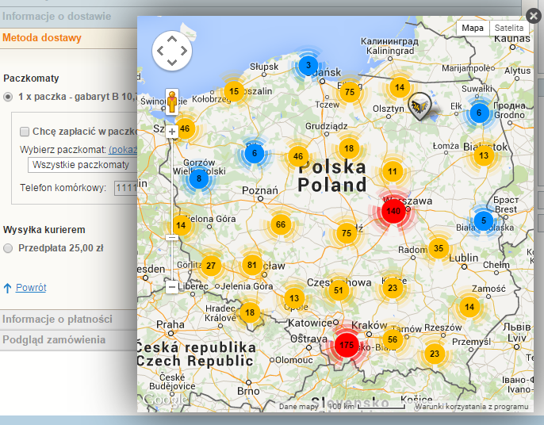
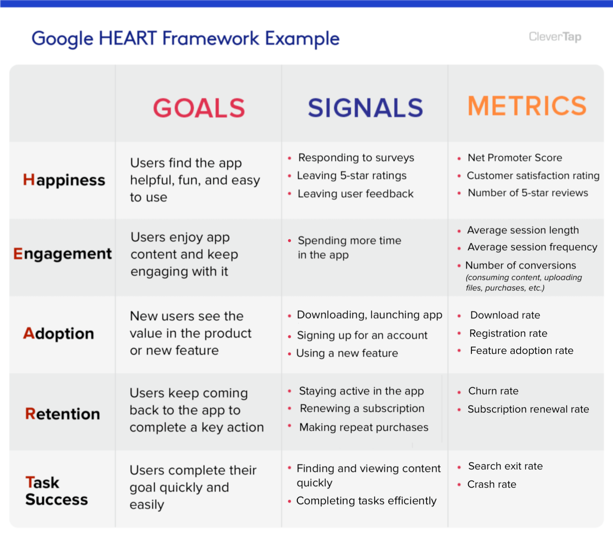
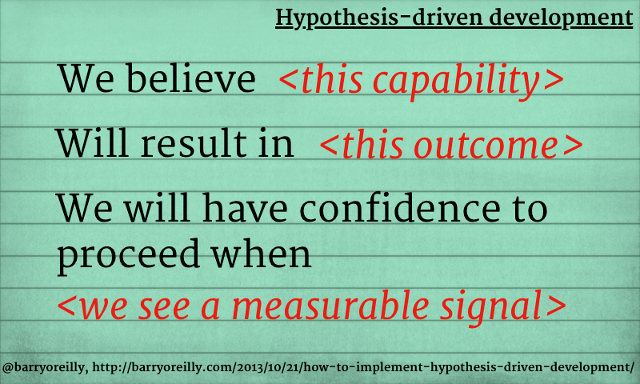
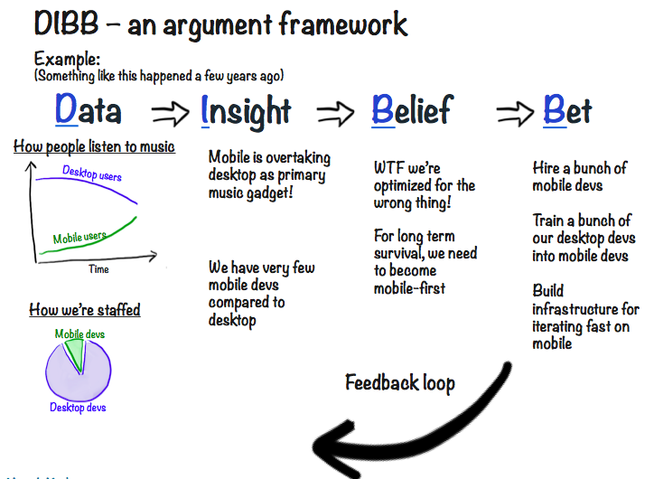

Przez ostatnie pół roku byłem zaangażowany bezpośrednio w tworzenie produktów cyfrowych - kontakty z użytkownikami, testy i sprawdzanie pomysłów, szybkie pętle zwrotne, itd. Dało mi to pewne przemyślenia, którymi chciałbym się z wami podzielić. Lista punktów:
- Różnica pomiędzy Co i Jak
- Dostarczanie to tylko połowa sukcesu
- Definicja sukcesu
- Wszystko jest hipotezą
- Czego się nauczę

## Różnica pomiędzy Co i Jak
Kiedy myślimy o nowej funkcji w naszym systemie to chcemy dostarczyć naszym użytkownikom konkretną możliwość. Jeśli naszym produktem jest sklep internetowy to taką funkcją dla klienta może być np. wybór paczkomatu do którego dostarczymy paczkę. To jest ta prosta część.

Trudniejszą jest zdefiniowanie jak chcemy tą funkcję zrealizować. Jak poszukasz w Google [istnieją setki sposobów wyboru paczkomatu przez klienta](https://shorturl.at/dhrDT):
- Część bazuje na wpisanym adresie w formularzu, 
- część na danych z przeglądarki, 
- część generuje mapy z wizualizacjami. 

"Najlepsze" z nich przypominają potworki z artykułów opisujących jak zepsuć wybór numeru telefonu - mamy ogromną listę paczkomatów i szukaj sobie użytkowniku tego właściwego:

https://qz.com/679782/programmers-imagine-the-most-ridiculous-ways-to-input-a-phone-number/

Prosty przykład, ale pokazuje różnicę:
- **Co chcemy dostarczyć** - jaką możliwość będzie miał użytkownik.
- **Jak chcemy to dostarczyć** - jaki proces użytkownik będzie musiał zrealizować aby tą możliwość osiągnąć.

Niestety osiągnięcie właściwewgo Jak posiadając ustalone Co jest trudne i czasochłonne. Możemy być zadowoleni z dostarczenia danej funkcji, gdy później okazuje się, że funkcja odstrasza naszych klientów od zakończenia procesu.

## Dostarczanie to tylko połowa sukcesu
Powyższe pokazuje, że udostępnienie danej funkcji klientom to zaledwie początek drogi. Trzeba jeszcze zebrać informacje jak ta funkcja wpłynęła na proces - zarówno ilościowe:
- wykorzystanie danej funkcji
- zmiana ilości klientów, którzy zrealizowali proces
- konkretne zdarzenia na których funkcja bazuje

jak i jakościowe bezpośrednio od klientów:
- jak reagują na nową funkcję
- czy ją rozumieją, czy wiedzą jak z niej korzystać
- czy spełnia ona ich potrzeby
- jakich potrzeb nie spełnia

**Dopiero na podstawie informacji zwrotnych możemy ocenić, czy dana funkcja rzeczywiście realizuje potrzeby klientów.** Przepiękna mapa paczkomatów, którą dostarczyliśmy, może  akurat dla naszych klientów być zbyt skomplikowana. Woleliby automatyczne podpowiadanie najbliższego miejsca odbioru.

https://www.smartmage.pl/paczkomaty/

Ciekawą jest też druga strona informacji zwrotnej - realizacja naszych potrzeb. Nawet jeśli klienci spełniają swoje potrzeby to nie zawsze oznacza, że spełniają również nasze. XYZ

## Definicja sukcesu
Samo zbieranie danych jest jednak niewystarczające. Łatwo jest gromadzić nowe informacje. 
Powstały nawet różne frameworki, które pozwalają w bardziej konkretny sposób definiować i mierzyć określone wskaźniki - [AARRR](https://medium.com/@ms.mbalke/aarrr-framework-metrics-that-let-your-startup-sound-like-a-pirate-ship-e91d4082994b), [RARRA](https://www.ptengine.com/blog/rarra-focus-on-retention-metrics-to-exponentially-grow-your-business), [HEART](https://clevertap.com/blog/google-heart-framework/) i inne nietypowe akronimy. 

https://clevertap.com/blog/google-heart-framework/

Wszystkie metody podane powyżej to jedynie środki do celu. Ocena czy nasza realizacja spełnia pokładane w niej założenia to już inny poziom problemu. Zadajmy sobie pytanie: czy wzrastające wykorzystanie funkcji jest OK, jeśli jednocześnie: 
- klienci dużo czasu poświęcają na daną funkcję, lub
- maleje liczba wykorzystujących inne ważne funkcje, lub
- zmniejsza się zadowolenie klientów?

Nie da się tutaj dać natychmiastowej odpowiedzi. **Definicja sukcesu jest wielowymiarowa i rzadko wystarczy do niej jedna metryka**.  Wyważenie wszystkich składowych i analiza danych może pokazać, że wdrożenie nie było takim sukcesem jak się wydawało na początku. 

Niekiedy warto zastanowić się czy w ogóle warto brać jako sukces pewne wartości. Niektóre metryki mogą tylko wspierać nasze błędne myślenie ([efekt potwierdzenia](https://pl.wikipedia.org/wiki/Efekt_potwierdzenia)). Liczba wchodzących może nie dawać żadnych rezultatów, ale dobrze wygląda w statystykach.

## Wszystko jest hipotezą
Jeśli weźniemy pod uwagę powyższe to możemy dojść do konkluzji, że nie możemy być pewni żadnego wdrożenia. **Nawet jeśli dostarczymy konkretną funkcję, to nie znaczy, że spełnimy potrzeby klientów, ani że osiągniemy sukces.** Niektórzy mogliby pomyśleć, że to bardzo sceptyczne podejście. 

Jest jednak odwrotnie - to podejście akceptuje otaczającą nas niepewność i stara się do niej przystosować. Jedynie bezpośredni eksperyment pozwala sprawdzić jak dana realizacja sprawdza się w praktyce. **Bez przetestowania naszego produktu opieramy się jedynie na naszych założeniach / przeczuciach.** Niestety często błędnych.

Jednym z podejść do takiej rzeczywistości jest [Tworzenie produktów bazujące na hipotezach](https://barryoreilly.com/explore/blog/how-to-implement-hypothesis-driven-development/):

https://barryoreilly.com/explore/blog/how-to-implement-hypothesis-driven-development/

Jest to kompletnie przeciwne podejście od typowego dla podejść zwinnych opisów "Jako X chcę Y aby Z". Tutaj jasno opisujemy w co wierzymy, co chcemy osiagnąć i jak to sprawdzimy. **Jasne określenie założeń pozwala przyznać się do niewiedzy i lepiej odkrywać nowe rozwiązania.** I na nich się uczyć jak lepiej odpowiadać na potrzeby klientów.

Warto przytoczyć jeszcze [DIBB framework](https://blog.crisp.se/2016/06/08/henrikkniberg/spotify-rhythm?ref=https://product-frameworks.com) stosowany w Spotify:

https://blog.crisp.se/2016/06/08/henrikkniberg/spotify-rhythm?ref=https://product-frameworks.com

na podstawie którego firma rozwija swoje usługi. Widać że kluczowym elementem tworzenia produktu są **zakłady**. Na ich podstawie Spotify określał co chce rozwijać dalej i w jaki sposób zmierzy czy miał rację. Niewiedza została wpisana w proces jako kluczowy czynnik.

## Czego się nauczę
https://svpg.com/failing-fast-vs-learning-fast/

## Podsumowanie

Marty Cagan (Product Executive z Doliny Krzemowej) w swoim artykule [The Inconvenient Truth About Product](https://svpg.com/the-inconvenient-truth-about-product/) zawarł taką myśl:
> ... even with the ideas that do prove to be valuable, usable and feasible, **it typically takes several iterations** to get the implementation of this idea to the point where it actually delivers the expected business value.