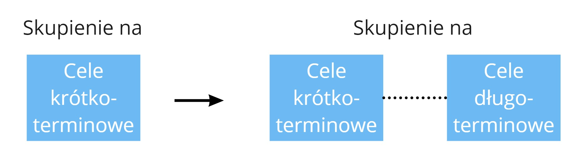

- Architektura ewolucyjna wywodzi się zarówno z doskonałości technicznej, jak i organizacyjnej.
- Architektura szybciej dostosowuje się do zmian, gdy biznes i IT pracują jako jeden zespół.
- Nie wszystkie subdomeny biznesowe ewoluują w podobny sposób, podobnie jak architektura.
- Myślenie eksperymentalne pomaga zweryfikować architekturę pod kątem rzeczywistych potrzeb.
- Myślenie systemowe jest wymagane, aby uniknąć zakończenia z niezrównoważoną architekturą.

## Wprowadzenie do architektury ewolucyjnej i jej znaczenie

W oparciu o [książkę](https://www.goodreads.com/book/show/35755822-building-evolutionary-architectures) Neala Forda, Rebecci Parsons i Patricka Kua, architekturę ewolucyjną (EA) można opisać jako architekturę zaprojektowaną tak, aby akceptowała przyrostowe i kierowane zmiany. Wraz z ewolucją wymagań biznesowych dbamy o to, aby nasze cechy architektoniczne nie uległy erozji. Dlatego w EA duży nacisk kładzie się na [Fitness Functions](https://www.thoughtworks.com/radar/techniques/architectural-fitness-function) - czyli metryki architektoniczne, które pomagają nam ocenić stan naszej architektury.

EA jest bardzo często postrzegana jako cel końcowy architektury oprogramowania. Nie możemy oczekiwać, że wszystkie wymagania będą znane z góry. Nasza architektura musi uwzględniać ten fakt. Rozwój nowych funkcjonalności powinien być traktowany jako ciągły ruch do przodu, bez stanu końcowego. Stąd powszechne powiedzenie "produkt oprogramowania nigdy nie jest skończony".

## Problemy z techniczną tylko perspektywą dla EA

Większość materiałów wokół EA poświęcona jest tematom technicznym. Oprócz Fitness Functions, popularne tematy to Microservices, Continuous Integration and Delivery, evolving database schemas, automated testing i wiele innych. Nie ulega wątpliwości, że są to elementy kluczowe dla osiągnięcia EA.

Jednocześnie, bazując na [prawie Conway'a](/2019/02/25/conways-law-jak-struktura-organizacji-wplywa-na-osiagane-rezultaty/), wiemy, że niektóre struktury organizacyjne są kontrproduktywne i w rezultacie, pożądana architektura może nie zostać dostarczona. W oprogramowaniu zawsze istnieją czynniki ludzkie. Zespoły nie stworzą trwałych produktów, jeśli będą zmuszone do pracy przeciwko sobie.

EA opiera się silnie na organizacji - bez właściwej współpracy całej firmy nie możemy zakładać, że wzorce techniczne będą wystarczające do obsługi ewolucji oprogramowania.

##Cechy organizacyjne dla EA: 
Jeśli chodzi o EA, istnieje kilka interesujących cech organizacyjnych, które powinny być brane pod uwagę:

### IT i Biznes jako jeden zespół

W organizacjach bardzo często zdarza się, że możliwości IT traktowane są jak centrum kosztów. Zespoły biznesowe wsłuchują się w potrzeby klienta i proponują funkcjonalności. Zespoły programistyczne działają jak [fabryka funkcjonalności](https://cutle.fish/blog/12-signs-youre-working-in-a-feature-factory) - dostają polecenie dostarczenia poszczególnych funkcjonalności w jak najkrótszym czasie. Zespół programistyczny nie zna potrzeb klienta, więc nie otrzymuje informacji zwrotnej na temat tych funkcjonalności.

Taka sytuacja tworzy dodatkowe warstwy komunikacji i utrudnia zrozumienie kontekstu biznesowego. Dostosowujemy naszą architekturę nie wiedząc, dokąd ma nas to zaprowadzić. Następnie otrzymujemy informacje zbyt późno, aby zmienić kierunek. Jesteśmy więc zmuszeni do tworzenia oprogramowania w poprzek architektury, tylko po to, aby dostarczyć zakładaną wartość.

W takim środowisku, architektura bardzo łatwo oddala się od potrzeb biznesowych. Istnieje zbyt duże opóźnienie pomiędzy potrzebami użytkownika a tworzoną architekturą.

Biznes i IT muszą współpracować, aby zrozumieć środowisko biznesowe i odpowiednio dostosować architekturę. Tylko wtedy pętla sprzężenia zwrotnego pomiędzy nowymi potrzebami klienta a tworzonym rozwiązaniem jest wystarczająco krótka, aby ewoluować architekturę we właściwym kierunku.

Zespół realizujący zamówienie bezpośrednio wsłuchuje się w potrzeby klienta i proponuje rozwiązanie. Dzięki temu nasza architektura ewoluuje naturalnie wraz z całym biznesem. Nie ma dodatkowej warstwy komunikacji, która spowalnia dostosowanie się do zmian. Gdy architektura nie odpowiada środowisku biznesowemu, jesteśmy w stanie znacznie szybciej ją przemodelować.

Dodatkowo, zespół realizujący dostawy pracuje bliżej klientów. Rozumieją ich potrzeby. Na tej podstawie ewolucja systemu staje się bardziej zorientowana na biznes. Nie tworzymy architektury dla samej architektury - tworzymy kręgosłup dla ogólnego celu biznesowego.

Ta idea upełnomocnionych zespołów jest szczegółowo przedstawiona w książce [Empowered](https://www.goodreads.com/book/show/53481975-empowered) Marty'ego Cagana i Chrisa Jonesa. Zespół jest odpowiedzialny za zebranie potrzeb klienta, znalezienie odpowiedniego rozwiązania, wdrożenie go i zebranie informacji zwrotnej. Pętla informacji zwrotnej jest krótka, a my odpowiednio kształtujemy architekturę.

### Cele ewolucyjne

Kiedy nasze organizacje skupiają się na krótkoterminowych celach, łatwo jest stracić z oczu szerszy obraz. Funkcjonalności są tak ważne, że tniemy każdy róg, aby je dostarczyć. Konkretny termin jest traktowany tak, jakby nie było dnia po nim - ale zazwyczaj jest.

W końcu odkrywamy, że mimo posiadania działającego systemu, nie potrafimy go dostosować do nowych potrzeb. Architektura systemu została zaprojektowana do realizacji celów krótkoterminowych. Wszystkie ograniczenia są ustawione w takim miejscu, że nie możemy ich przesunąć bez rozerwania całego systemu.

[Gerald Weinberg](https://en.wikipedia.org/wiki/Gerald_Weinberg) napisał w swojej książce [The Secrets of Consulting](https://www.goodreads.com/en/book/show/566213):

> "Im lepiej jesteś przystosowany, tym mniejszą masz skłonność do przystosowywania się". 

Organizacje, które skupiają się tylko na bieżącej sytuacji, nie są w stanie dostosować się do przyszłych potrzeb. Architektura jest tak silnie sprzężona, że żadna zmiana nie może być wprowadzona bez ogromnego poświęcenia.

Cele krótkoterminowe muszą ewoluować, aby realizować cele długoterminowe. Tylko wtedy architektura będzie w stanie ewoluować.

Kiedy koncentrujemy się na szczegółowym zestawie cech, nie możemy zapominać, że ostatecznie chcemy prowadzić długotrwały biznes i długotrwały system. Dlatego obecne prace nie powinny ograniczać możliwości architektury systemu. Szerszy kontekst biznesowy i dalsze cele pozwolą nam dobrać właściwą architekturę - nie tylko do obecnych potrzeb, ale również do przyszłych.

Ciekawym podejściem do tego problemu jest użycie dwuwymiarowej macierzy do oceny decyzji. Na jednej osi umieszczamy:

- na jednej osi zysk krótkoterminowy
- zysk długoterminowy na drugiej osi

Następnie możemy zmierzyć, jak nasza decyzja wpływa na całą architekturę. Przy wielu okazjach, możemy zdać sobie sprawę, że krótkoterminowe korzystne decyzje są bardzo szkodliwe dla ewolucji systemu w dłuższej perspektywie.

### Zrozumienie i dostosowanie do domeny biznesowej

Zazwyczaj istnieje wiele grup użytkowników, którzy używają produktu z różnych powodów i do różnych celów. Nawet pojedyncza funkcjonalność może być różnie definiowana, w zależności od tego, kogo pytamy. Niektóre wymagania wydają się być sprzeczne z innymi. Wszystkie potrzeby są wymieszane, a my dostarczamy oprogramowanie zgodnie z naszym rozumieniem.

To zamieszanie wpływa na ogólną architekturę. Potrzeby różnych klientów nakładają się na siebie, podobnie jak nasze rozwiązania. Próbujemy rozwijać nasz system w jednej części, ale okazuje się, że jest on sprzężony z innymi częściami. Złożoność i zależności utrudniają implementację nowych funkcjonalności.
Kończymy z monolityczną, wielką kulą błota - co jest oczywistym zaprzeczeniem Architektury Ewolucyjnej.

EA mocno opiera się na modularności oprogramowania. Ale jest to rezultat, a nie poprzednik. Kiedy nie rozumiesz domeny, niemożliwe jest wymyślenie właściwego podziału oprogramowania. Jeśli chcesz osiągnąć EA z uwzględnieniem modułowości, musisz wcześniej skupić się na domenie.

Zazwyczaj do rozwiązania tego problemu zalecane jest [Domain-Driven Design](https://martinfowler.com/bliki/DomainDrivenDesign.html) z jego wzorcami. Kluczowe jest skupienie się na wyodrębnieniu subdomen z jasno zdefiniowanym zakresem odpowiedzialności. Następnie zajmujemy się współpracą pomiędzy subdomenami i sprawdzamy, czy wszystkie procesy biznesowe są obsługiwane prawidłowo. Architektura jest odzwierciedleniem zrozumienia domeny. Każdy moduł może rozwijać się osobno.

Nie zapominajmy, że z socjotechnicznego punktu widzenia, biznes i IT powinny dopasować swoją strukturę do subdomen. Jest to często nazywane [odwrotnym manewrem Conway'a](https://www.thoughtworks.com/radar/techniques/inverse-conway-maneuver). Takie dopasowanie tworzy silniejszą współpracę pomiędzy zespołem dostawczym a jego klientami. Mamy mniej narzutów komunikacyjnych i mniejszą odległość do wymagań, co prowadzi do lepszej ewolucji architektury modułu.

### Wzorce ewolucyjne dla subdomen

Mamy tendencję do podobnego traktowania problemów. Pracujemy w danym kontekście biznesowym, a po przejściu do innego, stosujemy te same podejścia. Niestety, nie zawsze działa to poprawnie.

Może to prowadzić do scenariusza, w którym obie strony odczuwają negatywne skutki. Części biznesu, które wymagają bardziej nowatorskiego podejścia, są odciągane przez obszary biznesowe nastawione na standardy i jasne oczekiwania. W takich scenariuszach trudno jest eksperymentować i testować nowe pomysły. Jednocześnie obszary dojrzałe obniżają swoją efektywność ze względu na niestabilność całej platformy. Konflikt jest naturalnym wynikiem działania tych przeciwstawnych sił.

[Mapy Wardley'a](https://learnwardleymapping.com/) uczą nas, że różne subdomeny mają różny poziom dojrzałości i inaczej ewoluują. Możemy wykorzystać ten fakt, aby poradzić sobie z tymi zmianami w naszej ewolucyjnej architekturze.

Bardziej stabilne subdomeny (np. Zamówienia, pokazane powyżej) są rozpoznawane jako zrozumiałe przez Twoich klientów. Koncentrujemy się na stabilności - awarie nie są tolerowane. Twoja implementacja musi to odzwierciedlać - bardziej złożone wzorce są niezbędne do obsługi złożonych scenariuszy biznesowych. Rygorystyczne testowanie jest postrzegane jako konieczność. Architektura może być bardziej stabilna i ograniczona.

Z drugiej strony, bardziej dynamiczne subdomeny (np. Marketing, pokazany powyżej) wymagają bardziej innowacyjnego i elastycznego sposobu radzenia sobie z problemami. Testujemy nasze założenia, aby otrzymać informację zwrotną tak szybko, jak to możliwe. Zmiany wprowadzane są codziennie i łamią utarte schematy. Dla tych subdomen bardziej wyrafinowane wzorce mogą być obciążeniem. Architektura powinna być tak elastyczna, jak to tylko możliwe, aby dostosować się do codziennych zmian.

Mapy Wardleya to tylko jedna z technik pozwalających myśleć o ewolucji subdomen w inny sposób. Inne ciekawe techniki to [Core Domain Patterns](https://medium.com/nick-tune-tech-strategy-blog/core-domain-patterns-941f89446af5), [Cynefin Framework](https://en.wikipedia.org/wiki/Cynefin_framework), czy [Diffusion of innovations](https://en.wikipedia.org/wiki/Diffusion_of_innovations).

### Kultura współpracy i kontraktów

Ewolucja to ciągła zmiana. W naturalny sposób zmieniamy nasze metody pracy, aby dostosować się do nowych wymagań biznesowych. Często zdarza się, że potrzebujemy nowych informacji od zewnętrznych zespołów, abyśmy mogli wykonywać swoją pracę. Podobnie, ludzie z różnych zespołów używają naszych funkcjonalności do uruchamiania swojego kodu.

Zaczyna się to powoli, ale z czasem okazuje się, że nie rozumiemy naszych wewnętrznych i zewnętrznych zależności. Polegamy na niewypowiedzianych umowach. Zmiana w naszej funkcjonalności łamie czyjś kod. Taka sytuacja generuje problemy z synchronizacją i opóźnienia wynikające z harmonogramu zewnętrznego zespołu. Powstrzymuje nas to przed wprowadzaniem zmian, prowadzi do nieporozumień i niepokoju.

Architektura jest odzwierciedleniem tego problemu. Zamiast być modularną i oddzielną strukturą, staje się pajęczyną połączeń w całym systemie i zaczyna polegać na głębokiej wiedzy o funkcjonalności każdego zespołu. Ostatecznie, oprogramowanie nie może ewoluować w pożądany sposób.

W tak dynamicznym środowisku, współpraca pomiędzy zespołami musi osiągnąć znacznie wyższy poziom, aby umożliwić płynne działanie całego rozwiązania. Tylko wtedy architektura może podążać za dynamicznym środowiskiem i akceptować zmiany bez naruszania ustalonego porządku.

Wszystkie oczekiwania wobec pozostałych zespołów powinny być jasne i zaakceptowane. Powinniśmy być bardzo rozważni w informacjach, które udostępniamy jako nasz kontrakt. Nie możemy obiecywać kontraktu, który wkrótce złamiemy. To musi być świadoma decyzja, co udostępnić innym zespołom. Jednocześnie, zespoły muszą rygorystycznie udowodnić swoją zdolność do dostarczenia ustalonej umowy. Wprowadzanie zmian powinno być autoryzowane i obsługiwane przez wszystkie zespoły.

Architektura oparta na tych kontraktach jest bardziej stabilna. Jednocześnie, jest bardziej otwarta na ewolucję oprogramowania. Kontrakt staje się ograniczeniem architektonicznym, ale działa jako [ograniczenie umożliwiające](https://theitriskmanager.com/2018/12/09/constraints-that-enable/). Możemy ewoluować nasze oprogramowanie tak bardzo, jak tylko chcemy, utrzymując ten kontrakt na miejscu. Zmiana jest akceptowana, będąc częścią architektury.

W tym temacie, mogę polecić technikę [Context Mapping](https://github.com/ddd-crew/context-mapping). Pomaga ona przeanalizować zależności pomiędzy różnymi modułami i ustalić wzajemne zrozumienie tych powiązań pomiędzy zespołami.

### Myślenie oparte na hipotezach i eksperymentach

Kiedy podchodzimy do nowego problemu, mamy tendencję do trzymania się naszych przekonań. [Efekt potwierdzania](https://pl.wikipedia.org/wiki/Efekt_potwierdzenia) utwierdza nas w przekonaniu, że nasze rozwiązanie rozwiąże problem raz na zawsze. Nie chcemy sprawiać wrażenia niepewnych.

Po kilku tygodniach lub miesiącach w końcu dostarczamy rozwiązanie. I okazuje się, że nie spełnia ono potrzeb klienta. Próbujemy więc naprawiać sytuację na bieżąco. Wprowadzamy drastyczne zmiany tylko po to, aby uzyskać pozytywną reakcję klienta - nie bez kosztów.

Takie przeróbki mają ogromny wpływ na całą architekturę. W rezultacie, rozwiązanie ledwo działa, z każdym przekroczeniem ograniczeń i rozebranym modułem. Nikt nie pamięta o skupianiu się na funkcjach wydajnościowych, kiedy nie dostarczamy klientom wartości.

[Hypothesis-Driven Development](https://barryoreilly.com/explore/blog/how-to-implement-hypothesis-driven-development/) uczy nas skupiać się na uczeniu się na podstawie nowych wyzwań, zamiast wierzyć, że znamy najlepszą odpowiedź. Tylko informacja zwrotna od klienta jest źródłem prawdy. Staramy się wymyślić eksperyment, aby sprawdzić, czy nasze założenia są słuszne, zdobyć wystarczająco dużo danych, aby je udowodnić lub obalić i odpowiednio dostosować nasze kolejne działania.

Dzięki takiemu podejściu architektura naszego rozwiązania nigdy nie pójdzie w kierunku przeciwnym do potrzeb klienta. Regularnie sprawdzamy, czy struktura techniczna pasuje do problemu. Jeśli nie, zmieniamy strukturę techniczną. Jeśli takie podejście potraktujemy jako codzienną praktykę, nasza ewolucyjna architektura będzie ewoluować wraz z domeną biznesową.

### Myślenie systemowe zastosowane w architekturze
Duże firmy składają się z wielu różnych działów. W rezultacie, procesy biznesowe są rozłożone na różne zespoły. Każdy z nich koncentruje się na swoim backlogu, aby dostarczyć wartość. My jesteśmy odpowiedzialni za część całego systemu. Pytanie brzmi - czy będzie on działał jako całość?

To lokalne skupienie skutkuje tym, że rozwiązania są stosowane bez patrzenia poza mały kontekst. Niektóre problemy nie są rozwiązywane we właściwy sposób. Niektóre z nich w ogóle nie są naprawione, ponieważ nie są związane z konkretnym modułem, ale opierają się na interakcjach między modułami. Ponadto, ponowne wymyślanie koła jest dość powszechne.

W takich przypadkach implementacja pojedynczych części może zrównoważyć architekturę całego systemu. Pojawia się problem lokalnej optymalizacji. System może ewoluować oddzielnie, ale nie ewoluuje jako całość.

Russel Ackoff, myśliciel systemowy, powiedział w [swojej prezetancji](https://www.youtube.com/watch?v=OqEeIG8aPPk): "Wydajność systemu zależy od tego, jak części pasują do siebie, a nie jak działają brane osobno."

Każdy zespół powinien mieć świadomość pracy w określonym środowisku, z wyższymi celami do osiągnięcia. Sukces osiągniemy pod warunkiem, że cały system będzie działał poprawnie. Czasami ewolucja jednego modułu musi zostać zatrzymana, aby umożliwić ewolucję innych komponentów.

Architektura systemu musi uwzględniać takie podejście. Podjęcie decyzji architektonicznej jest zagadnieniem wielopoziomowym. Dlatego powinniśmy rozważyć wiele perspektyw, aby nie zaszkodzić jednemu modułowi na rzecz innego. Architektura odnosi sukces tylko wtedy, gdy cały system ewoluuje razem.

W tym scenariuszu, ciekawą praktyką byłoby utworzenie [gildii archiktektonicznej](https://github.com/jakubnabrdalik/architecture-guild). Gildia może koordynować wiele różnych potrzeb do jednego prostego celu. Zespoły nadal pracują niezależnie, ale są dopasowane do całego systemu przez międzyzespołową grupę, która dzieli się wiedzą techniczną i znajduje rekomendowane rozwiązania.

## Podsumowanie

Architektura ewolucyjna jest zbiorem zasad technicznych, które są kluczowe dla ewolucji architektury w celu spełnienia potrzeb biznesowych. Nie ma wątpliwości, że wymagana będzie doskonałość techniczna.

Jednocześnie, należy zadbać o socjotechniczną część tworzenia oprogramowania. Dobre praktyki wymagane są nie tylko od strony technicznej, ale również organizacyjnej. Brak nacisku na właściwą współpracę w firmie i zrozumienie biznesu zaprowadzi architekturę systemu donikąd.