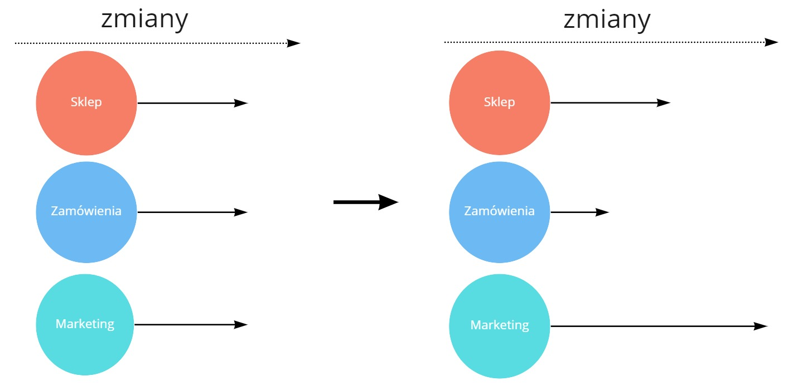

Ten artykuł jest tłumaczeniem mojego wpisu na [InfoQ](https://www.infoq.com/articles/evolutionary-architecture-organizational/), gdzie pojawił się on w maju 2021 roku. Część terminów zostawiłem w obecnym kształcie - trudno jest znaleźć dla nich polskie odpowiedniki.

Cały artykuł jest podzielony na sekcje:

* [Architektura ewolucyjna i jej znaczenie](#architektura-ewolucyjna-i-jej-znaczenie)
* [Architektura ewolucyjna to nie tylko technologia](#architektura-ewolucyjna-to-nie-tylko-technologia)
* [Cechy organizacyjne architektury ewolucyjnej](#cechy-organizacyjne-architektury-ewolucyjnej)
  * [IT i Biznes jako jeden zespół](#it-i-biznes-jako-jeden-zesp%C3%B3%C5%82)
  * [Cele ewolucyjne](#cele-ewolucyjne)
  * [Zrozumienie i dostosowanie do domeny biznesowej](#zrozumienie-i-dostosowanie-do-domeny-biznesowej)
  * [Wzorce ewolucyjne dla poszczególnych obszarów](#wzorce-ewolucyjne-dla-poszczeg%C3%B3lnych-obszar%C3%B3w)
  * [Kultura współpracy i kontraktów](#kultura-wsp%C3%B3%C5%82pracy-i-kontrakt%C3%B3w)
  * [Myślenie oparte na hipotezach i eksperymentach](#my%C5%9Blenie-oparte-na-hipotezach-i-eksperymentach)
  * [Myślenie systemowe zastosowane w architekturze](#my%C5%9Blenie-systemowe-zastosowane-w-architekturze)
* [Podsumowanie](#podsumowanie)

## Architektura ewolucyjna i jej znaczenie

Bazując na książce [Building Evolutionary Architecture](https://www.goodreads.com/book/show/35755822-building-evolutionary-architectures) Neala Forda, Rebecci Parsons i Patricka Kua, **architekturę ewolucyjną można opisać jako architekturę zaprojektowaną tak, aby akceptowała przyrostowe i kierowane zmiany**. Wraz z ewolucją wymagań biznesowych dbamy o to, aby nasza architektura nie uległa pogorszeniu. Dlatego w architekturze ewolucyjnej duży nacisk kładzie się na [Fitness Functions](https://www.thoughtworks.com/radar/techniques/architectural-fitness-function) - metryki architektoniczne, które pomagają nam ocenić stan naszej architektury.

Architektura ewolucyjna jest często postrzegana jako kluczowy element tworzenia produktu. Nie możemy oczekiwać, że wszystkie wymagania będą z góry znane. **Nasza architektura musi uwzględniać tą niewiedzę.** Dostosowywać się do nowych sytuacji. Rozwój nowych funkcjonalności powinien być traktowany jako ciągły ruch do przodu, bez stanu końcowego. Stąd powszechne powiedzenie:

> Software is never done.

## Architektura ewolucyjna to nie tylko technologia

Większość materiałów wokół architektury ewolucyjnej poświęcona jest tematom technicznym. Oprócz Fitness Functions, popularne tematy to mikroserwisy, ciągłe wdrażanie i dostarczanie, ewolucyjne wzorce baz danych, testy automatyczne i wiele innych. Nie ulega wątpliwości, że są to kluczowe elementy dla osiągnięcia tej architektury.

Jednocześnie, bazując na [prawie Conway'a](/2019/02/25/conways-law-jak-struktura-organizacji-wplywa-na-osiagane-rezultaty/), wiemy, że **struktury organizacyjne mogą być wysoce nieproduktywne**. W rezultacie, pożądana architektura może nie zostać dostarczona. W oprogramowaniu zawsze istnieje czynnik ludzki. Zespoły nie stworzą długotrwałych produktów jeśli będą zmuszone do pracy przeciwko sobie.

**Architektura ewolucyjna musi opierać się na organizacji** - bez właściwej współpracy całej firmy nie możemy zakładać, że wzorce techniczne będą wystarczające do zapewnienia ewolucji systemu.

## Cechy organizacyjne architektury ewolucyjnej 

Jeśli chodzi o architekturę ewolucyjną, istnieje kilka interesujących cech organizacyjnych, które powinny być brane pod uwagę:

### IT i Biznes jako jeden zespół

W organizacjach bardzo często zdarza się, że obszar IT jest traktowane jako centrum kosztów. Zespoły biznesowe wsłuchują się w potrzeby klienta i proponują rozwiązania. Zespoły programistyczne działają jak [fabryka funkcjonalności](https://cutle.fish/blog/12-signs-youre-working-in-a-feature-factory) - dostają polecenie dostarczenia poszczególnych rozwiązań w jak najkrótszym czasie. Zespół programistyczny nie zna potrzeb klienta, więc nie otrzymuje informacji zwrotnej na temat tych funkcjonalności.

**Taka sytuacja tworzy dodatkowe warstwy komunikacji i utrudnia zrozumienie kontekstu biznesowego.** Dostosowujemy naszą architekturę nie wiedząc, dokąd ma nas ona zaprowadzić. Następnie otrzymujemy informacje zbyt późno, aby zmienić kierunek. Jesteśmy więc zmuszeni do tworzenia oprogramowania w poprzek architektury, tylko po to, aby dostarczyć zakładaną wartość.

W takim środowisku, architektura bardzo łatwo dryfuje zdala od potrzeb biznesowych. Istnieje zbyt duże opóźnienie pomiędzy potrzebami klienta a tworzoną architekturą.

**Biznes i IT muszą blisko współpracować, aby rozumieć środowisko biznesowe i odpowiednio dostosowywać architekturę.** Tylko wtedy pętla informacji pomiędzy potrzebami klienta, a tworzonym rozwiązaniem jest wystarczająco krótka, aby ewoluować architekturę we właściwym kierunku.

Zespół realizujący rozwiązanie bezpośrednio wsłuchuje się w potrzeby klienta i proponuje rozwiązanie. Dzięki temu nasza architektura ewoluuje naturalnie wraz z całym biznesem. Nie ma dodatkowej warstwy komunikacji, która spowalnia dostosowanie się do zmian. Gdy architektura nie odpowiada środowisku biznesowemu, jesteśmy w stanie znacznie szybciej ją przemodelować.

**Dodatkowo, zespół realizujący rozwiązanie pracuje bliżej klientów.** Rozumie ich potrzeby. Na tej podstawie ewolucja systemu staje się bardziej zorientowana na biznes. Nie tworzymy architektury dla samej architektury - tworzymy kręgosłup dla ogólnego celu biznesowego.

**Ta idea często przedstawiana jest jako zespół produktowy**. Jest ona szczegółowo przedstawiona w książce [Empowered](https://www.goodreads.com/book/show/53481975-empowered) Marty'ego Cagana i Chrisa Jonesa. Zespół jest odpowiedzialny za zebranie potrzeb klienta, znalezienie odpowiedniego rozwiązania, wdrożenie go i zebranie informacji zwrotnej. Pętla informacji zwrotnej jest krótka, a my odpowiednio kształtujemy architekturę.

### Cele ewolucyjne

Kiedy nasze organizacje skupiają się na krótkoterminowych celach, łatwo jest stracić z oczu szerszy obraz. Funkcjonalności są tak ważne, że dopychamy kolanem do oporu, aby udało się to dostarczyć. **Deadline jest traktowany tak, jakby nie było dnia po nim - ale zazwyczaj jest.**

W końcu odkrywamy, że mimo posiadania działającego systemu, nie potrafimy go dostosować do nowych potrzeb. Architektura systemu została zaprojektowana do realizacji celów krótkoterminowych. Wszystkie ograniczenia są ustawione w takim miejscu, że nie możemy ich przesunąć bez rozerwania całego systemu.

[Gerald Weinberg](https://en.wikipedia.org/wiki/Gerald_Weinberg) napisał w swojej książce [The Secrets of Consulting](https://www.goodreads.com/en/book/show/566213):

> "Im lepiej jesteś przystosowany, tym mniejszą masz skłonność do przystosowywania się". 

**Organizacje, które skupiają się tylko na bieżącej sytuacji, nie są w stanie dostosować się do przyszłych potrzeb.** Architektura jest tak silnie sprzężona, że bez ogromnego poświęcenia żadna zmiana nie może być wprowadzona.

Cele krótkoterminowe muszą być wspólne z celami długoterminowymi. Tylko wtedy architektura będzie w stanie odpowiednio ewoluować.

Kiedy koncentrujemy się na szczegółowym zestawie funkcjonalności, nie możemy zapominać, że ostatecznie chcemy prowadzić długoterminowy biznes. A w nim długoterminowy system. **Dlatego obecne prace nie powinny ograniczać szejrzych możliwości architektury systemu.** Kontekst biznesowy i dalekosiężne cele pozwolą nam dobrać właściwą architekturę - nie tylko do obecnych potrzeb, ale również do przyszłych.

Ciekawym podejściem do tego problemu jest **użycie dwuwymiarowej macierzy do oceny decyzji**. Na jednej osi umieszczamy:

- na jednej osi zysk krótkoterminowy
- na drugiej osi zysk długoterminowy

Następnie możemy zmierzyć, jak nasza decyzja wpływa na całą architekturę. Przy wielu okazjach, możemy zdać sobie sprawę, że krótkoterminowe korzystne decyzje są bardzo szkodliwe dla ewolucji systemu w dłuższej perspektywie.

### Zrozumienie i dostosowanie do domeny biznesowej

Zazwyczaj istnieje wiele grup klientów. Używają oni produktu z różnych powodów i dla różnych celów. Nawet pojedyncza funkcjonalność może być różnie definiowana, w zależności od tego, kogo pytamy. Niektóre wymagania wydają się być sprzeczne z innymi. **Wszystkie potrzeby są wymieszane, a my dostarczamy oprogramowanie zgodnie z naszym niezrozumieniem.**

To zamieszanie wpływa na ogólną architekturę. Potrzeby różnych klientów nakładają się na siebie, podobnie jak nasze rozwiązania. Próbujemy rozwijać system w jednej części, ale okazuje się, że jest on złączony z innymi częściami. Złożoność i zależności utrudniają implementację nowych funkcjonalności.
Kończymy z monolityczną, [wielką kulą błota](https://en.wikipedia.org/wiki/Big_ball_of_mud) - co jest oczywistym zaprzeczeniem architektury ewolucyjnej.

Architektura ewolucyjna mocno opiera się na modularności oprogramowania. Ale to jest rezultat, a nie podstawa. Kiedy nie rozumiesz domeny biznesowej, niemożliwe jest wymyślenie właściwego podziału oprogramowania. **Jeśli chcesz osiągnąć modularny i rozwijalny system, musisz wcześniej skupić się na obszarze biznesowym.**

Zazwyczaj do podejścia do tego problemu stosuje się techniki dookoła [Domain-Driven Design](https://martinfowler.com/bliki/DomainDrivenDesign.html). **Kluczowe jest skupienie się na wyodrębnieniu mniejszych obszarów z jasno zdefiniowanym zakresem odpowiedzialności.** Następnie zajmujemy się współpracą pomiędzy tymi obszarami i sprawdzamy, czy wszystkie procesy biznesowe są obsługiwane prawidłowo. Architektura jest odzwierciedleniem zrozumienia domeny biznesowej. Każdy moduł może rozwijać się osobno.

Nie zapominajmy, że z socjotechnicznego punktu widzenia, biznes i IT powinny dopasować swoją strukturę do mniejszych obszarów biznesowych. Jest to często nazywane [odwrotnym manewrem Conway'a](https://www.thoughtworks.com/radar/techniques/inverse-conway-maneuver). Takie dopasowanie tworzy silniejszą współpracę pomiędzy zespołem produktowym a jego klientami. Zmniejszamy narzut komunikacyjny i odległość do wymagań. To prowadzi do lepszej ewolucji danego modułu.

### Wzorce ewolucyjne dla poszczególnych obszarów

Mamy tendencję do podobnego traktowania problemów. Pracujemy w danym kontekście biznesowym, a po przejściu do innego, stosujemy te same podejścia. Niestety, nie zawsze takie podejście przynosi dobre rezultaty.

**Może to prowadzić do sytuacji, w której przeciwne obszary biznesowe próbują przepychać rozwiązania bliskie sobie.** Obszary biznesowe, które wymagają bardziej nowatorskiego podejścia, są opóźniane przez obszary biznesowe nastawione na standardy i jasne oczekiwania. W takich scenariuszach trudno jest eksperymentować i testować nowe pomysły. Jednocześnie obszary dojrzałe obniżają swoją jakość ze względu na niestabilność całej platformy. Konflikt jest naturalnym wynikiem działania tych przeciwstawnych sił.

[Mapy Wardley'a](https://learnwardleymapping.com/) uczą nas, że różne subdomeny mają różny poziom dojrzałości i inaczej ewoluują. Możemy wykorzystać ten fakt, aby poradzić sobie ze zmianami w naszej ewolucyjnej architekturze.

**W bardziej stabilnych obszarach (np. Zamówienia) klienci nie będą akceptować żadnego błędu.** Koncentrujemy się więc na tej stabilności dostarczając zrozumiałe i pewne rozwiązanie. Twoja implementacja musi to odzwierciedlać - profesjonalne wzorce architektoniczne są niezbędne do obsługi złożonych scenariuszy biznesowych. Rygorystyczne testowanie jest postrzegane jako konieczność. Architektura może być bardziej zrównoważona i ograniczona.

Z drugiej strony, **dynamiczne obszary (np. Marketing) wymagają bardziej innowacyjnego i elastycznego sposobu radzenia sobie z problemami.** Testujemy nasze założenia, aby otrzymać informację zwrotną tak szybko, jak to możliwe. Zmiany wprowadzane są codziennie i łamią utarte schematy. Dla tych subdomen bardziej wyrafinowane wzorce mogą być obciążeniem. Architektura powinna być tak elastyczna, jak to tylko możliwe, aby dostosować się do codziennych zmian.

Mapy Wardley'a to tylko jedna z technik pozwalających myśleć o ewolucji subdomen w inny sposób. Inne ciekawe techniki to [Core Domain Patterns](https://medium.com/nick-tune-tech-strategy-blog/core-domain-patterns-941f89446af5), [Cynefin Framework](https://en.wikipedia.org/wiki/Cynefin_framework), czy [Diffusion of innovations](https://en.wikipedia.org/wiki/Diffusion_of_innovations).

### Kultura współpracy i kontraktów

Ewolucja to ciągła zmiana. W naturalny sposób zmieniamy nasze metody pracy, aby dostosować się do nowych wymagań biznesowych. Często zdarza się, że potrzebujemy informacji od zewnętrznych zespołów, aby wykonywać naszą pracę. Podobnie, pracownicy innych zespołów używają naszych funkcjonalności do uruchamiania swojego kodu.

**Zaczyna się to powoli, ale z czasem okazuje się, że nie znamy naszych zależności - zarówno my->świat jak i świat->my.** Polegamy na niewypowiedzianych umowach. Zmiana w naszym zespole rozwala funkcje innego zespołu. Taka sytuacja generuje problemy z synchronizacją i opóźnienia wynikające z harmonogramu zewnętrznego zespołu. Powstrzymuje nas to przed wprowadzaniem zmian, prowadzi do nieporozumień i niepokoju.

Architektura jest odzwierciedleniem tego problemu. **Zamiast być modularną i dobrze odseparowaną strukturą, staje się pajęczyną połączeń w całym systemie** i zaczyna polegać na głębokiej wiedzy o funkcjonalności każdego zespołu. Ostatecznie, oprogramowanie nie może ewoluować w pożądany sposób.

W dynamicznym środowisku współpraca pomiędzy zespołami musi osiągnąć znacznie wyższy poziom. Tylko wtedy architektura może podążać za dynamicznym środowiskiem i akceptować zmiany bez naruszania ustalonego porządku.

**Oczekiwania wobec pozostałych zespołów powinny być jasne i zaakceptowane.** Powinniśmy być bardzo rozważni w informacjach, które udostępniamy jako nasz kontrakt. Nie możemy obiecywać kontraktu, który wkrótce złamiemy. To musi być świadoma decyzja, co udostępnić innym zespołom. Jednocześnie, zespoły muszą rygorystycznie udowodnić swoją zdolność do dostarczenia ustalonej umowy. Wprowadzanie zmian powinno być autoryzowane i obsługiwane przez wszystkie zespoły.

**Architektura oparta na tych kontraktach jest bardziej stabilna. Jednocześnie, jest bardziej otwarta na ewolucję oprogramowania.** Kontrakt staje się ograniczeniem architektonicznym, ale działa jako [ograniczenie umożliwiające](https://theitriskmanager.com/2018/12/09/constraints-that-enable/). Możemy ewoluować nasze oprogramowanie tak bardzo, jak tylko chcemy, utrzymując ten kontrakt na miejscu. Zmiana jest akceptowana, będąc częścią architektury.

W tym temacie, mogę polecić technikę [Context Mapping](https://github.com/ddd-crew/context-mapping). Pomaga ona przeanalizować zależności pomiędzy różnymi modułami i zespołami, a następnie ustabilizować współpracę.

### Myślenie oparte na hipotezach i eksperymentach

Kiedy podchodzimy do nowego problemu, mamy tendencję do trzymania się naszych przekonań. [Efekt potwierdzania](https://pl.wikipedia.org/wiki/Efekt_potwierdzenia) utwierdza nas w przekonaniu, że nasze rozwiązanie rozwiąże problem raz na zawsze. Nie chcemy sprawiać wrażenia niepewnych.

Po kilku tygodniach (lub miesiącach) w końcu dostarczamy rozwiązanie. I okazuje się, że nie spełnia ono potrzeb klienta. Próbujemy więc naprawiać sytuację na bieżąco. Wprowadzamy drastyczne zmiany tylko po to, aby uzyskać pozytywną reakcję klienta - nie bez kosztów.

Takie zmiany mają ogromny wpływ na całą architekturę. W rezultacie rozwiązanie ledwo działa, a każdy moduł ma złamane granice. **Nikt nie pamięta o architekturze, kiedy nie dostarczamy klientom wartości.**

[Hypothesis-Driven Development](https://barryoreilly.com/explore/blog/how-to-implement-hypothesis-driven-development/) mówi by uczyć się na podstawie kolejnych eksperymentów, zamiast ślepo wierzyć, że znamy najlepszą odpowiedź. **Tylko informacja zwrotna od klienta jest źródłem prawdy.** Staramy się budować rozwiązanie jako hipotezę, którą sprawdzimy czy nasze założenia są słuszne. Następnie skupiamy się na zebraniu jak największej ilości informacji zwrotnej, aby je udowodnić lub obalić. Na tej podstawie dostosowujemy nasze kolejne działania.

**Dzięki takiemu podejściu architektura naszego rozwiązania nigdy nie pójdzie w kierunku przeciwnym do potrzeb klienta.** Regularnie sprawdzamy, czy struktura techniczna pasuje do problemu. Jeśli nie, zmieniamy strukturę techniczną. Jeśli takie podejście potraktujemy jako codzienną praktykę, nasza ewolucyjna architektura będzie ewoluować wraz z domeną biznesową.

### Myślenie systemowe zastosowane w architekturze

Duże firmy składają się z wielu różnych działów. W rezultacie procesy biznesowe są rozłożone na mniejsze zespoły. Każdy z nich koncentruje się na swoich zadaniach aby dostarczyć wartość. **My jesteśmy odpowiedzialni jedynie za część całego systemu. Pytanie brzmi - kto odpowiada za całość?**

To lokalne skupienie skutkuje tym, że rozwiązania są stosowane bez patrzenia poza szerszy kontekst. Niektóre problemy nie są rozwiązywane we właściwy sposób. Niektóre z nich w ogóle nie są naprawione, ponieważ nie są związane z konkretnym modułem, ale opierają się na interakcjach między modułami. Dodatkowo, wymyślanie koła zaczyna być powszechne.

W takich przypadkach implementacja pojedynczych części może zniekształcić architekturę całego systemu. Pojawia się problem lokalnej optymalizacji. **System ewoluuje w poszczególnych częściach, ale nie ewoluuje jako całość.**

Russell Ackoff, praktyk organizacyjny, powiedział w [swojej prezetancji](https://www.youtube.com/watch?v=OqEeIG8aPPk)

>Wydajność systemu zależy od tego, jak części pasują do siebie, a nie jak dobrze działają pracując osobno.

Każdy zespół powinien mieć świadomość pracy w określonym środowisku, z wyższymi celami do osiągnięcia. **Sukces osiągniemy pod warunkiem, że cały system będzie działał poprawnie.** Czasami ewolucja jednego modułu musi zostać zatrzymana, aby umożliwić ewolucję innych komponentów.

Architektura systemu musi uwzględniać takie podejście. Podjęcie decyzji architektonicznej jest zagadnieniem wielopoziomowym. Dlatego powinniśmy rozważyć wiele perspektyw, aby nie zaszkodzić jednemu modułowi na rzecz innego. Architektura odnosi sukces tylko wtedy, gdy cały system ewoluuje razem.

W tym scenariuszu, ciekawą praktyką byłoby utworzenie [gildii archiktektonicznej](https://github.com/jakubnabrdalik/architecture-guild). **Gildia może koordynować wiele różnych potrzeb do jednego wspólnego celu.** Zespoły nadal pracują niezależnie, ale są dopasowane do całej organizacji przez międzyzespołową grupę, która dzieli się wiedzą techniczną i znajduje rekomendowane rozwiązania.

## Podsumowanie

Architektura ewolucyjna jest zbiorem zasad technicznych, które są kluczowe dla ewolucji architektury w celu spełnienia potrzeb biznesowych. Nie ma wątpliwości, że wymagana będzie doskonałość techniczna.

Jednocześnie, należy zadbać o socjotechniczną część tworzenia oprogramowania. Dobre praktyki wymagane są nie tylko od strony technicznej, ale również organizacyjnej. Brak nacisku na właściwą współpracę w firmie i zrozumienie biznesu zaprowadzi architekturę systemu donikąd.