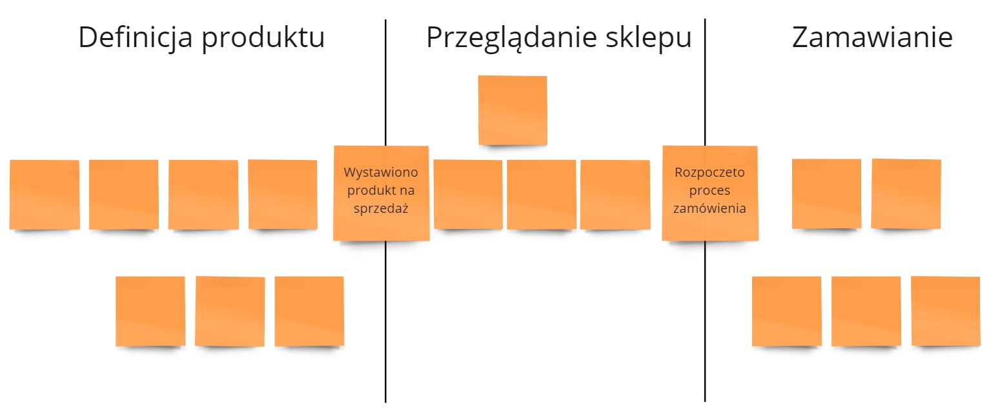
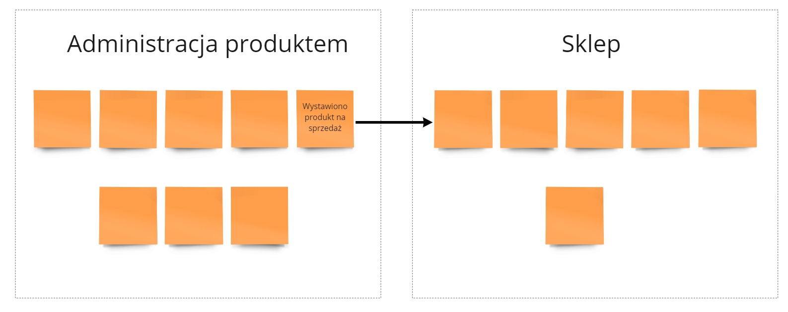
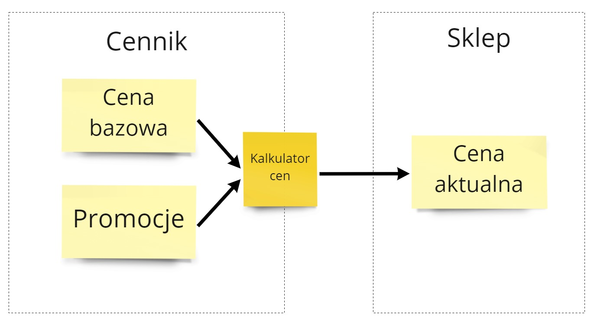
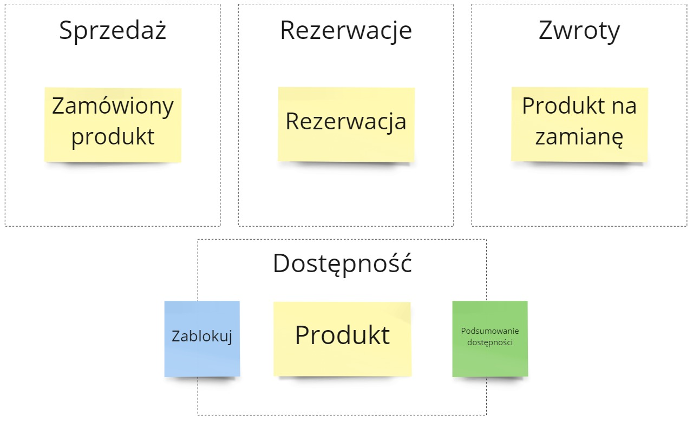
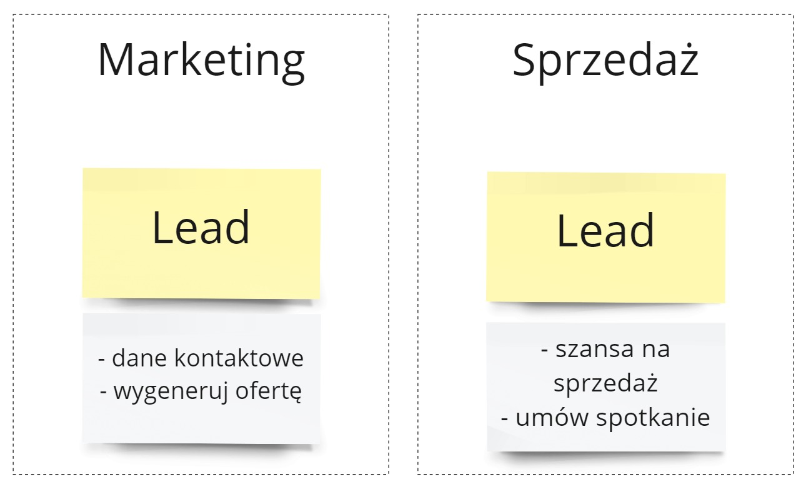
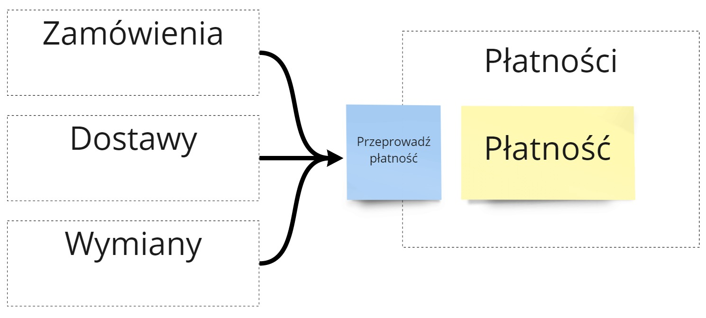

// wszystkie materiały zostały zebrane w [podsumowaniu cyklu](/2018/07/16/dlaczego-bounded-contexty-sa-wazne-podsumowanie/). 

Podział naszego rozwiązania technicznego na mniejsze konteksty to temat, który zawsze pojawia się podczas tworzenia bardziej rozbudowanego rozwiązania. Szczególnie jeśli mówimy o [mikroserwisach](https://blog.avanscoperta.it/2020/06/11/about-bounded-contexts-and-microservices/). Dlaczego tak jest? 

Nieprawidłowy podział kontekstów ma duże wady:
- praca będzie przechodziła przez wiele obszarów technicznych
- rozwój funkcji biznesowy wymagać będzie koordynacji  pracy kilku zespołów
- wiedza o statusie procesu będzie podzielona na kilka miejsc - brak będzie jednego źródła prawdy 
- rozwój jednej funkcji biznesowej będzie burzyć działanie funkcji pobocznych

Na potrzeby tego artykułu wyszczególniłem takie 5 podejść do dzielenia systemu na konteksty:
- Proces i jego podział
- Możliwości zmiany
- Źródło wiedzy

## Metody podziału na konteksty

### Proces i jego podział
Ta metoda podziału jest najbardziej popularna (co też oznacza, że nie zawsze właściwa). 

Rozpoczynamy od przeglądu naszego procesu, który chcemy informatyzować. Zbieramy informacje w jaki sposób przebiegają kolejne kroki. Wyszczególniamy kto się z kim komunikuje oraz jakie informacje podaje dalej.  A przede wszystkim jakie cele chcemy spełniać na poszczególnych etapach procesu.

Następnie szukamy zdarzeń granicznych ([pivotal events](https://www.dddheuristics.com/guiding-heuristics/eventstorming-emerging-pivotal-events-for-a-big-picture/)). To pozwoli nam określić w których miejscach proces zauważalnie zmienia swoją strukturę - pracują w nim inne osoby, lub proces spełnia inne cele. W systemie e-commerce takimi zdarzeniami mogą być:

- Zlecono wysyłkę - dział Zamówień oddał pracę dalej do działu Dostaw
- Uruchomiono kampanię marketingową - teraz dział Marketingu skupi się na zbieraniu leadów
- Wyłączono produkt ze sprzedaży - dalej sprzedaż produktu nie jest już możliwa

Bardzo często miejsce podziału procesu będzie pokrywało się z obecną strukturą organizacyjną, bądź z strumieniem wartości ([value stream](https://bacoach.nl/2020/11/business-value-streams-and-capabilities/#:~:text=make%20better%20decisions.-,Business%20Value%20Streams,-Next%20to%20capability)). **W ten sposób odkryjemy główny podział procesu i mniejsze obszary biznesowe.**

Na tej podstawie możemy utworzyć nasze konteksty. Aktywności biznesowe danej grupy docelowej oraz przetwarzane informacje będą zawierać się w danym kontekście. Zamykamy część procesu biznesowego tworząc dla niego osobny obszar techniczny.

**Zadaj sobie pytanie:**
- W którym miejscu mój proces się dzieli?
- Gdzie oddaję pracę innej osobie / innemu działowi?
- Jakie informacje są wymagane od działu w którym współpracuję?

https://www.dddheuristics.com/assets/images/value-stream-contexts.png

### Możliwości zmiany i autonomia
Jeśli widzimy, że pewne funkcje i cele biznesowe są często zmieniane, to bardzo możliwe, że warto dla nich wydzielić osobny kontekst. Nawiązuje to do słynnej pracy D.L. Parnasa [On the Criteria To Be Used in Decomposing Systems into Modules](https://www.win.tue.nl/~wstomv/edu/2ip30/references/criteria_for_modularization.pdf)

> We propose instead that one begins with a list of difficult design decisions or design decisions which are likely to change. Each module is then designed to hide such a decision from the others.

Załóżmy, że nasz dział marketingu wykorzystuje promocje w systemie e-commerce. Istnieją różne rodzaje promocji, a wobec czego różne sposoby liczenia cen produktów. Część z tych promocji może się na siebie nakladać, część nie. **Ostatecznie skończymy z olbrzymim narzutem promocji na implementację funkcji zakupów.** Wyliczenie ostatecznej ceny produktu będzie skomplikowane, czasochłonne i zaburzało proces zakupów. 

Dlatego też wartościowe będzie odseparowanie od siebie tych odpowiedzialności. Liczenie cen przeniesiemy do kontekstu _Cennik_, który będzie odpowiedzialny za bazowe ceny produktów oraz promocje. Tutaj będzie wyliczana ostateczna cena produktów. Na tej podstawie zasilony zostanie kontekst _Sklep_, który dostanie gotowe informacje do działania. **_Cennik_ może dowolnie kształtować promocje o ile dalej będzie zapełniać _Sklep_ danymi.**

Przydatną techniką tutaj jest [Mapa Wardley'a](https://learnwardleymapping.com/). Pozwala ona, po podziale na obszary, zastanowić się na ile są one dojrzałe i stabilne. Na tej podstawie możemy podjąć powyższe decyzje.

### Źródło wiedzy

Ta metoda podziału pozwala nam skupić się na bardziej ukrytych kontekstach. Są to również te konteksty, których podskórnie poszukują nasi klienci.

Załóżmy, że tworzymy rozbudowany system e-commerce. Możemy sprzedawać / rezerwować / zamieniać reklamacyjnie produkty. Każda z tych akcji blokuje konkretne sztuki produktów. Zadaj sobie wtedy pytanie **"Ile mam danego produktu możliwego do sprzedaży?"** Odpowiedź na to pytanie nie będzie łatwa - wymagane będzie przeliczenie 3 zbiorów danych. 

To jest sugestia, że brakuje nam dodatkowego obszaru, który będzie się zajmować obsługą dostępności produktów. Taki kontekst będzie przyjmował żądania blokowania produktu i zwracał podsumowanie dostępności. Kontekst _Dostępność_ będzie tutaj **źródłem wiedzy**. To do niego pozostałe konteksty będą uderzać aby pytać o dostępność produktów i blokować poszczególne towary.

**Pytania pomocniczne:**
- Na jakie główne pytania powiniśmy odpowiedzieć w naszym systemie?
- Co jest dla nas najbardziej istotną informacją w systemie?
- Jaka odpowiedź powinna być dla nas znana bez zapytań do innych kontekstów?

### Językowe różnice

Kontekst w ujęciu DDD dzieli rozwiązanie techniczne na mniejsze obszary, gdzie wybrane pojęcia mają jedno dokładne znaczenie. To nam pozwala dostrzec, w których miejscach nasze rozwiązanie powinno się dzielić na mniejsze konteksty. 

**Weźmy na tapet słowo Lead**. W zalezności czy mówimy o zespole Marketingu czy Sprzedaży to te [2 określenia będą znaczyły coś zdecydowanie innego](https://www.linkedin.com/feed/update/urn:li:activity:6545309519982014464/).
Taką istotną różnicę warto odseparować od siebie - inaczej skończymy z olbrzymim modelem mającym bardzo dużą odpowiedzialność.

Analogicznie może być w przypadku słowa Pracownik w systemie HRowym. W zależności od kontekstu, te słowa mogą znaczyć:
- Szansa na zatrudnienie - dla kontekstu _Poszukiwanie kandydatów_
- Potencjalne miejsce angażu - dla kontekstu _Projekty_
- Miejce w drabince organizacyjnej - dla kontekstu _Struktura organizacyjna_
- Stawka godzinowa oraz dni urlopowe - dla konktestu _Koszty_

**Pytania pomocnicze:**
- Jakie zwroty są różnie rozumiane w moim biznesie?
- O jakie odpowiedzialności / cechy kłócą się współpracownicy?
- Jakie pojęcia są strasznie niejasne (a więc ich klasy / obiekty w kodzie olbrzymie)? 

### Reużywalność

Jednym ze sposobóe na wydzielenie kontekstów jest myślenie w kryteriach reużywalności.

_Płatności_ są tego dobrym przykładem. Na początku chcielibyśmy aby klienci mogli nam płacić za towary. Połączenie odpowiedzialności płatności z zamówieniem wydają się dobrą początkową decyzją. Później jednak możemy chcieć aby klient mógł zapłacić dodatkową kwotę za rzeczy niezwiązane z zamówieniem - dodatkową wysyłkę, wymianę. **Dodanie nowych funkcji do już istniejących płatności w zamówieniach może przyprawić o siwe włosy.**

Wydzielenie reużywalnego kontekstu _Płatności_ daje nam duże zyski w tworzeniu bardziej modularnego systemu. Wtedy konteksty wyższego rzędu mogą prosić _Płatności_ o realizację płatności, bez informowania kontekstu po co się to dzieje. **Możemy łączyć ze sobą konteksty na zasadzie klocków,** tworząc nowe procesy.

Pytania pomocnicze:
- Jakie funkcje mogą być wykorzystywane przez różne części biznesu?
- Jaka odpowiedzialność powtarza się w procesach biznesowych?
- Co się pokrywa w dyskusjach poszczególnych grup / departamentów organizacji?

## Podsumowanie i materiały

`` Bounded Contexts shouldn’t serve the designer’s sensibilities and need for perfection, but enable business opportunities.

W internecie jest o wiele więcje metod podziału o których możecie przeczytać

https://www.dddheuristics.com/design-heuristics/

https://www.youtube.com/watch?v=ez9GWESKG4I

https://www.youtube.com/watch?v=ZEJ2Vyk1HA0

[Panel] Splitting systems towards bounded contexts and microservices
https://www.youtube.com/watch?v=h-7-lMJ_jdw

https://verraes.net/2021/06/split-domain-across-bounded-contexts/