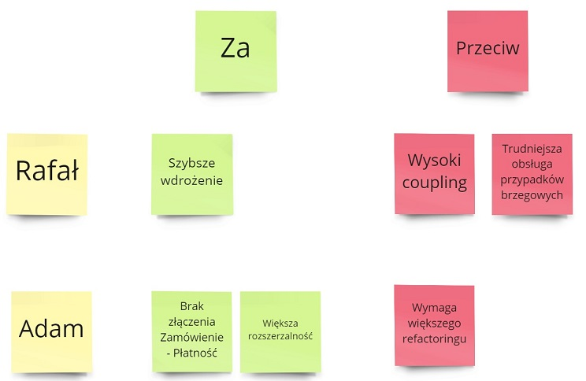

Kilka dni temu Oskar Dudycz napisał na Twitterze dość istotny zarzut dotyczący różnych technik kolaboracyjnych, w tym także Event Stormingu:



Warto przeczytać [cały wątek](https://twitter.com/oskar_at_net/status/1475153807910879232). Sam zgadzam się z zarzutem - techniki kolaboracyjne wymagają wysokiej atencji i dużej ilości interakcji. Jednocześnie część osób lepiej pracuje będąc w [strefie Zen](https://www.zenprogrammer.org/en/10-rules-of-a-zen-programmer.html), skupiając się głęboko nad danym obszarem produktu. Wmuszając te osoby w "jeden słuszny" model pracy stracimy na tym bardzo dużo.

**Na szczęście Event Storming można również przeprowadzić inaczej - asynchronicznie**. Dzięki temu łączymy 2 światy - głęboką wizualizację tworzonego rozwiązania z możliwością pracy w różnych godzinach i nad różnymi zadaniami. 

Poniżej kilka przykładów jak możemy to zrealizować:

- [Asynchroniczne projektowanie](#asynchroniczne-projektowanie)
- [Konkurencyjne rozwiązania](#konkurencyjne-rozwiązania)
- [Formalny proces](#formalny-proces)

## Przykłady

### Asynchroniczne projektowanie

Rozpoczynamy od stworzenia choćby bazowego rozwiązania na Miro. Nie musimy mieć od razu całego procesu gotowego. Zrzucamy tyle ile wiemy na ten moment. 

Do tablicy możemy dodać również notatki opisujące dlaczego wybraliśmy dane rozwiązanie. Pomoże to  czytelnikom zrozumieć nasze intencje. Warto też zaznaczyć na czym skończyliśmy pracę. Wtedy pozostałe osoby mogą podjąć działanie od tego momentu.

Dobrym pomysłem jest również zrzucenie na tablicę naszej niewiedzy. Bezpośrednio pokażemy gdzie nasze rozwiązanie ma braki, oraz co jeszcze rozważamy.

Kiedy zrzuciliśmy to co mieliśmy w głowie to wysyłamy link do naszego zespołu. Kolejne osoby mogą zobaczyć twój status prac oraz skomentować go, czy zaproponować inną strategię. 

Mogą również kontynuować pracę od miejsca, w którym zakończyliśmy pracę. 

### Konkurencyjne rozwiązania

Ten sposób jest dobry gdy mamy dwie (lub więcej) osoby, które mają różne pomysły na rozwiązanie danego problemu. Zamiast dyskutować te rozbieżności na wspólnej sesji to zaczynamy od równoległego zwizualizowania naszych pomysłów.

Następnie, gdy wszyscy skończą, to zmieniamy miejsce naszego skupienia. Przechodzimy do rozwiązań naszych kolegów i koleżanek aby dokonać analizy ich propozycji. Szukamy zarówno dziur, jak i dobrych pomysłów.  

Na końcu można w jednym miejscu zwizualizować wszystkie za i przeciw, aby łatwiej było podjąć ostateczną decyzję.

### Formalny proces

Event Stormingu możemy również wykorzystać aby przeprowadzić bardziej formalne procesy jak np. [Request for Comments](https://blog.pragmaticengineer.com/scaling-engineering-teams-via-writing-things-down-rfcs/) czy Googlowy [Design Doc](https://luanjunyi.medium.com/how-do-i-write-engineering-design-docs-in-google-an-example-f19febe0297c).

Najpierw wizualizujemy naszą propozycję w tablicy wirtualnej. Przeprowadzamy typową analizę tworzonego rozwiązania. Pokazujemy poszczególne kroki, zdarzenia i ich transformację pomiędzy wybranymi modułami. 

Następnie robimy podsumowanie naszego rozwiązania. Tworzymy to albo w Miro, albo w dedykowanym narzędziu jak Git, Docs / Word czy inny edytor. Wypunktowujemy główne elementy naszego rozwiązania oraz potencjalne konsekwencje. 

Wtedy przesyłamy taką pigułkę do sprawdzenia i akceptacji. Następują kolejne rundy asynchronicznej walidacji, na podstawie których możemy ocenić czy planowane rozwiązanie spełnia wszystkie nasze potrzeby.

## Podsumowanie

Efektywna praca asynchroniczna opiera się na dobrym zaplanowaniu procesu oraz wykorzystaniu odpowiednich narzędzi. Wykorzystując Event Storming i tablicę wirtualną możemy:

- Dodawać komentarze i odpowiadać na nie. Te komentarze przesuwają się wraz z kartkami czy ramkami.
- Sprawdzać co zostało zmienione podczas naszej ostatniej wizyty.
- Definiować kolejne zadania i przypisywać osoby do nich.
- Dyskutować na chacie oraz tworzyć notatki.
- Kategoryzować co jest już gotowe do sprawdzenia, a co jest jeszcze pracą w toku.

Na tej podstawie można stworzyć model pracy, który zadowoli każdą osobę - zarówno introwertyczną jak i ekstrowertyczną.

Oczywiście **to nie oznacza, że musimy całkiem zaprzestać organizowania zwyczajnych Event Stormingów**. Raczej powinniśmy dobierać model pracy do zespołów i spotykać się tak często (lub tak rzadko) jak chce tego nasz zespół.