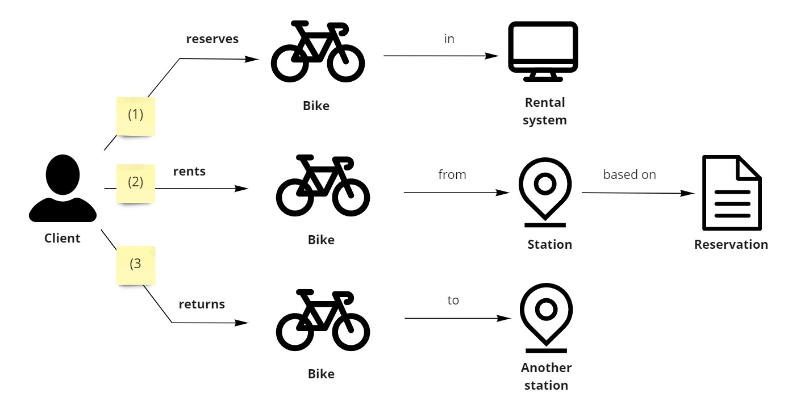

Większość przykładów opartych o Cosmos DB jest albo:

- zbyt tak prosta, że w zasadzie nic nie uczy
- źle zamodelowana - koszty bazy danych doprowadzą dyrektora finansowego na skraj załamania nerwowego

Dużo w tym zarzutu dla Microsoftu, że sprzedaje tą bazę w nieodpowiedni sposób. Pomyślałem więc, że dzięki temu będzie można coś fajnego zrobić 😀

Postanowiłem więc wziąć na tapet ciekawy problem biznesowy i rozpisać jak krok po kroku podejść do niego:

- Poznać potrzeby biznesowe
- Zamodelować możliwe rozwiązania w Cosmos DB
- Określić, które rozwiązanie będzie najlepiej spełniało potrzeby

A więc do dzieła!

## Modelowanie

Zanim zaczniemy opis biznesowy to może 2 słowa o tym, czym jest modelowanie.

[zdjęcie]

**Modelowaniem zwykło się nazywać zamykanie ogólnego problemu w konkretne ramy.** Odrzucamy elementy nieistotne dla naszego problemu. Zostawiamy tylko to co wpływa na sam problem. Jeśli naszym zagadnieniem jest picie kawy z kubka to nasz model może np. zawierać tylko pojemność kubka, - celowo odrzucimy  kształt kubka czy kolor.

W kontekście baz danych często używa się słowa ["modelowanie"](https://docs.microsoft.com/en-us/azure/cosmos-db/sql/modeling-data) jako zamykanie problemu biznesowego w konkretną realizację w bazie. **Modelowanie może tworzyć wiele modeli.** Każdy model będzie odpowiadał innej implementacji. Wtedy należy się zastanowić który model będzie najlepiej rozwiązywał nasz przypadek.

## Biznes do zamodelowania

Chciałem aby podstawą tego cyklu był rzeczywisty biznes. Jednocześnie, aby nie był to ograny e-commerce, których to problemy są rozwiązywane w co drugim artykule.

[zdjęcie]

A że mieszkam we Wrocławiu, więc [Wrocławski Rower Miejski](https://wroclawskirower.pl/) wydał mi dobrą bazą biznesową:

- Jest aktualny - nie jest to biblioteka czy kino
- Jest przystępny - każdy rozumie na czym polega
- Przy wgryzieniu się ma ciekawe problemy

Oczywiście zamodelowanie całego systemu byłoby zbyt czasochłonne, więc postanowiłem się skupić na jednym obszarze - wypożyczeń i zwrotów rowerów. Poniżej opis głównych scenariuszy.

Wykorzystałem notację [Domain Storytelling](https://domainstorytelling.org/) bo wg mnie bardzo przystępnie pokazuje scenariusze biznesowe. Za pomocą [1] / [2] / [3] pokazane są wysokopoziomowe kroki:

- Klient rezerwuje rower w systemie
- Następnie w stacji odbiera przypisany dla niego rower
- Na końcu oddaje rower na innej stacji

Oczywiście tak to wygląda z samej góry, ale diabeł tkwi w szczegółach 😀

## Skala projektu

Wzorowałem się na aktualnej skali i możliwościach Wrocławskiego Roweru Miejskiego ([mapa](https://wroclawskirower.pl/), [statystyki](https://pl.wikipedia.org/wiki/Wroc%C5%82awski_Rower_Miejski), [statystyki](https://wroclawskirower.pl/nowy-dzienny-rekord-wypozyczen-wroclawskiego-roweru-miejskiego/)). Jednocześnie nieco poszerzyłem rozmiar projektu aby wszystkiego nie dało się wykorzystać najprostszych rozwiązań 😉

Na potrzeby cyklu zakładam więc, że:

 - Wrocławski Rower Miejski osiągnął sukces i działa w 50 miastach Polski 😀
 - Miasta mają od 10 do 200 stacji
 - Miasta mają od 100 do 2000 rowerów
 - Miasta mają od 500 do 10000 wypożyczeń dziennie
 - Najmniejsze miasto ma odpowiednio 10/100/500, największe 200/2000/10000, a reszta liniowo

To pozwoli doświadczenie typowych problemów Cosmos DB - związanych z zbyt dużymi partycjami, hot partycjami, albo zapytaniami pomiędzy partycjami (jeśli nie znasz tych terminów to nie martw się - wyjaśnię dokładniej kiedy dany problem wystąpi).

## Co dalej?

Plan na kolejne artykuły jest następujący:

- Dokładniejsza analiza biznesowa
- Wstępne pomysły na modele
- Stworzenie metody ewaluacji rozwiązań
- Ocena każdego z rozwiązan
- Podsumowanie

Także jest co robić 😀 do usłyszenia