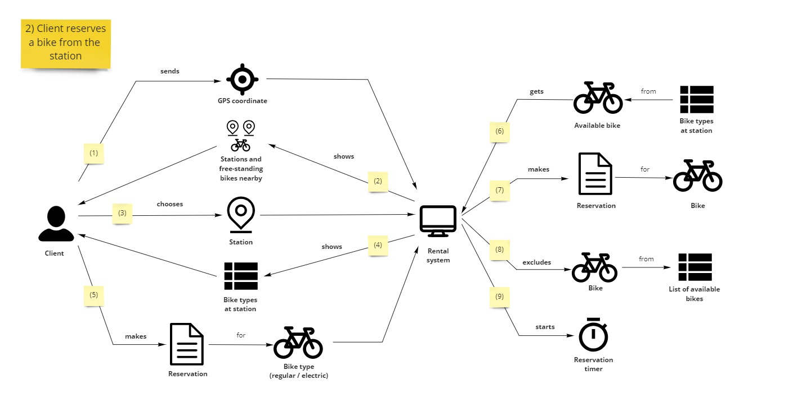
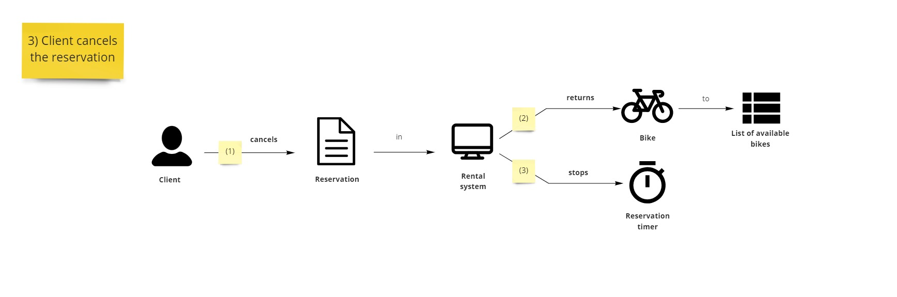

Kontynuujemy cykl o modelowaniu w Cosmos DB z rozmowami z biznesem i analizą ich potrzeb. Rozpoczynamy od początku, czyli od rezerwacji.

# Mapa miasta

Biznes przychodzi do nas ze szkicem, jak to wygląda u nich w głowie. Tutaj już pojawiają się dodatkowe trudności.

Na mapie widać klienta, a dokoła niego znaczniki z stacjami, rowerami i rowerami elektrycznymi. Dopytujemy się o szczegóły rezerwacji. Wynika z nich, że:

- istnieją różne modele rowerów - zwykłe i elektryczne
- ich rezerwacja nie różni się od siebie, ale koszt wynajmu elektrycznego jest wyższy
- rowery wypożycza się głównie ze stacji - na niej są dostępne różne modele rowerów 
- jeśli jednak ktoś nie zwrócił roweru na stację, to można taki wolnostojący rower wypożyczyć z danej lokalizacji
- rezerwację można anulować, albo sama się anuluje po pewnym czasie

Czyli z jednego zdania "Klient może rezerwować rower" mamy kilka złożonych scenariuszy biznesowych 😅 #ProzaŻyciaProgramisty

Zacznijmy to rozkładać na czynniki pierwsze.

# Rezerwacja roweru wolnostojącego

Pytamy się biznesu o rezerwację roweru, który z 2 scenariuszy jest prostszy. Biznes odpowiada, że rezerwacja roweru wolnostojącego:

- "Na początku uruchamiam apkę. Ona wysyła moją lokalizację i na tej podstawie dostaję mapę okolicznych stacji i rowerów. Potem klikam w dany rower i robię rezerwacje. Rower jest mój, więc system musi usunąć ten rower z listy dostępnych bo inaczej ktoś mi go zajmie."
- "A co z anulowaniem?"
- "A co z nim? 🤔"
- "Skąd będziemy wiedzieć kiedy anulować rezerwację?"
- "No powinien się jakiś licznik włączyć, czy coś, aby po kwadransie system wiedział, żeby tą rezerwacje anulować."

Składając tą konwersację w całość uzyskujemy następujący scenariusz #DomainStorytelling:

Pytamy się biznesu czy on tak to widzi - odpowiada, że jest git. Więc idziemy dalej.

# Rezerwacja roweru ze stacji

Drążymy dalej temat rezerwacji.

- "To jak sytuacja wygląda w temacie rezerwacji ze stacji?"
- "Jest tam jeszcze jeden krok pomiędzy. Jak w apce dostajemy mapę, to po kliknięciu stacji powinny mu się pokazać dostępne na niej rowery - elektryczne i zwykłe. Wtedy dopiero wybieramy rower i robimy rezerwację."
- "Czyli klient może wybrać sobie konkretny egzemplarz roweru ze stacji?"
- "To byłoby głupie - skąd on miałby wiedzieć, co oznaczają numery seryjne rowerów? Albo jeśli rowerów jest 20 to będzie się zastanawiać który kliknąć? Nie, lepiej jest mu tylko pokazać ile jest rowerów danego modelu. Np. elektryczny - 5 / zwykły - 3. On sobie klika, że chce elektryczny i system mu taki rower rezerwuje."
- "Ok, czyli klient prosi o rezerwację danego modelu, a system bierze pierwszy rower z danego modelu i go rezerwuje."
- "Owszem."

Zrzucając tą dyskusję na diagram uzyskujemy taki scenariusz:

Biznes po pokazaniu scenariusza mówi:

- "Czemu tam po stronie systemu jest tak dużo kroków?"
- "Jak klient prosi o model roweru to system musi wybrać konkretny egzemplarz i dopiero na tej podstawie tworzy się rezerwacja. Wcześniej nie wiemy jaki konkretny egzemplarz rezerwujemy."
- "To może niech aplikacja już wysyła konkretny egzemplarz z modelu?"
- "Tutaj mogą wyjść problemy - jeśli stacja ma wiele rowerów, a klient chwilę czekał, to jest duża szansa, że ktoś już ten rower zarezerwował. I klient dostanie błąd na twarz."
- "Hmm rzeczywiście. A na pewno nie chcemy mu pokazywać, że rowera nie ma, skoro jest 10 innych."

## Anulowanie rezerwacji

Pytamy się dalej, jak wygląda sprawa z anulowaniem rezerwacji.

- "Tutaj sprawa jest prosta. Jeśli klient chce, to może w ciągu kwadransa anulować rezerwację. Wtedy rower wraca do puli dostępnych rowerów."
- "I oczywiście musimy wyłączyć licznik rezerwacji."
- "To się rozumie samo przez się 🙄"

Biznes kontynuuje.

- "Jeśli zaś minie czas rezerwacji, to system sam anuluje rezerwację. Wtedy również rower wraca do puli rezerwacji. Dodatkowo trzeba również jakoś powiadomić klienta, że anulowaliśmy mu rezerwację."

- "I to chyba wszystko w rezerwacji..."

## Domain Storytelling post scriptum

### Ominięcie kroków

Scenariusz pierwszy nie posiada kroku z tworzeniem rezerwacji po stronie systemu, ale drugi już ją posiada. Czy nie powinniśmy dodać do pierwszego scenariusza tego kroku?

Możemy, ale nie musimy. **Domain Storytelling skupia się na opowieści i zbieraniu scenariuszy.** Pierwszy scenariusz jest bardziej trywialny i tam to rozróżnienie nie wnosi wiele do rozmowy. W drugim przypadku to rozróżnienie jest kluczowe. Inaczej wynikałoby, że dokonujemy rezerwacji na model roweru, a tak nie jest. 

Tutaj jestem otwarty na sugestie z waszej strony bo #tozależy

### Kwestie  (wcale nie)oczywiste 

Weźmy na tapet te dwa pytania do biznesu:
- "Czyli klient może wybrać sobie konkretny egzemplarz roweru ze stacji?"
- "I oczywiście musimy wyłączyć licznik rezerwacji."

Drugie z nich potwierdziło to co biznes uznawał za oczywiste. Jednak pierwsze z nich sprawiło, że odkryliśmy dość istotną zmianę w procesie biznesowym. Z perspektywy technicznej dla nas pewnie nie ma znaczenia, który scenariusz zrealizujemy. **Ale dla biznesu oczywiste było tym, co dla nas wcale oczywiste nie było.**

Dlatego podczas dyskusji z biznesem i tworzenia scenariuszy warto szczególną uwagę zwrócić na takie oczywistości. Pytać o kolejne przypadki by znajdować luki w naszym myśleniu. Lepiej teraz niż na prodzie 😉 