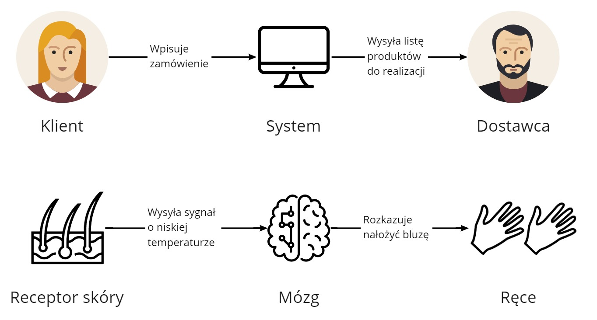
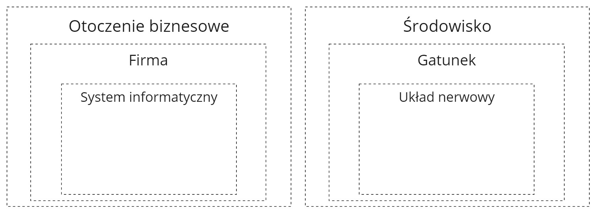

Wiele napisano o tym, dlaczego systemy informatyczne są trudne w budowie i utrzymaniu. Pozwólcie dołożyć do tego kilka słów ode mnie 😀 W mojej ocenie **ten problem wynika ze złej metafory**, jaką wykorzystujemy, myśląc o systemach informatycznych.

**Dla wielu osób system informatyczny to coś podobnego do mebla z Ikei**. Na początku dostajemy gotową paczkę elementów wraz z instrukcją. Składamy je razem i mamy szafkę (plus kilka nadmiarowych śrubek 😉). Niestety tworzenie systemu informatycznego jest kompletnie przeciwne.

Pora na inną metaforę, która odpowie nam dlaczego:

- nie ma identycznych systemów informatycznych,
- kopiowanie funkcjonalności jest trudne,
- integracje są takie trudne.

## Układ nerwowy a system informatyczny

System informatyczny, jak wskazuje sama nazwa, operuje na informacjach. To znaczy, że to co płynie przez system informatyczny to są pojedyncze porcje informacji. Wygląda to np. tak:

- Klient wpisuje zamówienie do systemu, 
- system przerabia zamówienie na listę produktów do realizacji, 
- na końcu dostawca widzi tę listę na ekranie i wie, co ma kompletować.

Informacje są wkładane, transformowane, grupowane. Jest baza danych z informacjami, są miejsca wejścia i wyjścia.

Możemy to porównać do tego, jak informacje są transportowane przez nasze ciało - **w układzie nerwowym**:

- Receptory skóry przesyłają informację do mózgu, że temperatura się obniża,
- na tej podstawie mózg podejmuje decyzję o założeniu dodatkowej odzieży,
- ręce dostają informację, że powinny założyć ciepłą bluzę (przez głowę!).

W naszym ciele mamy centralne miejsce gromadzenia i analizy informacji, różne receptory zbierające i reagujące na informacje oraz nerwy które te informacje przesyłają dalej.

A teraz rzecz najważniejsza.

## Dlaczego nie ma identycznych systemów informatycznych?

Systemy informatyczne są dostosowane do funkcji i potrzeb firmy, która go wykorzystuje. Firma zaś bazuje na otoczeniu biznesowym, w którym działa.

Analogicznie jest z układem nerwowym. Ten bazuje na danym gatunku i jego możliwościach. Dany gatunek zaś jest dostosowany do środowiska, w którym się znajduje. **Jeśli zaś porównamy układy nerwowe 2 różnych gatunków, np. człowieka i psa, to różni się praktycznie wszystko**:

- od tego jak mózg jest zbudowany i jak zarządza systemem nerwowym,
- przez to jakie informacje transportują nerwy, 
- po możliwości organów odbierających sygnały nerwowe. 
 
Nawet w przypadku tego samego gatunku różnice mogą być duże - nasze organizmy nie są do siebie bliźniaczo podobne. 

 Firmy również się różnią pomiędzy sobą. Inni klienci, różne systemy podatkowe, własne sposoby rozwiązywania podobnych problemów itd. **To powoduje, że systemy informatyczne firm nie są identyczne**. Każda z powyższych różnic to zmiana rodzaju informacji bądź sposobu ich przetwarzania informacji. A za tym idzie zmiana systemu informatycznego.

## Dlaczego kopiowanie funkcjonalności jest trudne?

Lub inaczej **"Dlaczego nie ma ludzi z nosami psów?"**

Weźmy na tapet najlepszego przyjaciela człowieka - psa. Pies posiada o wiele bardziej wyczulony węch, niż człowiek. Jest to spowodowane nie tylko posiadaniem lepszego narządu węchu, ale przede wszystkim bogatszą możliwością obróbki tych informacji przez mózg. Mózg rozpoznaje dziesiątki różnych bodźców z nosa i na ich podstawie wie jak zareagować. Funkcje nerwowe są przystosowane do możliwości i potrzeb psiego gatunku.

**Otóż aby człowiek mógł posiadać węch psa nie wystarczy mu tylko przeszczepić nos. Potrzebujemy przeorganizować cały system nerwowy dotyczący węchu.** Nerwy połączone do nosa musiałyby być dostosowane do większej liczby odbieranych bodźców, a mózg trzeba by nauczyć je interpretować. Co jest z obecnymi bioinżynieryjnymi możliwościami niemożliwe. I wyjaśnia dlaczego do tej pory do wykrywania narkotyków nie stosuje się ludzi z nosami psów.

Identycznie jest z systemem informatycznym. **Nie da się tak po prostu przenieść funkcjonalności A z systemu do systemu.** Ograniczają nas te same kwestie co powyżej:

- różny sposób wprowadzania informacji - proces biznesowy się różni, mamy inne biblioteki / frameworki, korzystamy z web / mobile,
- różny sposób gromadzenia i przetwarzania informacji - mamy inne procesy decyzyjne, różnimy się silnikami baz danych, modelem i nazwami pól,
- różny sposób ich udostępniania dalej - posiadamy inne sposoby wysyłania informacji do klientów, różnimy się wykorzystywanymi systemami zewnętrznymi.

Nawet drobna zmiana w polu _nazwisko_ z _second_name_ na _lastName_ potrafi wywrócić całą funkcjonalność biznesową systemu informatycznego.

## Dlaczego integracje są takie trudne?

Kilka tygodni temu pojawił się świetny artykuł na blogu Martina Fowlera [You Can't Buy Integration](https://martinfowler.com/articles/cant-buy-integration.html):

> Despite a wide range of tools that aim to simplify wiring systems together, you can’t buy integration.

który dokładnie pasuje do metafory układu nerwowego jako systemu informatycznego.

Otóż integrację można postrzegać jako przyszycie kończyny (np. dłoni), gdy ktoś uległ wypadkowi. Nie można po prostu przyczepić 2 części ciała. Najtrudniejszą sprawą w takich operacjach jest odpowiednie połączenie nerwów. **Odpowiednia transmisja informacji jest kluczowa, aby nowa część organizmu połączyła się z resztą.** Bez tego możemy mieć dłoń, ale nie będziemy w stanie nią ruszać.

Tak też to wygląda w przypadku wykorzystywaniu gotowych komponentów w systemach informatycznych. Jeśli chcemy np. wykorzystać bramkę [stripe](https://stripe.com/en-gb-pl) do płatności internetowych to nie wystarczy nam tylko ją dodać na stronę. **Integracja musi się bezbłędnie łączyć z naszym systemem** - mieć ten sam model komunikacji, nazewnictwo pól, adaptować się do naszego procesu biznesowego. Wszystkie małe drobiazgi muszą działać, bo inaczej na którymś etapie wystąpi błąd. I niemiłe debugowanie.

A jeszcze gorzej wygląda, jak mamy wiele zewnętrznych integracji. Kto nie miał problemu z różnym nazewnictwem pól adresów _firstLine_ / _street_ / _streetName_ pomiędzy systemami? Nagle mamy 10 różnych modeli i sposobów działania.

Wykorzystanie zewnętrznego komponentu wymaga odpowiedniego dopasowania go do naszego systemu. A na to trzeba czasu i nie jest to rzecz, którą zawsze da się wykonać. Albo powstanie nam Frankenstein 😉

## Podsumowanie

Myślenie o systemach informatycznych jako o meblach, które można składać wg instrukcji jest błędne. Przysporzyło nam dużo problemów w przeszłości. Mam nadzieję, że ta metafora będzie lepszym sposobem myślenia o systemach. Takim, które pokazuje z jak skomplikowanym tworem mamy do czynienia.

Trafiła do Ciebie ta metafora? Daj znać w komentarzu 😀

