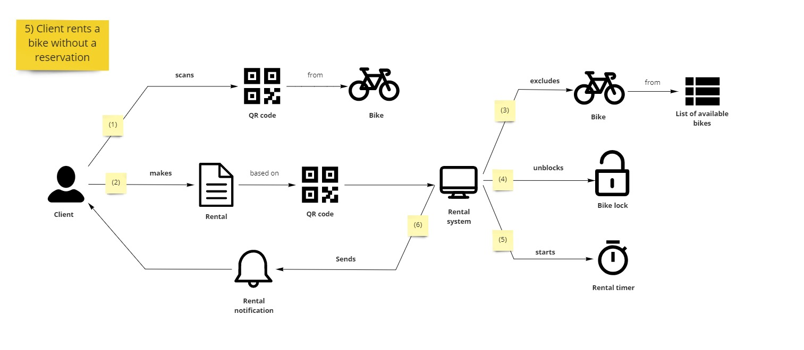
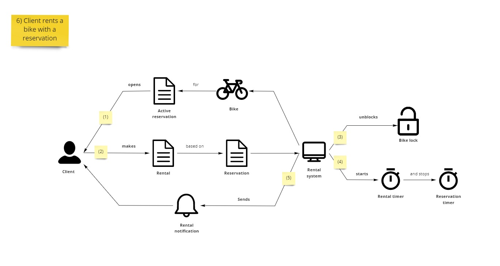

Kontynuujemy cykl o modelowaniu w Cosmos DB, na podstawie rozmów biznesem i analizą ich potrzeb. Po rezerwacjach przechodzimy do obszaru wypożyczeń.

## Wypożyczenia bez rezerwacji

Pytamy się biznesu, jak wygląda kolejny obszar biznesowy.

- "Skoro mamy już rezerwację, to teraz pora na wypożyczenia, prawda?"
- "Tak, mamy tutaj dwa scenariusze. Rozpocznijmy od tego niewymagającego rezerwacji. Klient podchodzi i skanuje kod z roweru. Na tej podstawie wypożycza rower, a system odblokowuje kłódkę rowerową. Potem powinno mu się wyświetlić jakieś powiadomienie, że wszystko jest OK."
- "Świetnie. Czy tutaj mamy jakiś licznik czasu wypożyczenia?"
- "Tak, chociaż o wiele dłuższy. Można wynająć rower na 24 godziny. Później przychodzi ostrzeżenie, a klient płaci karę."

Przy pokazaniu diagramu wspominamy biznesowi jeszcze o liście dostępnych rowerów.

- "Podczas rezerwacji wyłączaliśmy rower z listy dostępnych. Jeśli dobrze rozumiemy, to tutaj musimy zrobić analogicznie, prawda?"
- "Rzeczywiście - rower wynajęty również musi zniknąć z listy. Inaczej ktoś mógłby spróbować zarezerwować ten rower."

## Wypożyczenie z rezerwacją

Kontynuujemy z drugim scenariuszem.

- "Tutaj klient najpierw wyświetla aktywną rezerwację. Na jej podstawie przeprowadza wypożyczenie. Później jest podobnie - odblokowujemy kłódkę, ustawiamy licznik czasu, wysyłamy powiadomienie o wypożyczeniu."

Biznes nieco zdziwiony dodaje...
- "Hmm, umknął nam ten licznik czasu rezerwacji."
- "To drobnostka. Pewnie nic wielkiego by się nie stało, ale system mógłby błędnie zgłaszać klientowi anulowanie rezerwacji, która jest już zrealizowana."
- "A tego zdecydowanie nie chcielibyśmy."

## Domain Storytelling postscriptum 

### Budowanie przez analogię i różnice

- "Jeśli dobrze rozumiemy, to tutaj musimy zrobić analogicznie, prawda?"

Takie proste zdanie, a pozwoliło nam odnaleźć kolejną oczywistość w scenariuszu biznesowym. Moglibyśmy się również spytać przez zaprzeczenie.

- "Zastanawiamy się, dlaczego tutaj nie wykluczamy roweru z listy dostępnych?"

**Tego rodzaju pytania są wartościowe by odnajdywać podobieństwa i różnice w scenariuszach biznesowych.** Na ich podstawie możemy znajdować wspólne ścieżki, które następnie będą realizowane jedną procedurą programistyczną.
Lub odnajdywać istotne różnice, które doprowadzą nas do innej implementacji w systemie.

### Domknięcie procesu

Przechodząc przez kolejne scenariusze biznesowe zwykle otwieramy kolejne tematy. Ale kiedyś trzeba również je domknąć. **Mając kolejne scenariusze można zrobić porównanie poszczególnych komponentów, by znaleźć dziury.**

Licznik czasu rezerwacji jest tutaj dość prostym przypadkiem - uruchamiamy licznik i mamy 2 wyjścia:

- musimy go wyłączyć
- sam zgłosi zakończenie czasu

W ten sposób znaleźliśmy niezakończony proces, który później musielibyśmy łatać na szybko. Jednak z tą techniką można osiągnąć o wiele więcej:

- określić dodatkowe scenariusze brzegowe - możliwe, że chcemy znajdywać osoby, które notorycznie przekraczają czas rezerwacji
- zaproponować bardziej przyjazne użytkownikowi scenariusze - przypomnieć klientowi o końcu rezerwacji

Zarówno my, jak i ostateczni klienci, będziemy bardziej zadowoleni 😎