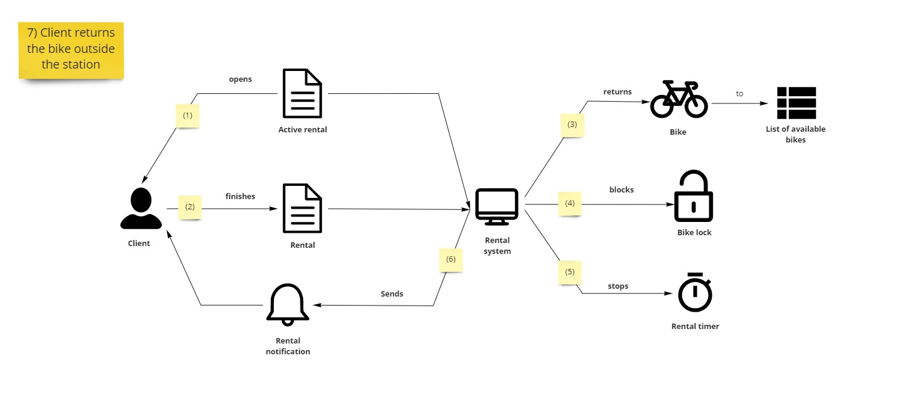
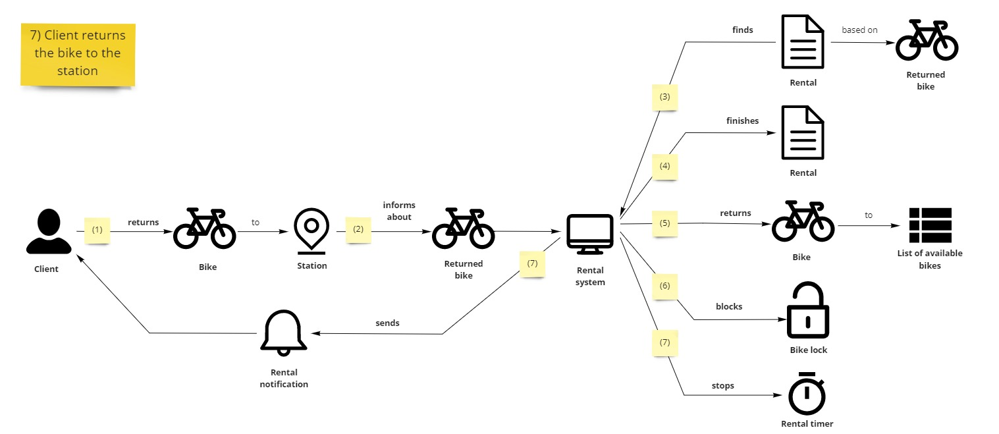
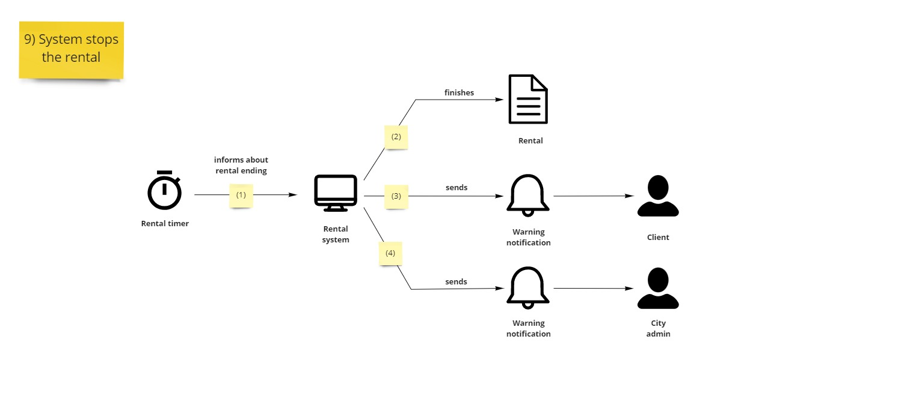

Kontynuujemy cykl o modelowaniu w Cosmos DB. W  tym odcinku skończymy analizę potrzeb biznesowych obszarem zwrotu wypożyczonych rowerów.

W kolejnych odcinkach przejdziemy do analizy scenariuszy pod kątem wymagań bazy danych 💻

## Wypożyczenia bez rezerwacji

Biznes wspomina o ostatnim obszarze - zwrotach, i pierwszym scenariuszu:

- "No to pora zakończyć naszą opowieść zwrotem roweru. Na początek zwrot poza stacją. Pomimo, że to dodatkowo kosztuje, to i tak klienci się na to zgadzają."
- "Czyli zatrzymuję rower, i co dalej?"
- "Otwierasz aplikację i aktywne wypożyczenia."
- "A to można mieć naraz kilka wypożyczeń?"
- "A czemu nie? Możesz wypożyczyć rower dla siebie i dzieci. Kiedy masz już aktywne wypożyczenie to wybierasz właściwe i je kończysz. System zwraca rower do listy dostępnych rowerów. Następnie blokuje kłódkę rowerową."

Nawiązując do poprzednich diagramów dodajemy licznik czasu i powiadomienie. Biznes kiwa głową i przechodzi dalej.

## Wypożyczenie z rezerwacją

Kontynuujemy z drugim scenariuszem.

- "Ok, to teraz druga opcja zwrotu - na stacji. Tutaj jest nieco inaczej. Klient podjeżdża na stację i wpina rower w wolne miejsce. Na tej podstawie system kończy wypożyczenie na dany rower."
- "Hmm, a czemu nie można po prostu otworzyć aktywnych wypożyczeń w apce i zwrócić rower?"
- "Ponieważ to w rzeczywistości nie jest proste. Jak potwierdzimy, że rower jest na stacji? Stacja i tak musi wysłać informację o odebraniu rowera. Dodatkowo, skoro mamy rower i stację, to czemu zmuszać klienta do otwierania aplikacji?"
- "Rzeczywiście. Co się dzieje dalej?"
- "Dalej jest w sumie identycznie jak poprzednio - zwrot na listę dostępnych, blokada kłódki, licznik i powiadomienie."

Wracamy z diagramem, dodając jedną ścieżkę:
- "Po wysłaniu informacji o rowerze ze stacji nie da się tak po prostu zakończyć wypożyczenia. Najpierw musimy dostać wypożyczenie na bazie zwracanego roweru. System sam z siebie nie będzie wiedział do jakiego wypożyczenia należy dany rower."
- "Słuszna uwaga. My założyliśmy, że stanie się to automagicznie 😁"

## Automatyczne zakończenie

Biznes rozpoczyna ostatni scenariusz:
- "Pora na automatyczne zakończenie wypożyczenia. Tutaj nie ma wielkiej filozofii. Po tym, jak upłynie czas na wypożyczenie (24 godziny), to kończymy automatycznie wypożyczenie. Następnie powiadamiamy klienta, a także pracowników administracji."
- "Czy nie powinniśmy również zablokować kłódki w rowerze?"
- "Niech was ręka boska broni by pisać taki kod 😱 Załóżmy, że ktoś tym rowerem jedzie. Przecież to mogłoby nawet zabić naszego klienta."
- "Co racja to racja."

## Domain Storytelling postscriptum 

### Dodatkowe ścieżki

> Najpierw musimy dostać wypożyczenie na bazie roweru. System sam z siebie nie będzie wiedział do jakiego wypożyczenia należy dany rower.

Patrząc na kolejne etapy scenariusza możemy zauważyć luki i potrzebę dodatkowych ścieżek:

- Aktor / System dostaje informację ABC
- Aktor / System przetwarza informację CDE
- ABC != CDE
- Brakuje kroku mapującego ABC->CDE

Nie zawsze jest potrzeba dodawania takiego kroku, ale w przypadku powyżej ten krok ułatwia zrozumienie pracy systemu oraz pokazuje dodatkową złożoność.

### Drobne akcje i głębokie konsekwencje

Zablokowanie kłódki przy automatycznym zakończeniu wypożyczenia wydaje się dobrym pomysłem. Ale czasem dobre pomysły mają bardzo złe konsekwencje. Jeśli odległość pomiędzy biznesem a osobami technicznymi byłaby zbyt wielka, to możliwe, że taka zmiana weszła by na produkcję.

Alberto Brandolini na jednej prezentacji powiedział:

> Programmers make 1 million dollar decisions, without even knowing it.

Czasem na szali jest nawet ludzkie życie 🧑👩