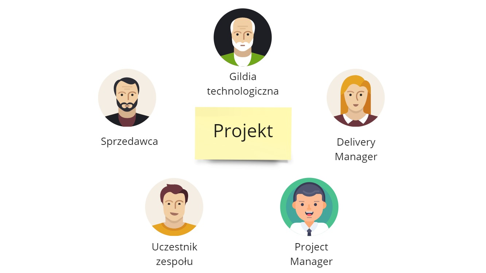

W trakcie mojej kariery zawodowej pracowałem w kilku software house’ach, pomagałem kilku kolejnym, znam kilkanaście więcej. **I w każdym jest ten sam problem – jak dobrze zarządzać wiedzą odnośnie projektów w firmie.** Na pierwszy rzut oka wydaje się to proste. Tworzymy Excel, czy wykorzystujemy do tego jakiś prosty edytor w Sharepoincie. Jak projekt pojawia się na horyzoncie to dodajemy go do narzędzia, a następnie w miarę postępu aktualizujemy o kolejne dane. Na końcu mamy gotowy zbiór informacji co jak poszło. Tak przynajmniej jest w założeniach...

I na założeniach się kończy. **W żadnej z tych firm nie słyszałem o dobrym podsumowaniu informacji związanych z  projektami jakie działy się, dzieją się, będą się dziać w firmie.** W każdej z firm informacje są rozsiane po dziesiątkach grup i plików, w której używa do tego innych narzędzi i trzyma te dane w innym formacie. Co gorsza te grupy rzadko się ze sobą się komunikują. Potęguje to poczucie zamieszania i brak jasnej informacji:

- co my w zasadzie zrobiliśmy,
- czym się możemy chwalić,
- czy coś podobnego już u nas nie było.

I szczerze mówiąć, w ogóle mnie to nie dziwi. A jest tak dlatego, ponieważ **obszar projektów jest z punktu widzenia DDD jedną z najbardziej skomplikowanych domen** z jaką się możecie spotkać w otoczeniu Software House’ów.

## Projekty – różne wymiary
Obszar projektów można podzielić na kilka wymiarów, które czasami są wliczane w projekty, a czasami nie. Rozpocznimy od obszarów informacyjnych:

- Informacje podstawowe – dla jakiego klienta, potrzeby biznesowe, od kiedy, do kiedy.
- Skład osobowy -  kto tam występuje, od kiedy do kiedy, z jakimi umiejętnościami.
- Finansowy – stawka, ilość spędzonych godzin dla danego klienta, koszty i zyski.
- Techniczny – jakie technologie w projektach, od kiedy do kiedy, co zadziałało.
- Biznesowy – jakie obszary biznesowe (e-commerce, lotnictwo, finanse, systemy rekomendacji).

Można też patrzeć na projekty z perspektywy czasowej:

- Daleko na horyzoncie - wstępne leady, ogólna znajomość technologii i kształtu projektu
- Oferta na stole - propozycja dla klienta, wraz z szacunkowym startem, technologiami oraz osobami w projekcie
- Zakontraktowane projekty - wiemy dokładnie kiedy rozpoczynamy  i jakim zespołem
- Projekty w trakcie - zmiany technologi, uczestników, zakresu, terminu (w zasadzie zmiany wszystkiego 😉) 
- Historia - domykanie projektów, wnioski i lessons learnt, pozyskane case study

## Różne role dookoła projektów

Można też patrzeć na podstawie interesariuszy i informacji, których wymagają do pracy. Każda z grup interesuje się innym zakresem informacji projektowych:

- Sprzedawca – szansa sprzedaży projektu, możliwości finansowe klienta, możliwe technologie (na wysokim poziomie), biznesowe case study dostarczonych projektów, techniczne case study z danych obszarów, możliwości upsellowe / cross sellowe.
- Delivery Manager – umiejętności pracowników i ich przypisania do zespołów by formować nowe zespoły, ogólny stan projektu by móc reagować gdy coś idzie nie tak, długoterminowe wnioski, ROI.
- Project Manager – status projektu (z perspektywy dostarczenia), zarządzanie pracownikami danego projektu, ilość przepracowanych godzin, notatki ze spotkań, poszukiwanie dodatkowych osób, obszary biznesowe.
- Członek zespołu – aktualizacja umiejętności na podstawie doświadczenia z projektu, zgłaszanie problemów, sprawdzanie technologii innych projektów by poszukać kogoś do pomocy.
- Gildia technologiczna – używane technologie (dokładniej), plany na modernizacje, wprowadzane nowinki, rekomendacje, przeprowadzane Proof of Concept.

**Każda z ról dookoła projektów potrzebuje innego zestawu informacji by działać efektywnie.** A to powoduje, że kształtuje informacje na swój sposób, nie patrząc na pozostałe role.

Dla sprzedażowca nie ma znaczenia czy w projekcie będzie w Angular w wersji 5 czy 13 bo może opowiedzieć potencjalnemu klientowi, że projekty w Angularze się toczą w firmie. Gildia technologiczna będzie już jednak zaniepokojona, że używamy starszych technologii i jaki jest plan na podniesienie wersji.

Project Manager chce wpisywać wszystkie możliwe problemy i akcje w ramach projektu. Dla Delivery Managera taka szczegółowość może być problematyczna. Ta rola woli operować na o wiele wyższym poziomie informacyjnym.

I na pewno nie pomaga tutaj, że w każdej firmie te role robią coś innego i znaczą coś innego 😀

## Różnice ilościowe

Różnice będą się też pojawiać na poziomie ilościowym. **Nie każdy projekt z punktu widzenia jednej grupy będzie tym samym projektem z punktu innej.** 

Możemy mieć np. kilkumiesięczny projekt, który dla sprzedażowców rozpoczął się i zakończył pomyślnie. Dla gildii technologicznej mogły tam być np. dwa Proof of Concepts, które dopiero finalnie skończyły się trzecim projektem. Wtedy zmapowanie jednego w drugie nie jest prostą relacją 1-1.

Podobnie może być z pracownikiem. Z perspektywy samego pracownika jest on po prostu przypisany do projektu. Ale z perspektywy PMa jego czas może być rozdzielony na kilka mniejszych projektów, z których każdy jest osobno rozliczany z klientem. Wtedy de facto mamy różnych pracowników, każdy po 1/4 FTE.

## Różnice w spojrzeniiu

To wszystko wyżej przekłada się na różnice w patrzeniu na te same informacje. Każda z grup będzie inaczej myślała o projekcie i aspektach z nim związanych. Stąd będzie bardzo dużo niejasności, pomyłek i nieporozumień.

Delivery Manager chce móc szybko ocenić kompetencje osob zaangażowanych w projekty. Tworzy więc prostą tabelkę z listą różnych technologii i prosi osoby o samoocenę. Jednak pracownicy się buntują - co to znaczy, że ja jestem 4-gwiazdkowym Azurowcem?

Sprzedawca będzie mówił na zewnątrz, że mamy super projekty w Azure. Ale gildia technologiczna nie będzie tak uważała - co to za projekty co siedzą na VMkach i nie wykorzystują PaaSa? Rozmowa tych dwóch grup o umiejętności Azure niechybnie skończy się kłótnią.

## I teraz software

Otóż system informatyczny rozumiany jako

- miejsce do zbierania informacji o projektach
- procesy gromadzenia i przetwarzania tej wiedzy

musiałby brać pod uwagę wszystkie powyższe wymiary i niuanse. I zwykle nie udaje się stworzyć takiego systemu. Zbyt dużo uczestników, zbyt wiele spojrzeń, zbyt mało oczywistych rozwiązań. A przede wszystkim zbyt mało czasu by to wszystko ogarniać. 

Ten post potraktuj proszę jako zaproszenie do rozmowy - jak to wygląda u Ciebie w firmie? 🙂

