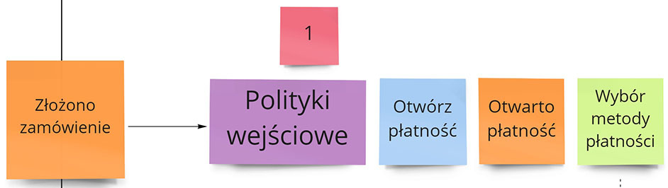

[Bounded Context](http://localhost:1313/2018/07/18/dlaczego-bounded-contexty-sa-wazne-wprowadzenie/) to sposób podziału systemu na oddzielne obszary biznesowo-techniczne. Świetnie tę koncepcję zwizualizował Nick Tune w swoim [Bounded Context Canvas](https://github.com/ddd-crew/bounded-context-canvas):

Powstaje jednak pytanie jak pokazać procesy wewnątrz takiego Bounded Contextu.



## Skąd potrzeba

Załóżmy, że mamy taki proces biznesowy:

- Posiadamy BC _Płatności_, który przeprowadza proces płacenia za zamówienie
- BC otrzymuje zdarzenie _Złożono zamówienie_, a odpowiada _Przeprowadzono płatność_ lub _Płatność odrzucona_
- Wewnątrz BC chcemy mieć wybór metody płatności, procesowanie płatności przez bramkę, obsługę błędów, powtarzanie płatności itd.

Przez długi czas czułem, że **brakuje tutaj kroku pośredniego pomiędzy Event Storming Process, a Design Level**:

- Process Level - przechodzimy przez cały proces, rozpisując pracę całego systemu - wtedy nie chcemy zajmować się detalami danego modułu.
- Design Level - wchodzimy na poziom agregatów i modelowania danych - wtedy łatwo skupić się na agregatach / encjach / VO a nie na procesie wewnątrz BC.

Jeśli chcemy pokazać pracę wewnątrz BC i na jego granicy, to musimy zrobić coś pośredniego. Pomyślałem, aby takie podejście nazwać inaczej - by mieć definicję, na podstawie której mogę łatwiej rozmawiać z moimi klientami i kolegami.

Stąd powstał ogólny termin **Event Storming - Bounded Context Level**.

## Od czego rozpocząć

To podejście stosujemy, gdy:

- Przeprowadziliśmy Event Storming Process Level i mamy ogólny proces działania naszego systemu.
- Wstępnie zaplanowaliśmy kształt naszego BC - np. na podstawie Bounded Context Canvas.

Tak mógłby wyglądać nasz ES PL i BCC dla procesu płatności:

Oczywiście po głębszej analizie procesu te granice mogą się zmienić. Jest to jednak dobra podstawa by dalej rozpisywać procesy wewnętrzne.

## Event Storming - Bounded Context Level

Poniżej mamy przykładowy wygląd modułu Płatności, jaki moglibyśmy uzyskać podczas takiej sesji: 

Obsłużyliśmy:

- Otwarcie płatności
- Wybór metody płatności
- Komunikację z systemami zewnętrznymi
- Odrzucenie płatności
- Licznik maksymalnej ilości czasu na płatność

Wygląda to podobnie jak Event Storming Process Level, z 4 różnicami:

### 0. Podział na zewnątrz i wewnątrz

Na diagramie mamy jasno wyznaczoną granicę tego, czym jest BC płatności. Wszystko, co jest wewnątrz tego BC jest niewidoczne na zewnątrz - zdarzenia, polityki, akcje. Kontraktem komunikacyjnym są jedynie elementy leżące na brzegu BC.

### 1. Obsługa zdarzenia zewnętrznego

Gdy przychodzi do nas zdarzenie zewnętrzne to musimy użyć polityki aby odpowiednio je obsłużyć. W tym momencie otwieramy proces wewnętrzny, który przeprowadzi klienta przez proces płatności. Budujemy dzięki temu rozróżnienie na to jaki jest kontrakt zewnętrzny, a jaki ma on na nas wewnętrzny wpływ.

### 2. Mapowanie wyjściowego zdarzenia pozytywnego

Kiedy zakończymy wewnętrzny proces płatności to chcemy powiadomić o tym świat wewnętrzny. Można wypuścić na zewnątrz nasze bazowe zdarzenie, ale nie zawsze to jest dobra opcja:

- zdarzenie jest zbyt drobiazgowe
- zdarzenie nie posiada wszystkich wymaganych danych
- zdarzenie może być niezrozumiałe spoza modułu

Wtedy dobrym pomysłem jest zamiana zdarzenia wewnętrznego na zdarzenie zewnętrzne. Posiada ono inny kształt - ma dane dostosowane do naszego słuchacza, a nie na potrzeby naszego wewnętrznego procesu.

### 3. Mapowanie wyjściowego zdarzenia negatywnego

Analogicznie postępujemy podczas zdarzeń negatywnych, które mają natychmiastowo zakończyć proces. Możemy mieć kilka różnych miejsc, gdzie nasz proces się kończy. Wtedy posiadanie jednego translatora negatywnego ułatwia i spłaszcza komunikację zewnętrzną. Dla naszego klienta rozróżnienie powodu odrzucenia płatności na 2 różne zdarzenia może być niepotrzebne.

## Podsumowanie

Technika Event Storming na poziomie Bounded Context pozwala nam zaplanować dokładnie pracę danego modułu. Możemy skoncentrować naszą pracę nad jednym obszarem, odkładając pozostałe obszary na bok. Jednocześnie nie wchodzimy na poziom technicznych agregatów. Pozwala to trzymać dyskusję na poziomie biznesowym i włączać do dyskusji osoby takie jak Product Manager, testerzy, analitycy.

Akceptuję, że część z was traktuje to co opisałem wyżej jako element ES PL. Pewnie część traktuje powyższe jako element ES DL. No cóż, nie łudzę sięc że przekonam każdego 😀