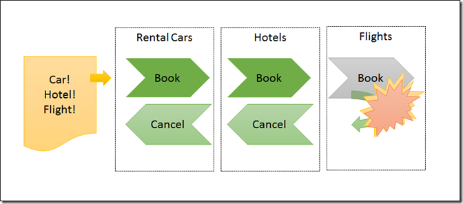
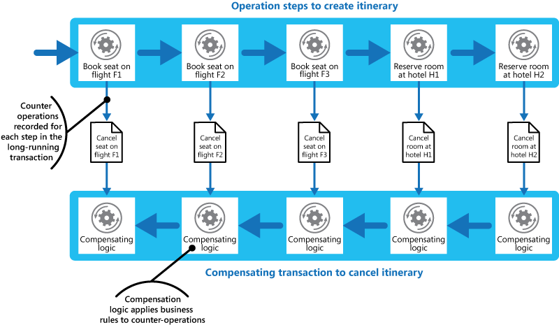

Kluczowe procesy biznesowe rzadko kiedy są proste. Np. dla procesu zakupowego w większym sklepie online:
- tworzymy zamówienie dla klienta
- odpytujemy systemy zewnętrzne o stany magazynowe
- przypisujemy konkretne produkty do zamówienia
- przeprowadzamy płatność
- generujemy dokument sprzedaży

Zwykle wtedy dzielimy taki proces na mniejsze części. Następnie w systemie informatycznym realizujemy je jako osobne kroki.

Jednak zawsze może nastąpić błąd (zarówno biznesowy, jak i techniczny). W takim razie, z punktu widzenia konkretnego procesu, trzeba umieć ten błąd obsłużyć. Nie chcemy skończyć z rozpoczętym procesem, który nie został zakończony.

Z punktu widzenia technicznego:
- rozproszony proces biznesowy nazywany jest **sagą**
- obsługa problemów w tym procesie nazywana jest **transakcją kompensującą**.

W większości artykułów transakcje kompensujące w sagach są opisywane w identyczny sposób - dokonujemy zawrócenia całego procesu ([1](http://vasters.com/archive/Sagas.html), [2](https://docs.microsoft.com/en-us/azure/architecture/patterns/compensating-transaction)):

I **to jest dramat**, moi drodzy. Żaden biznes nie pracuje w takim stylu.

## Antybiznes

Wyobraźmy sobie taką sytuację - przychodzi do nas biznes i pyta się co się stało z zakupem klienta. Odpowiadamy:
- Klient złożył zamówienie, gdzie mamy:
    - Telewizor za 10 tys.
    - Wieża Hi-Fi za 5 tys.
    - Laptop za 10 tys.
- Klient zapłacił za wszystko
- Rozpoczęliśmy blokowanie towarów do wysyłki
- Okazało się, że tej wieży już nie ma na stanie
- Więc wszystko zawracamy - zwracamy kasę i anulujemy zakup
- Biznes płacze 😭😭 

Jak przeczytamy sobie na głos te kroki to **zawracanie procesu biznesowego brzmi absurdalnie**. Więc czemu w ten sposób jest opisywana większość transakcji kompensujących?

Nie wiem.

## Spójność to problem biznesowy

My, jako osoby techniczne, mamy skłonność do myślenia o procesach biznesowych jako o czymś, co powinno być zawsze spójne. Robimy transakcję i chcemy, aby udała się ona 0-1. Albo całość, albo w ogóle. Tylko że to nie jest podejście biznesowe.

Kacper Gunia na [konferencji Explore DDD](https://www.youtube.com/watch?v=a1pRsAi9UVs) powiedział pewną myśl, która bardzo mocno do mnie trafiła.

> Consistency is a business problem

 **To, co robić, gdy mamy niespójność, to nie jest problem techniczny.** Biznes z takimi problemami styka się na co dzień. I ma na to gotowe odpowiedzi. Dopóki nie było komputerów to większość procesów biznesowych było niespójnych.

Rozmawiając na poziomie biznesowym z resztą zespołu możemy odkryć, że:

- Oni już mają ten problem rozwiązany
- Dla nich ten problem to nie jest problem, tylko okazja
- Możemy łatwo ten problem zminimalizować

## Jak to robią inni

Swojego czasu kupowałem sobie sprzęt komputerowy na Morele. Wybrałem, zapłaciłem i czekałem. Po 2-3 dniach zadzwonił telefon. Miła pani z Morele powiadomiła mnie, że przedmiotu nie ma. Przeprosiła i zaproponowała inny przedmiot po niższej cenie. Była to dobra okazja, więc się zgodziłem.

Z punktu widzenia technicznego proces się nie zawrócił. **Przenieśliśmy podjęcie decyzji do komponentu białkowego (człowieka).** Bardzo wiele firm postępuje w ten sposób.

Podobnie działa Amazon w dwóch obszarach:

- Kindle - wysyłamy książki, nawet jeśli płatność się nie powiedzie.
- Sklep Amazon - sprzedajemy towar, bazując na ogólnym stanie towarów, bez dokładnej informacji, ile ich jest + obsługujemy sprzedane braki.

Można się zastanowić - dlaczego firmy tak robią? Czemu nie dbają, aby wszystko było spójne? **Otóż przy pewnej skali nie da się zachować spójności.** Zawsze się coś nie uda. A lepiej jest coś sprzedać, nawet po niższej cenie, niż nie sprzedać nic.

## Ostateczna spójność

Biorąc pod uwagę to, co powyżej, musimy inaczej podejść do wdrażania procesu biznesowego w naszym kodzie. Trzeba inaczej zaplanować kształt procesu, aby brał pod uwagę możliwe problemy.

Możemy sobie w tym momencie zadać następujące pytania:

1. Jaka jest szansa na niepowodzenie procesu?
2. Jakie problemy możemy zaakceptować?
3. Czy możemy inaczej ustawić proces biznesowy?
4. Czy możemy zrealizować dodatkowe akcje?
5. Jak szybko proces musi się zakończyć?
6. Jak powiadomimy klienta, że coś się nie powiodło?

Pozwoli to nam tworzyć bardziej odporne procesy, zarówno ze strony technicznej, ale przede wszystkim biznesowym.