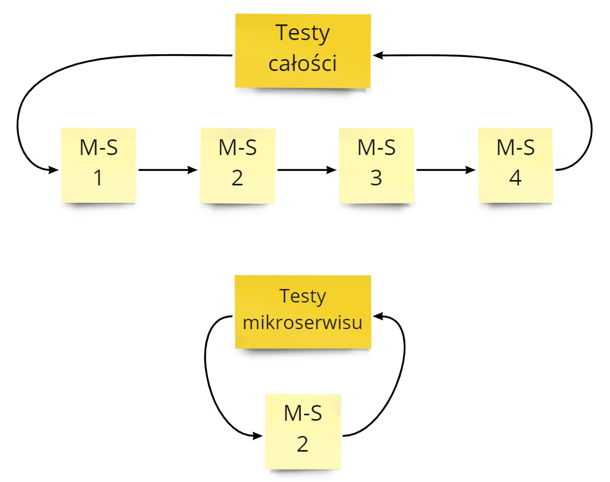

Mikroserwisy to skomplikowany wzorzec zarówno pod względem implementacyjnym, jak i testowym. Dodatkowa warstwa techniczna utrudnia skorzystania z "starych sprawdzonych metod testerskich", zwiększa różnorodność, wymaga dodatkowej wiedzy o tym wzorcu.

Jednak pytanie "Dlaczego testowanie mikroserwisów jest trudne?" zawiera drugie dno. **Pod pytaniem o testowanie mikroserwisu kryje się pytanie "Co w rzeczywistości testujemy?"**. Jakie scenariusze bierzemy pod uwagę? Gdzie się kończy cudza odpowiedzialność i zaczyna nasza? I tutaj myślę, że leży główna odpowiedź na tytułowe pytanie.

A więc by odpowiedzieć na nasze pytanie:

- przyjrzymy się codziennej praktyce testów mikroserwisów,
- znajdziemy dziury w standardowym podejściu do testów,
- wejdziemy w złożoność przypadków testowych,
- odpowiemy sobie na pytanie co można robić lepiej.

Tłem dla tego artykułu będzie cykl tweetów Gergely'ego Orosza. Zmiana w serwisie zewnętrznym, z którego korzystał Uber, spowodowała duże straty finansowe firmy:



## Codzienna praktyka testów mikroserwisów

Jak tworzymy większy serwis informatyczny, to naturalnie dzielimy go na mniejsze mikroserwisy. Chcąc mieć pewność, że całe rozwiązanie działa możemy przetestować automatycznie:
1. całość - sprawdzamy działanie od A do Z.
2. poszczególne mikroserwisy - wtedy sprawdzamy czy dany mikroserwis odpowiednio realizuje część procesu biznesowego.

Pierwsze rozwiązanie jest stosowane tylko w ograniczonym zakresie. Przetestowanie wszystkich przypadków dla całego rozwiązania jest w większym systemie niemożliwe.

Drugie rozwiązanie jest o wiele częściej spotykane. Polega ono na tym, że:

- Nasz proces biznesowy dzieli się na mniejsze części, obsługiwane przez pojedyncze mikroserwisy.
- Mniejsze części procesu biznesowego stają się dla nas przypadkami testowymi.
- Dla tych przypadków testowych piszemy testy automatyczne dla danego mikroserwisu (jednostkowe / integracyjne / komponentowe / inne).
- Takie testy uruchamiamy przed każdym wdrożeniu. 
- Gdy test przejdzie, to znaczy, że jesteśmy gotowi do wdrożenia.

**Praca w drugim podejściu zakłada, że działamy na zasadzie puzzli. Nasze testy wzajemnie się zazębiają.** Wyjście mikroserwisu A jest następnie wejściem do mikroserwisu B. Testowanie poszczególnych części daje nam pewność, że całość działa.

Tak zakłada teoria. Praktyka mówi, że przetestowany mikroserwis po wdrożeniu wygląda tak:

## Gdzie leży problem?

Cały problem wynika z naszej naiwności dotyczącej testowania mikroserwisu.

Załóżmy, że testujemy automatycznie scenariusz biznesowy:
- Mikroserwis dostaje wiadomości W1, W2, W3
- Po trzeciej wiadomości mikroserwis powinien zwrócić rezultat R1

Można by to napisać jako funkcję:
f({W1, W2, W3}) = R1
i w taki sposób napisać test automatyczny. Robota skończona, można się rozejść.

**Jednak tutaj robimy 2 ogromne założenia:**
1. Zawsze na wejściu mamy {W1, W2, W3}
2. Mikroserwis zawsze dla {W1, W2, W3} zwróci R1

Tylko wtedy nasz test ma rację bytu. A rzeczywistość pokazuje, że te 2 założenia w 99% sytuacji nie są spełnione.

### Założenia wejściowe

> Zawsze na wejściu mamy {W1, W2, W3}

Wejście do testu naszego mikroserwisu to 3 wiadomości. A te wiadomości pochodzą z serwisów zewnętrznych. My zaś **nie mamy wpływu w naszym mikroserwisie na świat zewnętrzny**. Wobec czego w teście zakładamy, że:

1. Wiadomości przyjdą do nas.
2. Wiadomości przyjdą do nas w konkretnej kolejności.
3. Wiadomości przyjdą do nas z pożądanymi wartościami.

Pytanie - czy mamy pewność, że mikroserwisy komunikujące się z nami spełniają to założenie?

Jeśli nie to w teście:

1. Musimy obsłużyć braki wiadomości np. {W1}, {W2, W3} - mamy 6 przypadków.
2. Musimy obsłużyć inne kolejności wiadomości np. {W1, W3, W2}, {W3, W2, W1}, ale także {W3, W2} - to nam zwiększa liczbę przypadków do 15.
3. Musimy obsłużyć różne wartości w wiadomościach. To absurdalnie zwiększa liczba przypadków. Np. załóżmy, że wiadomości mogą przyjąć wartość 0 lub 1. Wtedy mamy przypadki np. {W1=1, W2=1, W3=1}, {W3=0, W2=1}. Jeśli policzyłem dobrze to mamy 78 przypadków.

**78 przypadków.** To wszystko biorąc pod uwagę, że nie bierzemy pod uwagę duplikatów wiadomości. Wtedy w ogóle "sky is the limit" 🤣

Oczywiście, duża część przypadków będzie nierozróżnialna dla naszego mikroserwisu. Pytanie, które musicie sobie zadać: **Jeśli 78-ty przypadek rozwali nam mikroserwis na produkcji to czy nasz biznes będzie obchodziło, że przetestowaliśmy pozostałe 77?**

Pozostawiam wam odpowiedź na to pytanie.

### Założenia pracy mikroserwisu

> Mikroserwis zawsze dla {W1, W2, W3} zwróci R1

Powyższe oznacza, że nasz mikroserwis jest linią produkcyjną. Informacje wejściowe są przetwarzane w ten sam sposób i wypychane dalej. Nie ma żadnej zmiany sposobu przetwarzania.

Jednak nasze serwisy rzadko kiedy tak pracują. A to dlatego, że **obsługa wiadomości wejściowych nie zależy tylko od wiadomości wejściowych**. Zwykle tworzymy mikroserwisy stanowe - gromadzące swój stan w czasie pracy.

Wobec czego funkcja f ({W1, W2, W3}) zamienia się w:

- f(params, state), gdzie
- params = parametry wejściowe
- state = stan wewnętrzny

I tu się zaczyna piekło programistyczne 😈 Otóż stan wewnętrzny nie jest pojedynczą informacją. Raczej **stan wewnętrzny jest zbiorem bardzo wielu początkowych ustawień oraz zgromadzonych wcześniej danych**. Często sami nie wiemy co i jak wpływa na nasz proces.

Zróbmy proste przeliczenie. Załóżmy, że w procesie biznesowym biorą udział:

- 4 flagi systemowe, które mogą mieć wartość 0 lub 1.
- 2 zgromadzone dane, które mogą mieć wartość A, B, C, D.
- Łącznie mamy 256 kombinacji, a więc teoretycznie 256 przypadków do obsłużenia.

**256 przypadków**. Nie biorę pod uwagę oczywiście, że źle napisaliśmy nasz kodzik, bo to się przecież nie zdarza 😉

## Rzeczywista złożoność testowania

Przyjmijmy, że to co przychodzi do nas z zewnątrz określimy funkcją g. Wtedy nasz biznesowy podproces czyli funkcja f({W1, W2, W3}) = R1 zamienia się w:

- g(*) = params
- f(params, state) = results

Gdzie:

- params - zbiór wszystkich przypadków jak systemy zewnętrzne zachowają się dla danego scenariusza biznesowego.
- state - zbiór wszystkich stanów mikroserwisu, które wpływają na obsługę naszego scenariusza biznesowego.
- results - zbiór wszystkich możliwych rezultatów z jakimi wyjdziemy.

W powyższym przypadku mieliśmy:

- 76 przypadków dla parametrów wejściowych,
- 256 przypadków dla stanu mikroserwisu,
- co łącznie nam daje **19 456 rezultatów do sprawdzenia** w testach 🤣

Z prostego testu nagle urodził nam się całkiem skomplikowane zadanie. Oczywiście pytanie co chcemy osiągnąć:

- odhaczyć sobie taska w Jirze 😉 - wtedy robimy bazowym podejściem.
- realnie zapewnić jakość 😎 - musimy  zastanowić się z czym się zmagamy i jak rozwiążemy dany problem.

Drugie podejście jest droższe i bardziej czasochłonne. Pierwsze będzie nas (błędnie) zapewniać, że wszystko mamy pod kontrolą. A później wdrożenie na proda i system w płomieniach. Pick your poison 🍶

## Jak testować mikroserwisy na poważnie?

Powyższe mogłoby pokazywać, że przetestowanie pojedynczego mikroserwisu nie ma sensu. Owszem nie ma - jeśli robimy to tak płytko jak na początku. Aby to robić dobrze, trzeba odpowiednio zaprojektować system aby wspierał testowalność mikroserwisu.

To, co trzeba zrobić to przemyśleć następujące obszary:
 - Parametry wejściowe 
 - Praca mikroserwisu 
 - Akceptowane wyjścia

### Parametry wejściowe

Na początek należy zająć się parametrami.

Jak widać w punkcie [założenia wejściowe](#założenia-wejściowe) różnorodność parametrów wejściowych potrafi absurdalnie zwiększyć liczbę przypadków testowych.  

Rozwiązaniem tutaj jest przede wszystkim obniżenie liczby takich przypadków przez:

- Zmniejszenie liczby połączeń do serwisów zewnętrznych - np. tylko jeden mikroserwis wyśle do nas komplet informacji, zamiast 4 różnych.
- Zmniejszanie liczby potencjalnych informacji w wiadomościach - np. wysłanie podsumowania zamówienia zamiast zamówienia ze wszystkimi polami / statusami / zdarzeniami.
- Ograniczanie zrównoleglania - np. dogadujemy się z zespołem, że nie wyślą nam wiadomości dopóki wcześniej nie uzyskają poprzednika od innego systemu.com/equivalence-partitioning-boundary-value-analysis.html).
- Testy kontraktów - upewniamy się, że system zależny zachowa się w sposób, jaki zdefiniujemy.

Następnie należy bardziej defensywne podchodzić do świata zewnętrznego. Musimy założyć, że wiadomości przyjdą powtórzone bądź błędne. To co możemy zrobić:

- Podział przypadków obsługiwanych na prawidłowe i nieprawidłowe - np. korzystając z technik [Equivalence Partitioning](https://www.guru99.com/equivalence-partitioning-boundary-value-analysis.html).
- Opieranie się tylko na oczywistych zachowaniach API serwisów zewnętrznych - niejawne założenia z reguły po pewnym czasie są łamane.
- Dodatkowa forma potwierdzenia informacji w wiadomości - np. w zewnętrzny źródle.

### Praca mikroserwisu

Mamy zmniejszą złożoność na wejściu. Teraz możemy się skupić na poprawie samego procesu wewnątrz mikroserwisu. Pierwszym krokiem jest zmniejszenie liczby stanów od której zależy proces:

- Spłaszczanie informacji - np. do obsługi klienta w mikroserwisie reklamacji nie potrzebujemy jego 40 statusów a jedynie 2.
- Podział procesów na bardziej detaliczne - tak aby nie mieć jednego olbrzymiego, który zależy od całego stanu. 

Do tego dochodzi prostolinijne obsługiwanie procesu wewnątrz mikroserwisu:

- Analiza stanu mikroserwisu tylko dla prawidłowych wiadomości. Dla pozostałych sytuacji domyślna obsługa negatywna.
- Usuwanie zależności zewnętrznych podczas bezpośredniej realizacji procesu - np. w formie odwrócenia zależności przez nasłuchiwanie zdarzeń z zewnętrznych serwisów.
- Obsługa biznesowych przypadków w [Functional Core](https://www.kennethlange.com/functional-core-imperative-shell) bez zależności zewnętrznych.

Na koniec należy zakładać najgorsze - stany nierealizowalne na pewno się zrealizują np. przez race-condition na serwisach zewnętrznych 😉

- Odpowiednia obsługa niewłaściwych stanów np. przez odpowiednie modelowanie  [link1](https://khalilstemmler.com/articles/typescript-domain-driven-design/make-illegal-states-unrepresentable/), [link2](https://fsharpforfunandprofit.com/posts/designing-with-types-making-illegal-states-unrepresentable/)

### Akceptowane wyjścia

Rzeczywistość jest złożona. Procesy biznesowe w mikroserwisach też takie będą. Wobec czego czasami musimy zaakceptować negatywne sytuacje i obsłużyć je zarówno na warstwie technicznej, jak i biznesowej.

- Obsługa braku odpowiedzi od systemów zewnętrznych - zamiast anulować proces można wyłączyć część funkcjonalności. Wtedy proces będzie kontynuować w okrojonym zakresie. 
- Obsługa race-condition w procesie biznesowym - np. gdy faktura przyjdzie przed zamówieniem bo ktoś zapomniał wysłać zamówienie a faktura idzie automatycznie. Na taki scenariusz warto mieć przygotowany plan na rekoncyliację.

## Myślenie życzeniowe a rzeczywiste

Jak pracujemy w sposób opisany powyżej to czasem możemy poczuć się jak Jocker z Dark Knight:

Łatwo sobie wmówić, że podział systemu na 4 mikroserwisy w żaden sposób nie wpłynie na naszą pracę. Że te 3 bazy danych zawsze będą spójne. Że jak odpytamy serwisy zewnętrzne to odpowiedź zawsze nadejdzie. **To jest myślenie życzeniowe**

Myślenie rzeczywiste opiera się wzięciu pod uwagę problemów, które wynikają z założeń pracy systemów rozproszonych, takich jak [Fallacies of distributed computing](https://en.wikipedia.org/wiki/Fallacies_of_distributed_computing) czy [PACELC theorem](https://en.wikipedia.org/wiki/PACELC_theorem). Im mamy bardziej rozproszony system, tym problemów będzie więcej.

Ale ponieważ teraz jest trend na tworzenie mikroserwisów to problemów będzie co nie miara. Co jednak oznacza, że pracy dla nas nie zabraknie 😀