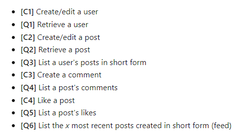
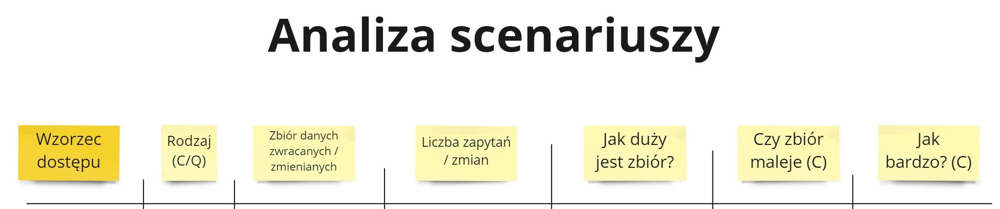
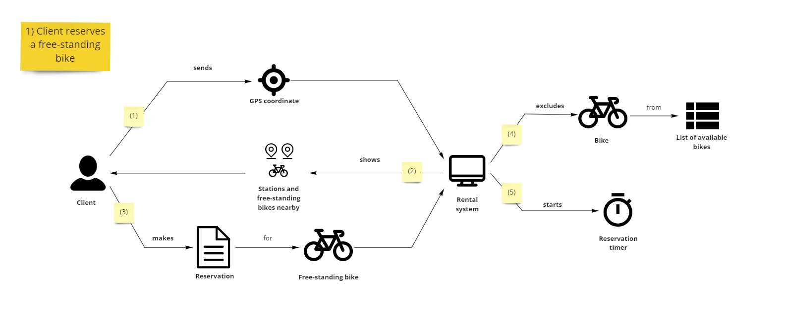

Kontynuujemy cykl o modelowaniu w Cosmos DB. Skończyliśmy analizę potrzeb biznesowych. Teraz trzeba się zastanowić się nad potrzebami bazy danych. Wykorzystamy do tego **tablicę wzorców dostępu**.

W tym odcinku wam przybliżę tę technikę. W kolejnym odcinku przeniesiemy cały obszar biznesowy na tę tablicę oraz zaproponujemy syntezę zgromadzonej wiedzy.

## Mapowanie potrzeb biznesowych na bazodanowe

U większości zespołów praca nad bazą danych przebiega następująco:

1. Zebraliśmy potrzeby biznesowe.
2. Tworzymy model bazy danych na podstawie potrzeb biznesowych.

I jest to dobre podejście, jednak podskórnie robimy tutaj pewien krok, którego nie widać. Otóż potrzeby biznesowe nie mapują się bezpośrednio na bazę danych. To, co się naprawdę dzieje to:

1. Zebraliśmy potrzeby biznesowe.
2. **Mapujemy potrzeby biznesowe na potrzeby dotyczące bazy danych.**
3. Tworzymy model bazy danych na podstawie potrzeb bazodanowych.

To dzieje się w naszych głowach. Tworzymy spis potrzeb bazodanowych. Problemem jest to, że rzeczy w naszej głowie trudno jest pokazać drugiej osobie. Jeśli nie wyniesiemy tych potrzeb bazodanowych na zewnątrz naszej głowy to może się stać taka sytuacja:

- Mamy potrzebę biznesową.
- Na jej podstawie ja w głowie definiuję potrzebę bazodanową A.
- Jednak koleżanka ma inne postrzeganie tej potrzeby biznesowej. W głowie definiuje potrzebę bazodanową B.
- Na podstawie potrzeb bazodanowych ja proponuję rozwiązanie X, koleżanka rozwiązanie Y.
- Kłócimy się o X vs Y, gdzie w rzeczywistości powinniśmy przedyskutować A vs B.

## Wzorce dostępu - jak to robi Microsoft

Na stronie dokumentacji CosmosDB możemy znaleźć [artykuł](https://docs.microsoft.com/en-us/azure/cosmos-db/sql/how-to-model-partition-example#identify-the-main-access-patterns) o optymalizacji zapytań do tej bazy. Autorzy na początku **określili wzorce dostępu do bazy danych** w swojej aplikacji. Następnie krok po kroku optymalizowali strukturę bazy danych pod te wzorce:

Jednak dla nas najważniejsze z tego artykułu są wzorce dostępu - główny sposób pobierania danych. W tym podejściu podejściu **traktujemy bazę danych jako black box** - skupiamy się na jej obserwowalnych zachowaniach.

To jest świetne podejście by odczepić model bazy danych (a nawet silnik bazy danych) od rzeczywistych potrzeb dotyczących bazy danych. **Możemy najpierw zdefiniować wzorce dostępu do bazy, a następnie porównywać propozycje modeli bazodanowych.** Dzięki temu mamy obiektywny sposób oceny struktury względem potrzeb. 

## Tablica wzorców dostępu

Pomyślałem, że można rozwinąć powyższe wzorce o dodatkowe parametry. Dzięki nim jeszcze lepiej zanalizujemy potrzeby bazodanowe:

Przechodzimy po kolei scenariusze biznesowe. Na ich podstawie definiujemy poszczególne wzorce dostępu do bazy danych. Uzupełniamy kolejne kolumny:

- Nazwa - Musimy jakoś nazwać nasz wzorzec dostępu 😀
- Rodzaj - Czy to jest zapytanie o dane (Query), czy zmiana stanu (Command).
- Zbiór danych - O jakie dane się pytamy, jakie informacje chcemy pozyskać.
- Liczba zapytań / zmian - Jak wiele planujemy zapytań w naszym systemie.
- Jak duży jest zbiór - Jak wiele danych będzie w odpytywanym zbiorze.
- Czy zbiór rośnie (C) - W przypadku zmiany stanu chcemy zrozumieć czy zmieniany zbiór nam rośnie.
- Jak bardzo (C) - Jeśli nasz zbiór rośnie, to określamy jak bardzo.

Nie musimy wpisywać dokładnych liczb, czy być super szczegółowi wobec zbiorów danych. **Skupiamy się na usunięciu ze scenariuszy biznesowych całego szumu**. Zostawiamy tylko "mięso bazodanowe".

Powyższe kolumny są propozycją - jeśli macie sugestię jak usprawnić tę tabelę, to dajcie znać w komentarzach 📩

## Tablica wzorców dostępu - przykład

Pełny spis wzorców dostępu dla systemu wypożyczeń pojawi się w kolejnych odcinkach. Tutaj opiszę przykład na jednego scenariusza - [rezerwacji roweru wolnostojącego](/2022/01/30/modelowanie-w-cosmos-db-rezerwacje/).

Wpisujemy w tabelę informacje, które bazują na scenariuszach biznesowych poznanych wcześniej oraz na dalszych rozmowach z biznesem. Większość informacji w tabeli powyżej tłumaczy się sama. Poruszę więc tylko najwazniejsze kwestie:

- Biznes powiedział nam, że około połowa codziennych wypożyczeń dzieje się przez rezerwację. Mamy więc 500-20 000 rezerwacji dziennie.
- Każde wykonanie rezerwacji powoduje, że rośnie nam zbiór danych. Możemy kiedyś to zoptymalizować, ale domyślnie tak jest.
- Jednak wyłączenie roweru z dostępnych zachowuje się inaczej. Liczba rowerów jest stała (gdy modyfikujemy rowery) lub +/- stała (gdy dodajemy i usuwamy rowery).

Tak prosty przykład, a już widzimy, że:

- Podczas jednego scenariusza biznesowego dotykamy różnych zbiorów danych.
- Mamy wzorce, które różnią się sposobem działania oraz liczbami.
- Będziemy posiadali silnie rosnący zbiór Rezerwacji, który potencjalnie może utrudnić nam planowany model bazy danych.

## Zalety tablicy wzorców dostępu

Tablica wzorców dostępu pozwala nam spojrzeć potrzeby bazodanowe w całości. Równocześnie widzimy detale każdej pożądanej operacji. To ma szereg zalet, ponieważ możemy:

1. Zauważyć podobieństwa i różnice zapytań, przez wszystkie scenariusze biznesowe.
2. Przemyśleć, gdzie musimy szczególnie zadbać o odpowiednie modele bazy danych, a gdzie możemy nieco odpuścić.
3. Znaleźć zbiory, które są wspólnie odpytywane. 
4. Zaplanować od razu nasz model pod obsługę pożądanego ruchu.
5. Przedyskutować z biznesem scenariusz bazodanowy, który będzie drogi do implementacji, aby znaleźć prostsze rozwiązanie.

## Komentarze do komentarzy

Rozmawiając z kolegami i koleżankami o tej tablicy dostałem parę komentarzy. Pomyślałem, że odniosę się do nich od razu.

### Nie mamy przypadków biznesowych

To oznacza, że nie przeszliśmy przez poprzednie kroki naszego cyklu. Bez przypadków biznesowych trudno jest zaplanować kształt systemu i bazy danych. Musimy wrócić do początku i zrozumieć potrzeby biznesowe. Na tej podstawie rozpisać scenariusze biznesowe. Wtedy będziemy gotowi, by zająć się wzorcami dostępu 😊

### Nie wiemy jakie liczby wpisywać

Jeśli nic nie wiemy, to trudno jest zaplanować system. Zapytajmy się więc naszego biznesu. 

> A co, jeśli biznes również nie wie jakie jest / powinno być wykorzystanie?

Biznes wie, chociaż na swój sposób. Jeśli zadamy mu pytanie o dokładną wartość, to bardzo możliwe, że wiedzieć nie będzie. **Biznesu należy pytać o wartości, które zna i rozumie.** Np. możemy nie mówić w ogóle o zapytaniach, a skupić się na klientach (i założyć jakieś przeliczenie klient -> liczba zapytań):

- 1 klient na dzień
- 1 klient na godzinę
- 1 klient na sekundę

Możemy również poprosić o podstawowe statystyki (np. z Google Analytics), jeśli jakiś system już istnieje.

> A jeśli naprawdę nie wie, albo mówi o zakresie 1 - 1 000 000 zapytań dziennie?

To musimy się skupić nad zawężeniem tego zakresu, zanim zaczniemy tworzyć wzorce dostępu do bazy danych. Dalsza praca nie ma sensu, ponieważ:

- Jeśli stworzymy system dla 1 zapytania dziennie, a będziemy mieli  1 milion, to system wywali się w sposób arcyspektakularny 🔥
- Jeśli stworzymy system dla 1 miliona zapytań dziennie, to system będzie przepalał pieniądze, aż miło 💰

### To nie jest zwinne

Jak pisałem w [artykule](https://radekmaziarka.pl/2022/01/21/architektura-ewolucyjna-z-perspektywy-organizacji/#wzorce-ewolucyjne-dla-poszczeg%C3%B3lnych-obszar%C3%B3w) "Architektura ewolucyjna z perspektywy organizacji" nie wszystkie obszary biznesowe są identyczne pod względem zwinności. Część potrzebuje bardziej up-front podejścia, aby dobrze rozwiązać jego potrzeby. **Wyobrażasz sobie, że w wersji pierwszej zrobimy wypożyczenie, ale nie zrobimy oddania roweru?** Ja też nie 😉

Ogólnym moim zarzutem jest to, że w mojej ocenie jest to bardzo zwinne podejście. Jak mówił na jednej prezentacji [Tomek Nurkiewicz](https://www.linkedin.com/in/tomasz-nurkiewicz-80513b92/?originalSubdomain=pl): 

> "Pięć dni kodowania pozwoli nam zaoszczędzić kwadrans analizy"

Wolę więc najpierw zwinnie zrozumieć potrzeby, a później usiąść do kodzenia. I napisać raz a dobrze.

### A co, jeśli pojawi się nowe wymaganie

W sumie nic nieznanego. Mamy 2 podejścia: 

- Jeśli to wymaganie możesz obsłużyć obecną strukturą, to nie ma się co stresować. 
- Jeśli wymaganie wymaga dużej zmiany w bazie, to i tak powinniśmy najpierw wykonać analizę zmian, zanim zaczniemy je aplikować. Tablica wzorców dostępu jest jednym z podejść by sprawdzić jak nowe wymaganie wpasowuje się w obecne potrzeby.

W kolejnych odcinkach będzie informacja, w jaki sposób ocenić jak bardzo problematyczne może być nowe wymaganie.