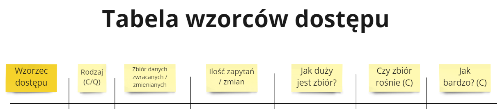
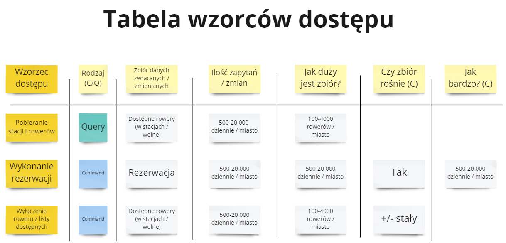

Kontynuujemy cykl o modelowaniu w Cosmos DB. XYZ skonczylismy analize potrzeb i teraz trzeba sie zastanowic nad baza danych. Wykorzystamy do tego tablicę wzorców dostępu.

W tym odcinku wam przybliżę tą technikę. W kolejnym odcinku przepiszemy cały obszar biznesowy na tą strukturę oraz zaproponujemy syntezę.

## Jakie sa problemy ad-hoc desingu

Nie rozumiesz jak potrzeby wpływają na rozwój bazy danych.

Nie potrafisz zmapować potrzeby na konkretne rozwiązanie.

Optymalizujesz na produkcji.

## Wzorce dostępu - jak to robi Microsoft

https://docs.microsoft.com/en-us/azure/cosmos-db/sql/how-to-model-partition-example#identify-the-main-access-patterns

W artykule MS zawarł informację o tym w jaki sposób podnieść wydajność rozwiązania opartego o Cosmos DB.

Jednak najwazniejsze z tego artykułu były **wzorce dostępu** - główny sposób pobierania danych. 

W tym podejściu podejściu **traktujemy bazę danych jako blackbox** - skupiamy się na jej obserwowalnych zachowaniach.

To jest świetne podejście by odczepić strukturę bazy danych (a nawet silnik bazy danych) od rzeczywistych potrzeb dotyczących bazy danych. **Możemy najpierw zdefiniować wzorce dostępu do bazy a następnie porównywać propozycje struktury baz.** Dzięki temu sprawimy, że mamy obiektywny sposób oceny struktury względem potrzeb. W artykule Microsoft pokazał jak zmiana struktury V1->V2->V3 realnie zwiększyła efektywność systemu.

## Tablica wzorców dostępu

Na podstawie artykułu Microsoftu przygotowałem poniższą tabelkę.

Przechodzimy po kolei scenariusze biznesowe. Na ich podstawie uzupełniamy kolejne kolumny - dodajemy karteczki z opisem:

- Rodzaj: czy to jest zapytanie o dane (Query), czy zmiana stanu (Command)
- Zbiór danych - O jakie dane się pytamy, jakie informacje chcemy pozyskać
- Ilość zapytań / zmian - Jak dużo planujemy zapytań w naszym systemie
- Jak duży jest zbiór - Jak wiele danych będzie w odpytywanym zbiorze
- Czy zbiór rośnie (C) - W przypadku zmiany stanu chcemy zrozumieć czy zmieniany zbiór nam rośnie
- Jak bardzo (C) - Jeśli nasz zbiór rośnie to określamy jak bardzo

Nie musimy wpisywać dokładnych liczb, czy być super szczegółowi wobec zbiorów danych.

## Tablica wzorców dostępu - rezerwacja

## Jak tablica wzorców dostępu nam pomaga

1. Możemy na tej podstawie podzielić nasze potrzeb
2. Widzimy co jest odpytywane wspólnie, co rozdzielnie
3. Dostrzegamy gdzie potrzebne jest więcej danych

## Parę komentarzy do tablicy wzorców dostępu

Dostałem parę komentarzy odnośnie tej tablicy. Pomyślałem, że odniosę się do nich od razu.

### Nie mamy przypadków biznesowych

To oznacza, że nie przeszliśmy przez poprzednie kroki naszego cyklu. Bez przypadków biznesowych trudno jest zaplanować kształt systemu i bazy danych. Musimy wrócić do początku i zrozumieć potrzeby biznesowe. Na tej podstawie rozpisać scenariusze biznesowe. Wtedy będziemy gotowi by zając się wzorcami dostępu 😊

### Nie wiemy jakie liczby wpisywać

Jeśli nic nie wiemy, to trudno jest zaplanować system. Zapytajmy się więc naszego biznesu. 

> A co jeśli biznes również nie wie jakie jest / powinno być wykorzystanie?
 
Biznes wie, chociaż na swój sposób. Jeśli zadamy mu pytanie o dokładną wartość to bardzo możliwe, że wiedzieć nie będzie. A

### To nie jest zwinne

Jak pisałem w [artykule](https://radekmaziarka.pl/2022/01/21/architektura-ewolucyjna-z-perspektywy-organizacji/#wzorce-ewolucyjne-dla-poszczeg%C3%B3lnych-obszar%C3%B3w) "Architektura ewolucyjna z perspektywy organizacji" nie wszystkie obszary biznesowe są identyczne pod względem zwinności. Część potrzebuje bardziej up-front podejścia aby dobrze rozwiązać jego potrzeby. **Wyobrażasz sobie, że w wersji pierwszej zrobimy wypożyczenie, ale nie zrobimy oddania roweru?** Ja też nie 😉

Ogólnym moim zarzutem jest to, że w mojej ocenie jest to bardzo zwinne podejście. Jak mówił na jednej prezentacji Tomek Nurkiewicz: 

>> "Pięć dni kodowania pozwoli nam zaoszczędzić kwadrans analizy"

Wolę więc najpierw zwinnie zrozumieć potrzeby, a później usiąść do kodzenia.  

### A co jeśli pojawi się nowe wymaganie

To je dodajesz do tabelki. Jeśli realnie zmienia twoją strukturę, to musisz się zastanowić jak w takim raize zmienić twoją strukturę.

Jednak masz opisane wszystkie wzorce dostępu, wobec czego wiesz czy realnie potrzebujesz to zrobić. Ewentualnie czy nie możesz wykorzystać już obecnych wzorców i wykonać kilka dodatkowych akcji.
