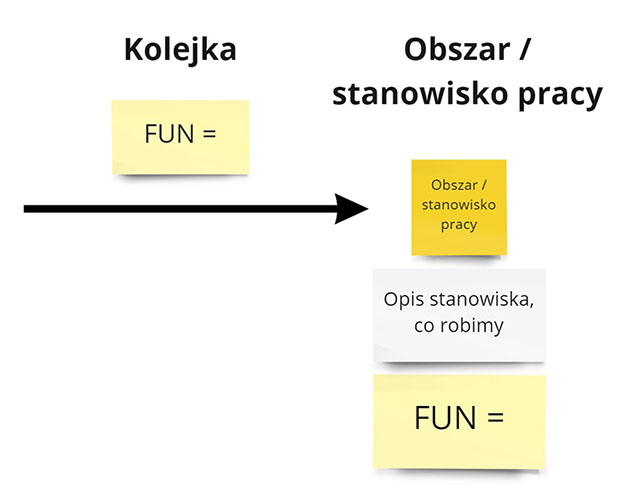
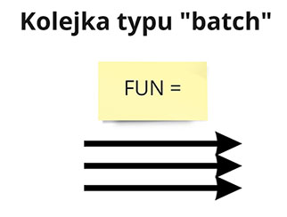
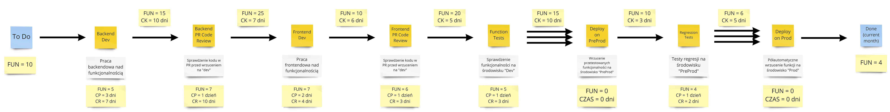

Dlaczego nam tak wolno praca idzie? Czy możemy zmusić developerów aby kodzili szybciej, a testerów aby szybciej testowali?

**A gdybym wam powiedział, że pracując więcej, wcale nie dowieziemy więcej zadań?**

Zobaczmy więc dlaczego nam ta praca tak wolno idzie. Wykorzystamy do tego praktyki wizualizacyjne związane z techniką [Value-Stream Mapping](https://radekmaziarka.pl/2020/05/29/narzedzia-pracy-konsultanta-value-stream-mapping/).

## Pozorna wizualizacja pracy

Załóżmy, że mamy typowy system e-commerce. Pracuje nad nim typowy zespół - kilku backend i frontend devów, z 2 testerów, ktoś od wdrożeń. Zespół ma również typową tablicę zadań.

Na tablicy widać, że mamy bardzo dużo zadań w trakcie. Gdy rozmawiamy z zespołem słyszymy, że praca idzie bardzo wolno. Cały czas ktoś na kogoś czeka.

Zadajemy więc pytania, kto na kogo czeka:
- Mamy PR Code Review przed mergem do deva.
- Zespół Frontend czeka ze swoją pracą na Backend. Dopiero gdy ich zmiany są na dev to rozpoczynają pracę.
- Testerzy testują dopiero gdy oba zespoły developerskie zakończyły swoją pracę. Dopiero wtedy proces CI/CD robi wrzutkę na środowisko Dev.
- Nie wrzucamy pojedynczo funkcjonalności na produkcję. Robimy to w większych partiach. Czasem niektóre z nich czekają tygodniami na wrzucenie.
- Przed wrzuceniem na produkcję robimy testy regresji na środowisku preprodukcyjnym. Testujemy ogólnie wszystkie wrzucane funkcjonalności, wraz z sprawdzeniem czy obok coś nie wybuchło.
- Na produkcję wrzuca tylko wdrozeniowiec. Ma on dodatkowe skrypty, które robią magię związaną z resetem cache na serwerach produkcyjnych.

Czy widać to na tablicy? Nie widać. **Tablica pracy nas oszukuje - pokazuje pozorny sposób pracy zespołu.** Na takiej podstawie trudno zauważyć gdzie praca utyka.

## Właściwa wizualizacja pracy

Wszystkie te punkty można pokazać na tablicy pracy. Można do tego wykorzystać notacje VSM:

- Kolejki
- Obszary / stanowisko pracy

Dodatkowo czasami stanowisko pracy musi przetworzyć wszystkie funkcjonalności naraz (np. gdy wrzucamy je wszystkie naraz na dane środowisko). Wtedy możemy zwizualizować to jako kolejkę typu "batch".

Jak więc wygląda właściwa wizualizacja pracy? Następująco:

Dużo, prawda? 😂 

Może na początku przytłoczyć. Jednak jest to celowe. **Otóż nasz sposób pracy jest złożony. My po prostu tego nigdy nie pokazaliśmy w całości.**

To co się rzuca w oczy to ilość pracy w kolejkach. Praca czeka pomiędzy stanowiskami pracy. Nikt się na niej nie skupia. Zespół zajmuje się innymi funkcjonalnościami.

## Czas procesowania

Powyższą wizualizację pracy można wzbogacić o 3 dodatkowe informacje:

- Czas procesowania - CP - ile średnio zajmuje nam praca nad pojedynczą funkcjonalnością.
- Czas realizacji - CR - jaki jest średni czas od rozpoczęcia pracy do jej zakończenia, wlicząc wszystkie zmiany priorytetów.
- Czas kolejki - CK - jaki jest średni czas funkcjonalności w kolejce

Wykorzystujemy do tego wartości, które przekazał nam zespół.

Wynik jest jeszcze bardziej przerażający, niż wcześniej:
- Czas procesowania funkcjonalności jest o wiele niższy niż czas dostarczania. Zespół pracuje nad wieloma funkcjonalnościami naraz. Przeskakuje pomiędzy nimi, w ramach zmiany priorytetów. Powoduje to zwiększenie czasu dostarczenia pojedynczej funkcjonalności.
- Nawet jeśli funkcjonalność opuści stanowisko pracy to kolejna rola nie zajmuje się nią od razu. Liczba zadań w kolejkach powoduje że funkcjonalność czeka bardzo długo zanim się kogoś jego podejmie.

## Suma wszystkich strachów

Na samym koncu można przeprowadzić wyliczenie w jaki sposób praca  wygląda z perspektyyw całego procesu:

Na powyższym wyliczeniu widać jasno, że:

- Czas realizacji danej funkcjonalności jest dalece wyższy od samej pracy nad nią - 8 razy wyższy.
- Funkcjonalności głównie czekają w kolejkach - przez 2/3 czasu.

 Samo popędzanie programistów / testerów batogiem nie pomoże. Będziemy optymalizować naszą pracę pod niewłaściwe wskaźniki.

## Jak pracować efektywniej
Przede wszystkim należy zwizualizować rzeczywisty przebieg pracy. Bez tego nie ma jak rozpocząć poprawy.

Następnie można wykorzystać techniki, które skupiają się na uporządkowaniu przepływu pracy.

### Zmniejszenie ilości pracy w toku

W obecnej sytuacji dużo  liczba funkcjonalności czeka na swoje zakończenie w kolejkach.
To też powoduje, że się "starzeją" - w międzyczasie zmienia się kod, albo wymagania biznesowe.
W rezultacie musimy modyfikować już napisaną funkcjonalność.
To też zwiększa ogólny koszt pracy, jeszcze bardziej opóźniając realizację.

Limit pracy w toku pozwala na ograniczenie rozrostu kolejek. Gdy osiągniemy określoną liczbę otwartych funkcjonalności (dla konkretnego stanowiska, bądź całości procesu) przestajemy dobierać kolejne. Zamiast tego aktywnie działamy, aby zakończyć już otwarte funkcjonalności:

- Natychmiastowo przejmujemy tematy, które pojawiły się podczas pracy w innych obszarach np. od razu naprawiamy błąd znaleziony przez testerów.
- Pracujemy w parach z osobami które pracują nad otwartymi funkcjonalności. To powoduje, że  szybciej kończymy naszą pracę.
- Automatyzujemy naszą pracę, aby sprawniej obsługiwać istniejące funkcjonalności. 

### Usunięcie stanowisk pracy

Każde stanowisko pracy naturalnie będzie rodziło przed sobą kolejki. Możemy próbować to niwelować usuwając konkretne stanowiska. Takie zachowanie pozwala całkowicie usunąć zarówno czas w kolejce, jak i zmniejszyć czas realizacji:

- To co się od razu rzuca w oczy to niepotrzebne czekanie na wdrożeniowca podczas wdrożenia na Produkcję. Gdy testerzy będą mogli po regresji sami wdrożyć sprawdzone funkcje odpadnie nam jedna kolejka.
- Sama regresja również mogłaby być zautomatyzowana. Określone przypadki użycia i ich sprawdzenie w smoke-testach pozwoliłyby uniknąć kolejnego miejsca pracy w procesie.
- Innym rozwiązaniem będzie tutaj zastąpienie PR code review bardziej zwinnymi technikami. Opisałem to w artykule XYZ.

### Połączenie stanowisk pracy

Równolegle z usuwaniem stanowisk pracy można się zastanowić nad ich łączeniem. Stworzymy wtedy bardziej cross-funcjonalne stanowiska, które będą wspólnie zaczynać i kończyć pracę. Pojedyncza kolejka uniemożliwi rozjazd pracy pomiędzy dwoma zespołami.

W przypadku powyżej zdecydowanie pomogłoby połączenie pracy zespołu backendowego i frontendowego. Pracownicy razem rozpoczynali by prace nad daną funkcjonalnością. Oraz kończyliby razem. To też zwiększałoby tempo pracy nad pojedynczą funkcjonalnością oraz zmniejszało liczbę rozpoczynanych.

### Praca w mniejszych partiach
Im większe mamy partie pracy, tym większa jest szansa że nastąpi rozrost kolejek. Bierze się to z faktu, że duże partie naturalnie potrzebują więcej czasu aby je zrealizować. Gdy nastąpi jakiekolwiek opóźnienie to zatrzymuje ono cały ośrodek pracy. Praca nie płynie.

W powyższym przypadku może pomóc:
- Uruchamianie automatycznych testów i regresji dla po każdej funkcjonalności. Dramatyczine zmniejszymy wielkość parti testowej.
- Dzielenie funkcjonalności na mniejsze cross-techniczne zadania, zamiast na większe mono-techniczne. Pomogą tutaj odpowiednie techniki dzielenia, jak np. Event Modeling. 
- Wdrażanie funkcjonalności bez jej pokazywania klientowi - za pomocą np. feature toggli. To pozwala na wdrażanie małych funkcjonalności, bez negatywnego wpływu na klienta.

### Dopasowywanie funkcjonalności do mocy przerobowych

TBD

## Podsumowanie

Wartości przedstawione wyżej mogą się Ci wydawać wydumane. Nie są.

Przeprowadzałem powyższą analizę z wieloma zespołami na przełomie kilku lat. Wszędzie wyniki są takie same. **Kolejki są głównym źródłem opóźnień w dostarczaniu.** Choćby nie wiem jak mocno zespół się skupiał na swojej pracy, to wcale nie pomaga w przyspieszeniu dostarczania.

Podobne zdanie ma Donald G. Reinertsen, twórca książki [The Principles of Product Development Flow](https://www.goodreads.com/en/book/show/6278270)

>In product development, our greatest waste is not unproductive engineers, but work products sitting idle in process queues.

Niestety, w przeważającej większości zespoły nie sprawdzają stanu swoich kolejek. A jak jest u was? Ile macie zadań czekających na podjęcie? 😀 