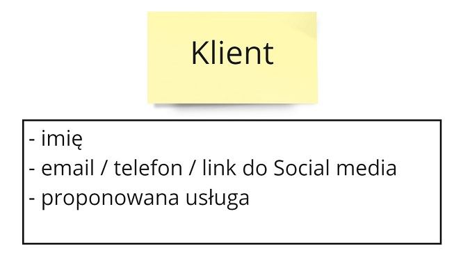
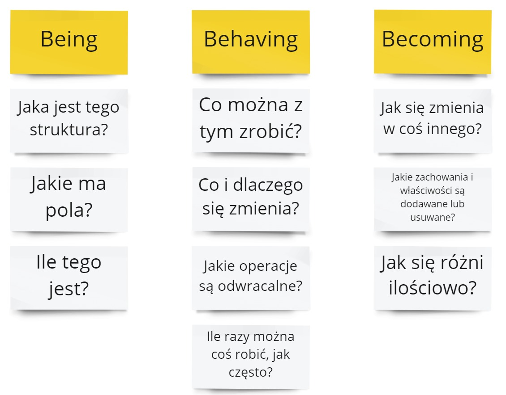
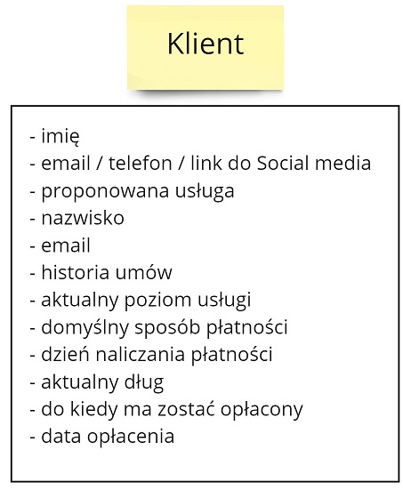
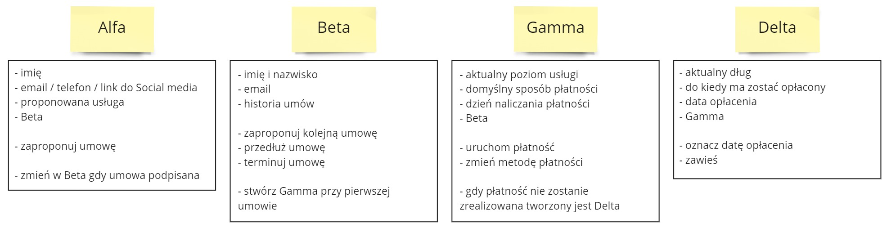
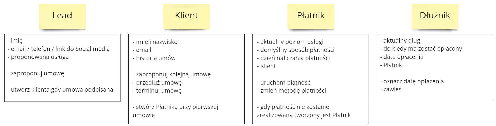
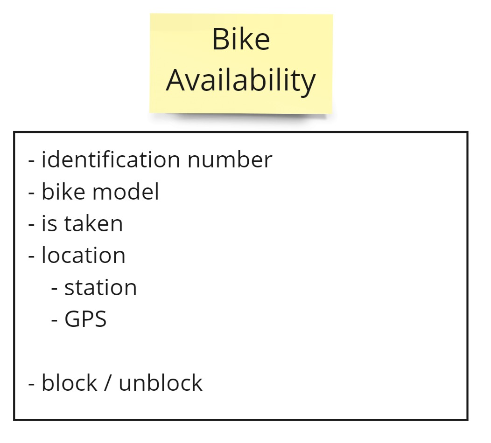
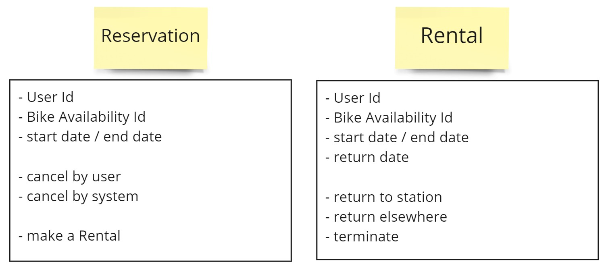
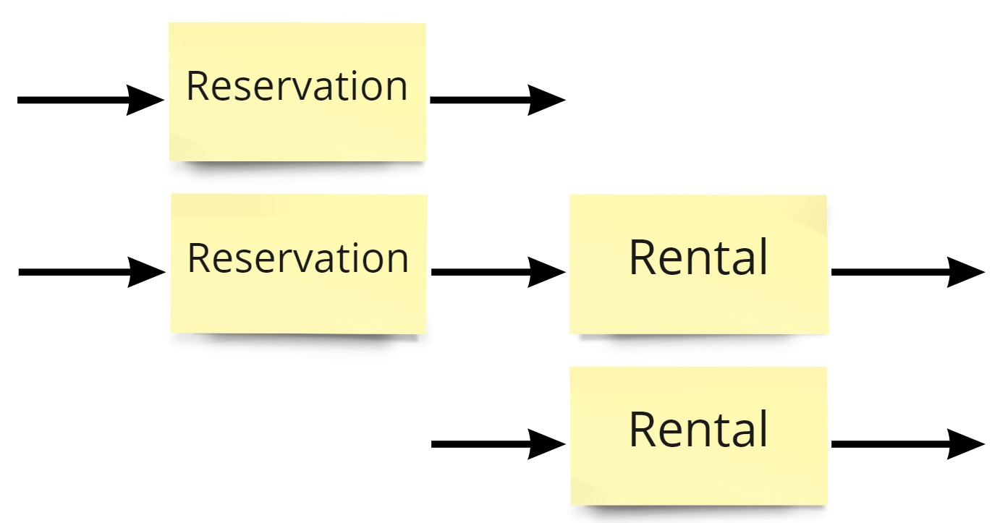

Kontynuujemy cykl o modelowaniu w Cosmos DB. W [poprzednim odcinku](/2022/06/05/modelowanie-w-cosmos-db-wymagania-bazy-danych/) opisaliśmy wzorce dostępu do bazy wymagane do spełnienia potrzeb biznesowych.

W tym odcinku określimy obiekty bazodanowe. Chciałbym tutaj przedstawić podejście, które pozwoli nam uniknąć głównych problemów związanych z takim modelowaniem.



## Problem z modelowaniem obiektów

Zwykle jak modelujemy obiekty w kodzie, to skupiamy się na aspektach fizycznych modelowanego obiektu. Staramy się odwzorować czym jest dana rzecz - np. jakie cechy ma nasz klient. Niestety, to działa tylko na początku.

**Gdy mamy bardziej złożony biznes modelowanie skupione na właściwościach prowadzi do spaghetti code.** Kończymy z olbrzymimi modelami, które robią wszystko. A więc nie robią nic dobrze.

Zobaczmy jak to wygląda na przykładzie modelu Klienta. Rozpoczynamy od prostego modelu skupionego na szukaniu klienta. Posiadamy imię klienta + przynajmniej jeden sposób, w którym możemy się z tym klientem skontaktować. Na tym etapie nasi sprzedażowcy nie mają więcej danych.

Następnie podpisujemy umowę, a wtedy potrzebujemy dodatkowych danych - imienia i nazwiska, emaila, historii umów.

Tutaj jednak coś zaczyna nie grać. Nagle email staje się wymagany. Dołączają dodatkowe pola, które w jednym przypadku są wymagane, a w drugim nie. **W tym momencie pojawią się statusy.** Inaczej nie będziemy mogli sprawdzić, jakie pola muszą być wymagane.

Idziemy dalej i uzupełnimy model Klienta o właściwości z obszaru Płatności i Wierzytelności. 

Tutaj już widzimy do jakiego piekła doszliśmy. Mamy masę informacji, ale one wszystkie średnio do siebie pasują. **Klient jest wszystkim i niczym jednocześnie.** W naszym kodzie musimy wykorzystywać masę ifów by bronić się przed sytuacją, gdy dane nie są kompletne. Im dłużej w las, tym większa szans, że skończymy z obiektem mającym 100+ pól.

Z takim podejściem ucieka nam również część możliwości biznesowych:

- Trudno wyliczyć, skąd przychodzą klienci, bo pola kontaktowe są reużywane.
- Mamy informację tylko o jednym zadłużeniu, poprzednie nam uciekają.

## Being, behaving, becoming

Sławek Sobótka na swojej [prezentacji](https://www.youtube.com/watch?v=do-xqIbKZ_8) "Co gryzie świadomego programistę" przedstawił remedium na taki stan rzeczy (a w zasadzie przytoczył podejście z [książki](https://www.goodreads.com/book/show/1639010.Rethinking_Systems_Analysis_and_Design) "Rethinking Systems Analysis and Design" Geralda Weinberga).

Sławek pokazał jak można lepiej modelować obiekty na podstawie podejścia Being / Behaving / Becoming:

Jest to podejście, które każe nam wziąć pod uwagę również zachowanie i zmianę danego obiektu. **To sprawia, że zadajemy lepsze pytania przy modelowaniu obiektów.** Spojrzenie z innej perspektywy pogłębia nasz model i rozdziela odpowiedzialności. Trudniej jest wrzucić wszystko do jednego worka. 

Na podstawie analizy odpowiedzialności obiektu Klienta moglibyśmy dojść do następujących rezultatów:

Posiadamy obiekty, które odwzorowują zarówno stan faktyczny, jak i działanie. Mamy bardziej detaliczne obiekty, które odpowiadają na konkretne potrzeby. Nie nazywamy ich od początku. **Chcemy to zrobić dopiero wtedy, kiedy mamy pewność, jaka jest ich odpowiedzialność.** To pozwala nam uniknąć błędu poznawczego - [zakotwiczenia](https://pl.wikipedia.org/wiki/Heurystyka_zakotwiczenia_i_dostosowania).

Na tej podstawie osiągamy wymierne zyski:

- Możemy mieć różne scenariusze działania - Poszukującego i Klienta, lub samego Klienta.
- Płatnik ma dane dostosowane do swojego modelu pracy.
- Dany klient może być kilka razy Dłużnikiem.

## Rozwiązanie w domenie rowerów

Ok, mamy ogólne zrozumienie jak stosować technikę Being / Behaving / Becoming. Wykorzystajmy ją na naszym przykładzie.

### Obiekty stałe

Zacznijmy od najprostszych obiektów. Będziemy mieli w systemie obiekty, które odwzorowują pewne stałe informacje. 

To są informacje, które zmieniają się bardzo wolno. I przeważnie są planowane wcześniej. Nikt przecież nie doda nowego miasta z dnia na dzień - potrzeba tutaj głębszego planowania.

Takie obiekty można łatwo cache'ować w warstwie aplikacyjnej. Nawet jeśli się zmienią, to ich obsługa będzie relatywnie prosta.

### Obiekty opisujące aktualną rzeczywistość

W tym momencie możemy zauważyć, że brakuje nam dodatkowego obiektu. Takiego, który by opisywał rower, ale z perspektywy dostępności roweru dla klientów. Taki obiekt odpowiadałby na diametralnie inne pytania, niż wcześniej określony Bike. Spójrzmy jak to może wyglądać:

Widzimy, że pomimo bycia rowerem obiekty Bike i BikeAvailability różnią się wzajemnie. **Zadanie sobie dodatkowych pytań pomaga nam znaleźć lepsze propozycje obiektów.** Dzięki temu odpowiedzialności zarządzania flotą rowerów i dostępnością rowerów nie przenika na siebie wzajemnie.

### Obiekty przyrastające w czasie

Na koniec zastanówmy się, w jaki sposób odwzorować obiekty związane z akcjami użytkownika.

Tutaj możemy zapropowować 2 obiekty - Reservation i Rental:

Pierwszy z nich odpowiada za wszystkie aspekty rezerwacji. Mamy zarówno wymagane informacje, jak i możliwe akcje. Oraz sposób przejścia do obiektu Rental.

Obiekt Rental jest niezależny od obiektu Reservation. Możemy mieć takie ścieżki:

**Połączenie tych obiektów razem spowodowałoby niepotrzebną zależność pomiędzy dwoma potrzebami.** Lepiej jest je oddzielić od siebie, aby mogły niezależnie ewoluować.

W tym momencie może nam przyjść do głowy pytanie: 

> Czy nie potrzebowalibyśmy obiektu Zwrot? 
 
W tym przypadku oceniam, że nie - odpowiedzialność takiego obiektu byłaby minimalna. Gdy w przyszłości pojawią się dodatkowe wymagania możemy zrewidować naszą decyzję.

## Podsumowanie

Dzięki zastosowaniu techniki Being / Behaving / Becoming możemy zaprojektować bardziej dopasowane modele. Złożoność nie przenika pomiędzy konceptami. Poszczególne odpowiedzialności obiektów są dobrze dopasowane do problemu.

**Takie podejście pozwala nam obsługiwać więcej przypadków biznesowych.** Łatwiej jest również wprowadzać zmiany. Wasz biznes będzie w długiej perspektywie zadowolony, że stosujecie to podejście 😀