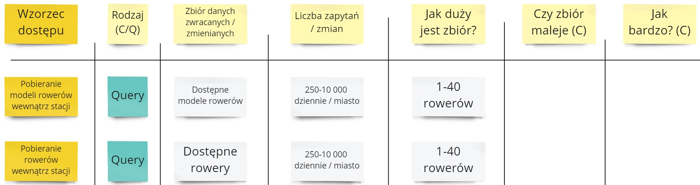

Kontynuujemy cykl o modelowaniu w Cosmos DB. W poprzednim odcinku wykorzystaliśmy **tabelę wzorców dostępu** aby pokazać w jaki sposób można zdefiniować wymagania dotyczące bazy danych - [artykuł](/2022/04/17/modelowanie-w-cosmos-db-wzorce-dostepu/).

W tym odcinku przejdziemy przez wszystkie wymagania i spiszemy je w formie wzorców dostępu. 

## Rezerwacje

Posiadamy już wstępnie uzupełnioną tablicę z wymaganiami bazodanowymi, bazujące na wypożyczeniu roweru wolnostojącego:

Przejdźmy przez pozostałe scenariusze.

### Wypożyczenie roweru ze stacji

Porównajmy ten przypadek z wypożyczeniem roweru wolnostojącego. Możemy zauważyć, że w zasadzie są identyczne, poza sposobem pobierania danych o rowerach. Dopiszmy więc tylko wychwycone różnice.

Z punktu widzenia bazy danych dodatkowymi zapytaniami są te o dostępne rowery w stacji. Od biznesu dostajemy informację, że około 50% osób rezerwuje rower ze stacji, więc liczba zapytań jest mniejsza. Zbiór również jest mniejszy, ponieważ liczba rowerów jest zawężona do stacji.

### Anulowanie rezerwacji

Następnie skupmy się na anulowaniu, zarówno przez klienta jak i system.

Dostajemy informację, że około 1/5 wszystkich rezerwacji jest anulowana. W obszarze anulowania nie mamy za wiele wymagań bazodanowych, wszystkie dodatkowe można zamknąć w 3 wpisach:

Ciekawą kwestią jest tutaj rozmiar zbioru Rezerwacji. Ponieważ chcemy przechowywać informację o anulowanej rezerwacji to jej zbiór nie maleje.

## Wypożyczenia

W obszarze wypożyczeń mamy 2 scenariusze - wypożyczenie z rezerwacją oraz bez rezerwacji.

Przechodzimy po kolei przez scenariusze i szukamy wymagań bazodanowych.

Bazujemy na liczbach od biznesu, że połowa wypożyczeń jest przeprowadzana przez rezerwację, a połowa nie. Co istotnego odnaleźliśmy?

- Pojawił się nowy zbiór danych - Wypożyczenie. On również stale rośnie.
- Mamy identyczne wzorce dostępu jak z obszaru Rezerwacji - "Wyłączenie roweru z listy dostępnych" oraz "Pobranie aktywnych rezerwacji". Będziemy mogli sobie te wzorce uprościć na etapie syntezy informacji.
- Wzorzec "Wykonanie wypożyczenia na bazie rezerwacji" zmienia 2 obiekty - Rezerwację i Wypożyczenie. Rezerwacja się kończy a Wypożyczenie tworzy.

## Zwrot

Na koniec przyjrzyjmy się zwrotowi:

## Pytania

### Czemu nie ma point-readów?

Ponieważ one nie są wymagane do ogarniania planu bazy danych. Za to będą wartościowe by wyliczyć ostateczny koszt, ale to jest lepiej robić na bazie bezpośrednich wyników z bazy danych.