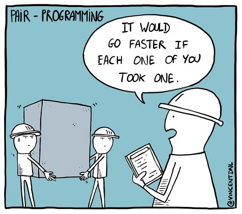
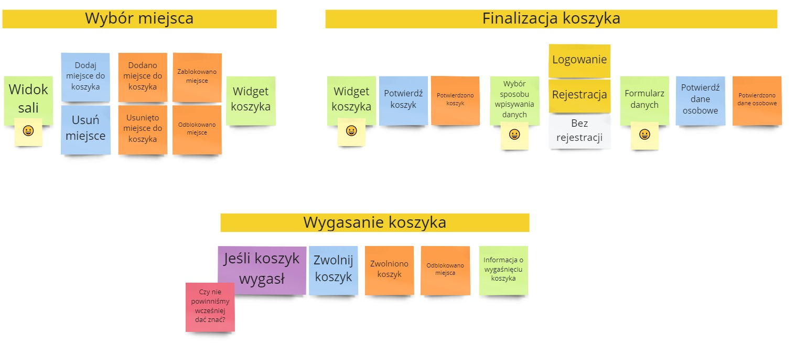

(Artykuł zakłada, że nie pracujesz w stylu [Trunk Based Development](https://trunkbaseddevelopment.com/) - twoje branche żyją kilka / kilkanaście dni.)

Pull Request Review  wydaje się być bardzo głęboko zakorzeniony w procesie wytwarzania oprogramowania. Większość artykułów o pracy zespołów programistycznych zawiera taki PR Review. Również jest on obecny w domyślnych szablonach pracy w narzędziach CI/CD.

Ja osobiście stoję po stronie barykady, która twierdzi, że w przeważającej liczbie przypadków **PR Review jest zabójcze dla szybkości dostarczania**. I chciałbym w tym artykule dostarczyć remedium na te problemy.

Jednak aby właściwie zaadresować problemy, najpierw warto przedstawić, po co robimy PR Code Review. 

##  Powody posiadania PR  Review

Wykorzystałem kilka artykułów z internetu i zebrałem poniższą listę powodów posiadania PR Review (dorzućcie w komentarzach, jeśli jeszcze macie jakiś przykład):

- Sprawdzenie, czy kod spełnia wymagania biznesowe.
- Zapewnienie spójnego kodu z resztą systemu, pod względem architektury.
- Odnajdywanie błędów, zarówno biznesowych, jak i technicznych, optymalizacyjnych i innych.
- Spełnienie wymogów Compliance, jak np. [PCI DSS](https://en.wikipedia.org/wiki/Payment_Card_Industry_Data_Security_Standard).
- Wymiana wiedzy w zespole lub organizacji.

To jednak są zyski, które można osiągnąć innymi, lżejszymi sposobami. Wady dużych PR Review są za to niewątpliwe.

## Dlaczego nie robić PR Review?

Otóż PR Review jest zabójcze dla prędkości dostarczania. 

Aby to pokazać wystarczy spojrzeć na typową linię czasu przy wykorzystaniu PR Review ([tweet Dragana Stepanovića](https://twitter.com/d_stepanovic/status/1379451260638785536)):

To jest komunikacja tylko z jedną osobą + wymagane są niewielkie zmiany. **Jednak i tak wdrożenie zmian z PR Review trwa kilka dni.** W przypadku komentarzy wielu osób i dużych zmian architektonicznych całość może trwać tygodnie.

W mojej ocenie PR Review:

- Jest przeprowadzane zbyt późno - koszt wprowadzania zmian na tym etapie jest ogromny. Bardzo często musimy zmienić całą architekturę rozwiązania.
- Jest przeprowadzane dla zbyt dużych kawałków kodu - całą funkcjonalność jest bardzo trudno sprawdzić, koszt poznawczy jest wysoki.
- Tworzy znaczne kolejki w zespole - jak opisałem w artykule [Dlaczego tak wolno dowozimy](/2022/05/29/dlaczego-tak-wolno-dowozimy-o-kolejkach/).
- Tworzy opóźnienie w pętli zwrotnej uczenia się zespołu - przeskakujemy z tematu na temat.

Ale przede wszystkim **PR Review nie daje odpowiednich zysków w stosunku do kosztów jakie ponosimy**. Problem, że mało kto to liczy 🙄

Analogiczne zdanie na ten temat ma wiele osób z obszaru Continuous Delivery, jak Jez Humble (twórca książki [Accelerate](https://www.goodreads.com/en/book/show/35747076)) czy Thierry de Pauw:





## Co w zamian

Ok Radku, pokazałeś wady PR Review. Co masz do zaproponowania w zamian? 

Poniżej przedstawiłem kilka propozycji, z różnych obszarów pracy zespołowej. Mają one na celu:

- Zwiększenie prędkości dostarczania dla całego procesu pracy zespołu.
- Zmniejszenie ilości reworku.
- Szybszą pętlę zwrotną dotyczącą błędów i ich poprawy.
- Łatwiejsze wprowadzanie nowych osób do zespołu, czy do nowych funkcjonalności.

Przy jednoczesnym zachowaniu wszystkich powodów posiadania PR Review opisanych wyżej.

(Celowo pomijam poniżej Trunk Based Development - powód na końcu artykułu)

###  Pair Programming / Mob Programming

Możemy zacząć od humorystycznego obrazka Vincenta Déniela ([tweet](https://twitter.com/vincentdnl/status/1252628160111394817)):

Praca w parach / grupie jest dobrą przeciwwagą na PR Review. A to dlatego, że wykonujemy sprawdzenie kodu natychmiastowo jak pisze go druga osoba. Chyba nie da się szybciej 😂

Jest to wysoce błędne przekonanie, że taka praca idzie wolniej, bo pracują nad nią dwie osoby. Jak widać na obrazku linii czasu wyżej **praca samemu połączona z PR Review trwa o wiele dłużej**. Koszt wytworzenia kodu wspólnie jest mniejszy, niż wytworzenia kodu samemu, a następnie poddaniu go sprawdzeniu.

Taką pracę w parach (a więc i sprawdzanie kodu) można robić również zdalnie. Dziś nawet posiadamy narzędzia, dzięki którym można pisać naraz w jednym IDE (jak [VS Code Live Share](https://code.visualstudio.com/learn/collaboration/live-share)). Pozwala nam to pracować wspólnie, nawet jak jesteśmy kilometry od siebie.
 
Co jest nie zawsze oczywiste, code review wykonywany podczas pair programmingu spełnia wymogi instytucji finansowych, czy PCI:





Są nawet firmy (jak np. [vmware](https://tanzu.vmware.com/developer/learningpaths/application-development/pair-programming/)), które z definicji pracują w ten sposób. Jednak jest oczywiste, że nie wszystkie firmy mogą pracować w ten sposób. Również trudne może być przez 100% czasu pracować w ten sposób. Możemy więc omówić inne sposoby.

### Ad-hoc code review

Nikt nam nie broni robić sprawdzenia naszego kodu częściej, niż tylko na PR Review.

Kilka firm, z którymi współpracowałem, posiadało praktykę przeprowadzenia code review co każdy commit. Braliśmy osobę obok / zdzwaniało się osobę wolną. Następnie opowiadaliśmy napisany kod. Zwykle wychodziło wiele rzeczy do poprawy, więc od razu je aplikowaliśmy.

**Metoda ad-hoc code review jest świetnym remedium na problemy PR Code Review**. Taka praktyka pozwala na bardzo wczesne zauważenie, że coś idzie nie tak. Mamy szybki feedback. W zasadzie już pojedynczy commit pozwala nam na zauważenie, że praca podąża w złym kierunku.

Nie musimy jednak robić tego tylko synchronicznie. **Praktyka ta może być również przeprowadzona asynchronicznie.** Zgłaszamy informację o nowym commicie na wybranym kanale. Ktoś, kto ma akurat wolną chwilę wskakuje i sprawdza nasz kod. Szybki feedback połączony z pracą async.

To co jest tutaj problemem, to dość ad-hocowy (jak nazwa wskazuje) sposób przeprowadzania review. Część osób będzie się czuła rozpraszana. Można więc to zorganizować inaczej.

### Cykliczny code review

Jeśli nie chcemy być rozpraszani, to możemy ustalić cykliczność wykonywania code review. Np. raz dziennie, po daily. Zespół wspólnie przechodzi po otwartych PR i wspólnie omawia zmiany, a także proponuje rozwiązania. 

Ciekawy przykład takiego spotkania podał Maciej Jędrzejewski:



Pojedyncze spotkanie, zamiast serii rozpraszaczy podczas dnia. **W jednym spotkaniu możemy upchać wiele różnych code review.** Wszystkie osoby w zespole wiedzą, kiedy mogą oczekiwać sprawdzenia swojego kodu. Łatwiej jest zaplanować swoją pracę.

Wszystkie opisane powyżej działania skupiają się na ocenie pracy. A co jeśli można sprawić, by ogólnie było mniej zmian podczas code review?

###  Lekkie metody projektowania

Zmieńmy nieco naszą optykę. Na co poświęcamy najwięcej czasu podczas PR Review? Na zmianach architektonicznych.

Chcemy więc wypracować razem z zespołem odpowiedni plan wykonania, zanim zaczniemy implementację. **Usprawnieniem będą więc metody, które ułatwiają właściwe zaprojektowanie naszej architektury.** W lekki sposób określimy komunikację, kontrakt, sposób przetwarzania danych i inne.

To na co warto zwrócić uwagę:

- Praktyki pracy: równoległe projektowanie, wykorzystywanie wizualizacji, zderzanie różnych pomysłów, niezależne oceny rozwiązań i wybieranie najlepszych. 
- Kolaboratywne narzędzia pracy: tablice wirtualne (np. [Miro](https://miro.com/)), tablice modelowania (np. [DomoRoboto](https://domorobo.to/)) miejsca gromadzenia wiedzy (np. [Notion](https://www.notion.so/)).
- Techniki projektowania i ustalania rozwiązania: wizualne (np. [Event Storming](https://radekmaziarka.pl/2018/12/06/event-storming-jak-szybko-odkrywac-nieznane/), [Event Modeling](https://eventmodeling.org/)) czy tekstowe (np. [ADR](https://adr.github.io/) czy [RFC](https://blog.pragmaticengineer.com/scaling-engineering-teams-via-writing-things-down-rfcs/))

Taka praca również nie musi być synchroniczna. **Techniki projektowania świetnie sprawdzają się w wersji asynchronicznej** - tutaj przykład dla [Event Stormingu](/2022/01/01/event-storming-asynchronicznie/). Skupiamy się na równoległym zbudowaniu wielu propozycji i zderzaniu pomysłów. Następnie spotykamy się razem tylko na podjęciu decyzji.

W ostatnich latach widać coraz większą popularność takich praktyk, przez:

- Dokładniejsze projektowanie rozwiązań przed implementacją.
- Głębszą i szerszą wymianę wiedzy w zespole.
- Łatwość w pracy wielu osób naraz nad jednym rozwiązaniem.
- Wciąganie większej liczby ról i potrzeb w projektowanie.
- Wbudowanie wysokiej jakości na wczesnym etapie pracy.

## Na koniec

Na koniec zapytam Ciebie - czy wiesz jak długo trwa u Ciebie zakończenie PR Review?

Wiele zespołów tego nie wie. A skoro nie wie, to nie może z tym nic zrobić. Praca idzie wolno, czas ucieka ⏰

PS. Draft artykułu wzbudził bardzo ciekawą dyskusję na [Twitterze](https://twitter.com/RadekMaziarka/status/1528817293785976832). Jan Kosmala pokusił się również o polemikę w artykule [Pull requests/code review jako dobra praktyka – kit czy hit?](https://blog.jankosmala.eu/2022/05/25/pull-requests-code-review-jako-dobra-praktyka-kit-czy-hit/).

Odpowiedzią większości osób były praktyki, które były bliźniaczo podobne do TBD - małe branche, krótki czas życia. Jednak w mojej ocenie jest to zbyt prosta porada. Większość zespołów pracuje z ogromnymi zadaniami, w bardzo skostniałych strukturach. **Wdrożenie TBD wymaga drastycznego przearanżowania naszej pracy + zmiany mindsetu.** To nie jest coś, co da się wdrożyć przez noc, i na drugi dzień mieć wszystko działające.

Ale jest to coś, co można opisać w formie listy praktyk i kolejnych kroków w osobnym artykule 😉