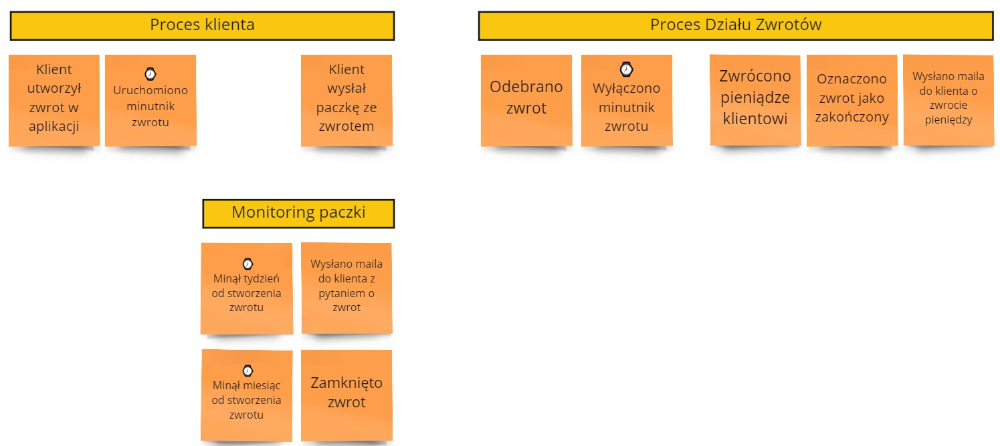
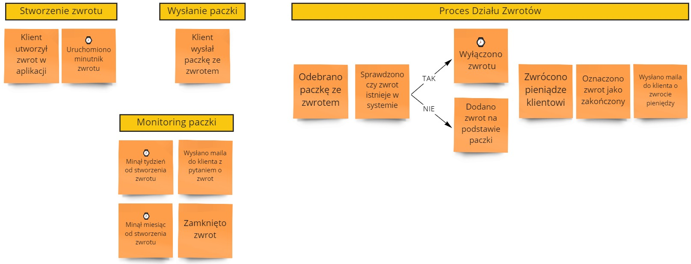
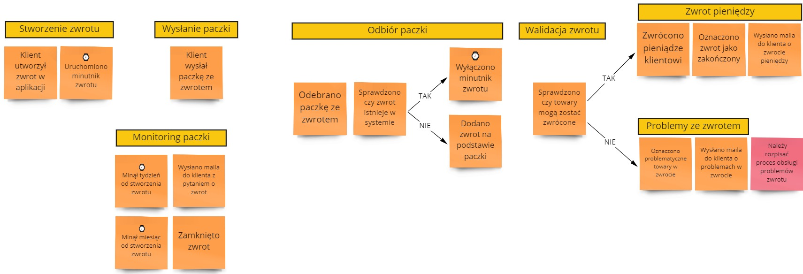
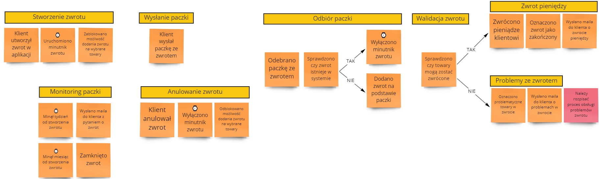
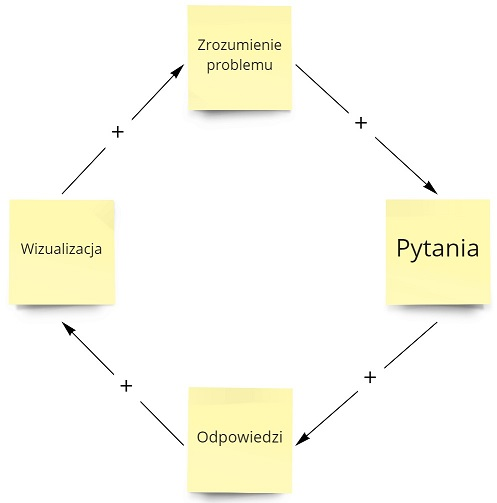

Event Storming kojarzy się przede wszystkim z pomarańczowymi karteczkami ze zdarzeniami. Rzucamy je na tablicę, aby pokazać określony proces biznesowy. Następnie układamy je wedle konkretnego schematu. Określamy kilka problemów i gotowe. Nie do końca...

Taki proces nie wytrzyma zderzenia z rzeczywistością, ponieważ sesja nie pomogła nam dojść do sedna problemu. A to dlatego, że podeszliśmy do tej techniki zbyt płytko.

**Jeśli podczas warsztatu nie będziemy zadawać pytań pogłębiających to stracimy 80% zysku z wykorzystywania Event Stormingu**. Tylko wtedy ta technika jest bardziej skuteczna niż zwykła analiza wykonana w Wordzie, czy na makietach. Dopiero odpowiednia wizualizacja + pytania na jej podstawie dają nam właściwy poziom analizy.

Pokażmy sobie ten problem na podstawie zwrotu produktów do sklepu (np. do Zalando).

## W czym leży problem

Załóżmy, że pracujemy z Działem Zwrotów. Po analizie z pracownikami tego działu wyszedł nam poniższy proces:

Proces wydaje się kompletny - od utworzenia zwrotu do wysłania maila z informacją, że zwrot pieniedzy miał miejsce. 

Czy powinniśmy być zadowoleni? Czy sądzicie, że jest OK?

(Nie mogłem się powstrzymać - ten fragment z Pulp Fiction zbyt dobrze tutaj pasował 😉) 

Wszystko wydaje się proste i takie jest - dlatego, że zbyt płytko weszliśmy w proces. Jakby pójść z czymś takim na produkcję to mamy wręcz pewność, że nasz system upadnie pod atakiem rzeczywistości.

Moja reguła kciuka w tym przypadku to:

**Jeśli nie ma przynajmniej kilku rozgałęzień to znaczy, że nie zadaliśmy odpowiednich pytań.**

## Pytania

A więc przejdźmy po najbardziej popularnych pytaniach, które warto zadać w takich sytuacjach:

### A co, jeśli nie?

To jest pytanie, które zadaję przechodząc przez proces po każdym zdarzeniu. W przypadku powyższego procesu możemy zapytać:

> A co, jeśli klient stworzył zwrot, ale nie wysłał paczki?
> 
> A co, jeśli klient wysłał paczkę, ale jej nie odebraliśmy?

Na tej podstawie możemy dojść do następujących wniosków:
- Nie możemy 100% określić, że klient wysłał do nas paczkę. Nawet jeśli wygenerował przesyłkę przez naszą stronę kurierem to mógł ją nadać inaczej. Musimy monitorować zwroty, aby znaleźć te rozbieżności.
- Paczka mogła się zgubić po drodze lub zawieruszyć u dostawcy. Wtedy klient będzie zły, że nie otrzymał pieniędzy, a zrobił wszystko co powinien.

W takim przypadku rozwiązaniem może być prosty monitoring zwrotu, który najpierw skontaktuje się z klientem. Jeśli przez kolejne 2 tygodnie nic się nie stanie, to automat zamknie zwrot. Nasza tablica ES może wtedy wyglądać następująco:

### Czy klient zawsze postępuje tak samo?

To jest pytanie, które pozwala nam wejść w buty zewnętrznego aktora. Zastanawiamy się czy możemy z jakiegoś powodu podejść do tego procesu inaczej. W powyższym scenariuszu jest możliwa inna opcja:

> Czy klient zawsze nadaje paczkę ze zwrotem po dodaniu zwrotu do systemu? 

Możemy odwrócić to pytanie:

> Czy klient może wysłać towary do zwrotu bez dodania zwrotu w systemie?

**Oczywiście, że może - sam tak zrobiłem 😀** 

W tym przypadku, zdarzenie "Odebrano zwrot" jest nieprawidłowym zdarzeniem. My nie wiemy czy paczka ze zwrotem posiada swój odpowiednik w systemie. Jednocześnie skoro klient wysłał nam te towary to pewnie chce dokonać tego zwrotu. Wobec czego w przypadku braku zwrotu w systemie musimy go sami stworzyć:

### Czy my zawsze robimy tak samo?

Warto również potwierdzić, że nasze zachowanie jest zawsze takie samo. Znajdziemy wtedy dodatkowe scenariusze dla przypadków brzegowych. W procesie zwrotu może to wyglądać np.

> Czy zawsze dla otrzymanego zwrotu wysyłamy pieniadze?

I to w 99% przypadków może być prawda, ale w tym 1% już nie 😀

Zwrot, który zadeklarował klient może się różnić od tego co zostało dostarczone. Lub może być uszkodzone przez klienta. Wtedy nie możemy zwrócić pieniędzy. Wobec czego musimy to uwzględnić w naszym procesie.

### Czego już nie można zrobić?

Tego pytania używamy, aby znaleźć reguły reakcji na istotne zdarzenia w naszym procesie. W powyższym procesie warto zadać pytanie:

> Czego klient nie może zrobić po stworzeniu zwrotu?

Najprawdopodobniej nie może już utworzyć nowego zwrotu na te same towary. To mogłoby spowodować duże zamieszanie w systemie i potencjalny wielokrotny zwrot tych samych pieniedzy. Warto by mu więc ograniczyć możliwość dokonania zwrotu drugi raz.doda

To pytanie jest bardzo skuteczne aby wyciągać niewidoczne założenia na wierzch. **Wasz biznes mógłby uważać za oczywiste, że tak się powinno stać.** Ale to co jest oczywiste dla nich, może dla nas nie być 😉

### Czy podjętą decyzję można zmienić / wycofać?

To pytanie pomoże nam odnaleźć dodatkową warstwę w naszych procesach biznesowych. Tutaj może to wyglądać następująco:

> Czy klient może chcieć anulować zwrot, albo zmienić dane zwrotu?
> 
> Czy powinniśmy na to pozwolić?

Tutaj technicznie można wszystko obsłużyć. Ale biznesowo część opcji może nie mieć sensu lub wprowadzać ogromne zamieszanie. Rozmawiając z biznesem o plusach i minusach możemy dojść do wniosku, że:

- Pozwalamy anulować zwrot, ale tylko do momentu wysłania paczki przez klienta / odebrania paczki w zakładzie.
- Nie pozwalamy zmienić danego zwrotu - jeśli klient się pomylił to anuluje calość i ponawia zwrot.

Wtedy nasz proces będzie wyglądać następująco:

Mała uwaga dotycząca stosowania tego pytania w praktyce. **Nie pozwalajcie na słowa "Wyedytowano" / "Zaktualizowano" w waszych zdarzeniach** (przynajmniej bez głębszej analizy). To jest ukryte siedlisko różnych przypadków brzegowych.

## Podsumowanie

Z 6 zdarzeń i 2 procesów doszliśmy do 18 zdarzeń i 7 procesów. Jeśli wejdziemy głębiej w detale wysyłania paczki czy problemów ze zwrotem pewnie jeszcze zwiększymy ten wynik. Robi się coraz bardziej skomplikowane 😨

Ale taki jest cel ponieważ taka jest otaczająca nas rzeczywistość. **Odpowiednia wizualizacja pozwala nam na zadawanie lepszych pytań.** Zaś lepsze pytania pozwalają nam jeszcze głębiej odkrywać złożoności naszego procesu. I lepiej go wizualizować. Mamy tutaj typowe sprzeżenie zwrotne dodanie:

To co jest ważne to podejście iteracyjne. Za pierwszym razem nie uda nam się znaleźć wszystkich scenariuszy. Ale nikt nie mówił, że należy tylko raz przeprowadzać sesję Event Stormingu 😀