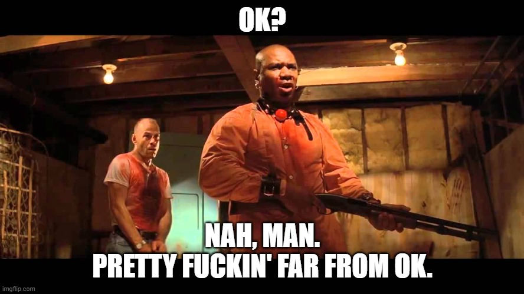

Storming to oczywiście są karteczki pomarańczowe ze zdarzeniami. Rzucamy je na tablicę aby pokazać określony proces biznesowy. Następnie układamy je wedle konkretnego schematu. Określamy kilka problemów i gotowe.

Tak niestety nie jest. **Nie zadając odpowiednich pytań tracimy 80% zysku z wykorzystywania Event Stormingu**.  Wtedy ta technika nie będzie bardziej skuteczna niż zwykła analiza wykonana w Wordzie. Dopiero wizualizacja + pytania dają nam odpowiedni poziom analizy problemu.

Pokażmy sobie ten problem na podstawie zwrotu produktów do Zalando.

## W czym leży problem

Załóżmy, że chcemy zwizualizować proces zwrotu towaru do Zalando. Po analizie z biznesem wyszedł nam taki rezultat:

// ES
		○ Klient utworzył zwrot w aplikacji
		○ Klient wysłał paczkę ze zwrotem
		○ Odebrano zwrot 
		○ Zwrócono pieniądze klientowi
        ○ Odznaczono zwrot jako zakończony
        ○ Wysłano maila do klienta z informacją

Posiadamy tutaj cały proces, po kolei wszystkie zdarzenia. Proces jest kompletny - od utworzenia zwrotu do wysłania maila z informacją, że zwrot pieniedzy miał miejsce. 

Czy powinniśmy być zadowoleni? Sądzicie, że jest OK?

(Nie mogłem się powstrzymać 😉) Wydaje się proste i takie jest - dlatego, że zbyt płytko weszliśmy w proces. Jakby pójść z czymś takim na produkcję to mamy wręcz pewność, że nasz system nie wytrzyma ataku rzeczywistości.

Zasadą kciuka jest, że:

> Jeśli nie ma przynajmniej kilku rozgałęzień to znaczy że nie zadaliśmy odpowiednich pytań.

## Pytania

A więc przejdźmy po najbardziej popularnych pytaniach, które warto zadawać w takich sytuacjach:

### A co, jeśli nie?

To jest pytanie, które zadaję przechodząc przez proces po każdym zdarzeniu. W przypadku powyższego procesu możemy zapytać:

- A co, jeśli klient stworzył zwrot, ale nie wysłał paczki?
- A co, jeśli klient wysłał paczkę, ale nie odebraliśmy jej?

Na tej podstawie możemy dojść do następujących wniosków:
- Nie możemy 100% określić, że klient wysłał do nas paczkę. Nawet jeśli wygenerował przez naszą stronę wysyłkę kurierem to mógł ją nadać inaczej. Musimy monitorować zwroty, aby móc znaleźć te rozbieżności.
- Paczka mogła się zgubić po drodze lub zawieruszyć u dostawcy. Wtedy klient będzie zły, że nie otrzymał pieniędzy, a zrobił wszystko co powinien.

Nasza tablica ES może wtedy wyglądać następująco:

### Czy klient zawsze postępuje tak samo?

To jest pytanie, które pozwala nam wejść w buty zewnętrznego aktora. Zastanawiamy się czy możemy z jakiegoś powodu podejść do tego procesu inaczej. W powyższym scenariuszu jest możliwa inna opcja:

- Czy klient zawsze nadaje paczkę ze zwrotem po dodaniu zwrotu do systemu? 

Na tej podstawie pojawia się nam scenariusz:

- Czy klient może wysłać towary do zwrotu bez dodania zwrotu w systemie?

**Oczywiście, że może - sam tak zrobiłem 😀** W tym przypadku, zdarzenie "Odebrano zwrot" jest nieprawidłowym zdarzeniem. My nie wiemy czy paczka ze zwrotem posiada swój odpowiednik w systemie. Wobec czego musimy podejść do tematu oddzielnie:

// ES

### Czy my zawsze robimy tak samo?

Warto również potwierdzić, że nasze zachowanie jest zawsze takie samo. Znajdziemy wtedy dodatkowe scenariusze dla przypadków brzegowych. W procesie zwrotu może to wyglądać np.

- Czy zawsze dla otrzymanego zwrotu wysyłamy pieniadze?

I to w 99% przypadków może być prawda, ale w tym 1% już nie 😀

Zwrot, który zadeklarował klient może się różnić od tego co zostało dostarczone. Lub może być uszkodzone przez klienta. Wtedy nie możemy zwrócić pieniędzy. Wobec czego musimy to uwzględnić w naszym procesie.

### Czego już nie można zrobić?

Tego pytania używamy, aby znaleźć reguły reakcji na istotne zdarzenia w naszym procesie. W powyższym procesie warto zadać pytanie:

- Czego klient nie może zrobić po stworzeniu zwrotu?

Najprawdopodobniej nie może już utworzyć nowego zwrotu na te same towary. To mogłoby spowodować duże zamieszanie w systemie i potencjalny wielokrotny zwrot tych samych pieniedzy. Warto by mu więc ograniczyć możliwość dokonania zwrotu drugi raz.

// ES

To pytanie jest bardzo skuteczne aby wyciągać niewidoczne założenia na wierzch. **Wasz biznes mógłby uważać za oczywiste, że tak się powinno stać.** Ale to co jest oczywiste dla nich, może dla nas nie być 😉

### Czy podjętą decyzję można zmienić / wycofać?

To pytanie pomoże nam odnaleźć dodatkową warstwę w naszych procesach biznesowych. Tutaj może to wyglądać następująco:

- Czy klient może chcieć anulować zwrot, albo zmienić dane zwrotu?
- Czy powinniśmy na to pozwolić?

Tutaj technicznie można wszystko obsłużyć. Ale biznesowo część opcji może nie mieć sensu lub wprowadzać ogromne zamieszanie. Rozmawiając z biznesem o plusach i minusach możemy dojść do wniosku, że:

- Pozwalamy anulować zwrot, ale tylko do momentu wysłania paczki przez klienta / odebrania paczki w zakładzie.
- Nie pozwalamy zmienić danego zwrotu - jeśli klient się pomylił to anuluje calość i ponawia zwrot.

Wtedy nasz proces będzie wyglądać następująco:

Mała uwaga dotycząca stosowania tego pytania w praktyce. **Nie pozwalajcie na równocześnie na słowa "Wyedytowano" / "Zaktualizowano" w waszych zdarzeniach** (przynajmniej bez głębszej analizy). To jest ukryte siedlisko różnych przypadków brzegowych.