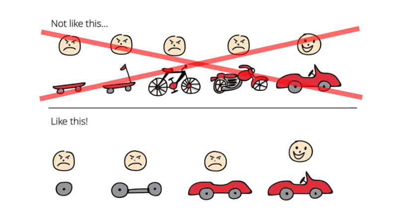

Jednak praca iteracyjna "zwinna" nie jest odpowiedzią na wszystko.

Tłem do artykułu będzie post sprzed roku Oskara Dudycza [When Agile is not enough](https://event-driven.io/en/when_agile_is_not_enough/)
Twój artykuł dał mi do myślenia. Powiedziałbym, że podejście powinno być przyjmowane w zależności od tego, na ile jesteśmy pewni tego, co budujemy. Pozwól mi to wyjaśnić.

## Praca iteracyjna

W oparciu o zasadę Pareto powiedziałbym, że w 80% naszej pracy
- nie jesteśmy do końca pewni co do rzeczywistego rozwiązania, które chcemy dostarczyć, ale
- rozumiemy cel, który chcemy osiągnąć.

Na przykład chcemy, aby użytkownik zrealizował określony cel przechodząc przez nowy proces. Nie ma wielu (jeśli są w ogóle) przykładów, jak ułożyć taki proces w rzeczywiste strony i formularze. Nie jesteśmy pewni, czy to wszystkie informacje, które musimy zebrać. Proponowane rozwiązanie to tylko przypuszczenie.

W tym scenariuszu powinniśmy skoncentrować się na bardzo szybkim przetestowaniu rozwiązania, aby sprawdzić, czy jesteśmy na dobrej drodze. Otrzymujemy informacje zwrotne od użytkowników i odpowiednio dostosowujemy nasze rozwiązanie. Pogłębiamy nasze zrozumienie. Stąd podejście iteracyjne.

O tym podejściu mogliśmy przeczytać w artykule Barry Oreilly poświęconym [How to implement Hypothesis-Driven Design](https://barryoreilly.com/explore/blog/how-to-implement-hypothesis-driven-development).Barry opisał, jak wykorzystać niepewność, aby uczyć się na nowych przykładach i tworzyć lepsze rozwiązania.

## Praca nieiteracyjna

Z drugiej strony są obszary, w których mamy przekonanie graniczące z pewnością co musimy dostarczyć. Zwykle dotyczy to bardziej stabilnych domen, z których przykład może być:
- rozliczanie czasu pracy - jak praca osoby z konkretną umową jest rozliczana 
- księgowość - jak obsługiwać faktury i liczyć podatki
- dokumenty magazynowe - regulujące jak obracać stanami magazynowymi
- zasady prawne specyficzne dla kraju 
- wyliczenia matematyczno-fizyczne 
i podobne. Mamy określone wejście i wyjście dla naszego procesu.

Lub możemy też chcieć zrealizować odpowiednio duży komponent, który powinien posiadać określone właściwości. David Jeske, były dyrektor w Google, [opisuje takie podejście] podczas pracy nad ich systemami(https://www.quora.com/Why-do-some-developers-at-strong-companies-like-Google-consider-Agile-development-to-be-nonsense/answer/David-Jeske?share=1)

W przypadku tych problemów lepiej podejść do analizy z wyprzedzeniem, aby mieć pewność, że w końcu dostarczymy wymagany mechanizm/proces. **Znajomość całego procesu pomaga nam stworzyć odpowiednie abstrakcje, których nie bylibyśmy w stanie stworzyć, robiąc to iteracyjnie.** Lub ich wdrożenie wymagało by wyrzucenie obecnej pracy do kosza.

Przeprowadzając takie zmiany wiele firm stosuje podejścia oparte na dokumentach projektowych jak [Google Design Document](https://www.industrialempathy.com/posts/design-docs-at-google/) czy [Uber RFC](https://blog.pragmaticengineer.com/scaling-engineering-teams-via-writing-things-down-rfcs/)

## Co kiedy wybierać?

// obrazek there's always a bigger fish

W jednym systemie możemy napotkać różnego rodzaju problemy. Powstaje pytanie, kiedy jakie podejście wybierać. **Na pewno nie chcemy stosować jednego podejścia do każdego problemu.** Skończy się to katastrofą.

Do analizy poszczególnych podejść można zastosować [Mapy Wardley'a].

// zdjęcie map

Podzielimy nasze rozwiązanie na mniejsze komponenty, z których się ono składa. Następnie dodamy do tego wymiar stabilności rynkowej. Na tej podstawie można oceniać jakie rozwiązanie zastosować. 

Innym sposobem podziału może być [Cynefin Framework](https://en.wikipedia.org/wiki/Cynefin_framework)

// zdjecie

Gdzie dzielimy nasz problem na obszary: Oczywisty / Skomplikowany / Złożony / Chaotyczny / Nieuporządkowany. Następnie stosujemy odpowiednie podejście. 

Jednak zauważcie co trzeba zrobić najpierw. **Musimy wykonać analizę, aby zdecydować, że dane zadanie wykonamy iteracyjnie** (lub nie). W przypadku dużego problemu taka analiza nie będzie szybka. Wobec czego również pracujemy nieiteracyjnie.

## Brak designu jest jeszcze głupszy

Simon Brown kończy swoje [prezentacje o architekturze](link) cytatem:

> Big design up front is dumb. Doing no design up front is even dumber.

Bardzo podoba mi się to podejście.

Simon mocno promuje podejście z książki [Just Enough Software Architecture: A Risk-Driven Approach](https://www.goodreads.com/en/book/show/9005772)

Określenie ryzyk, kompromisów, celów, zależności.

## Organizacja 

// jakiś fail na twarz?

I wszystko to co napisałem wyżej może być tylko marzeniem, jeśli wasza organizacja działa tylko w jednym stylu pracy:

- Wszyscy są agile - pracujemy w fajnych dwutygodniowych sprintach, ale niedochodzimy nigdzie konkretnie.
- Wszyscy są waterfall - definiujemy od A do Z rozwiązanie do dostarczenia, a później rzeczywistość nam wymusza zmiany.

Jakoś jest tak, że wpadamy ze skrajnośći w skrajność.

Aby móc pracować w ten sposób, ludzie w zespole (nie tylko programiści, a może zwłaszcza nie sami) muszą zaakceptować fakt, że nie wiedzą wszystkiego. I myślę, że zwykle jest to najtrudniejsze do pokonania ograniczenie.