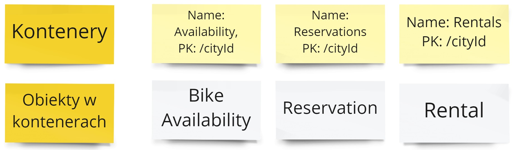
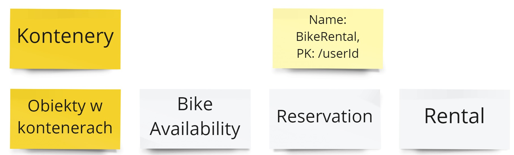
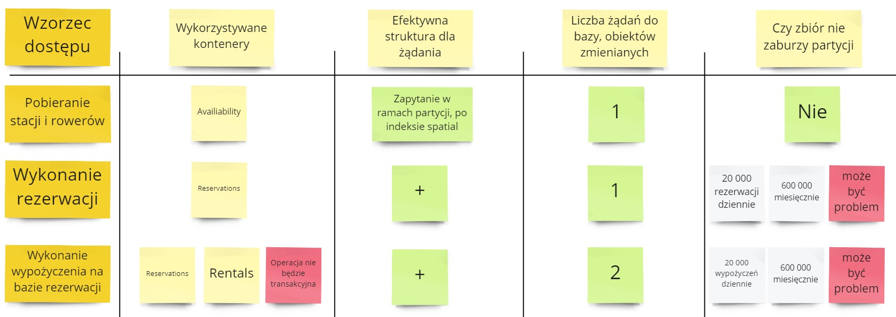
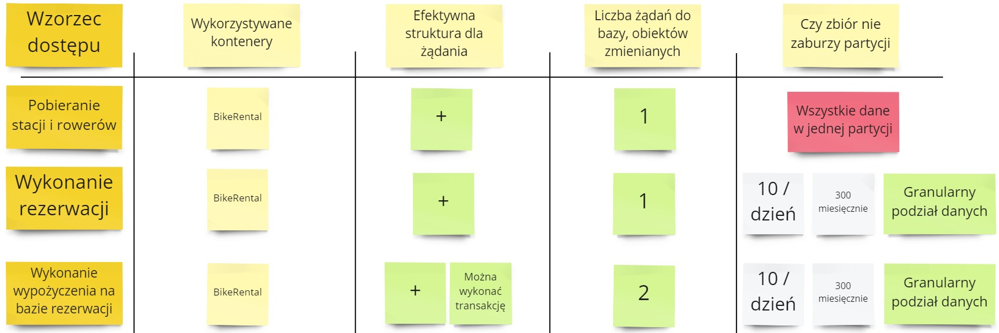
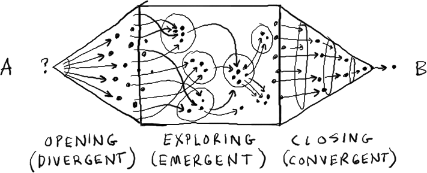

Kontynuujemy cykl o modelowaniu w Cosmos DB. W [poprzednim odcinku](/2022/06/22/modelowanie-w-cosmos-db-obiekty-bazodanowe/) opisaliśmy, jakie obiekty bazodanowe będziemy potrzebowali w naszym rozwiązaniu.

W tym odcinku zastanowimy się nad strukturą bazy - kontenerami, oraz które obiekty powinny do nich należeć. Tak jak zawsze, zaproponuję "inżynierskie" podejście do porównywania propozycji 😉



## Co musimy zaplanować?

Kiedy posiadamy już obiekty bazodanowe, to kolejnym krokiem jest zaplanowanie struktury bazy danych. Mamy tutaj następujące problemy:

1. Jaka powinny być kontenery? 
   1. Ile ich powinno być?
   2. Jakie powinny być ich klucze partycjonujące?
2. Jakie obiekty przechowywać w poszczególnych kontenerach?

Jak spojrzymy na ten problem szerzej, to widać, że istnieją tutaj dziesiątki możliwych rozwiązań:
- Można wszystkie obiekty trzymać razem - w jednym kontenerze.
- Można wszystkie obiekty trzymać osobno - kontener per obiekt.
- Można partycjonować kontenery po miastach - wtedy dane miasta są trzymane i dostępne razem.
- Można partycjonować kontenery po klientach - wtedy dane klienta są trzymane i dostępne razem.
- Można partycjonować identyfikatorem obiektu - wtedy wszystko jest uber atomowe 😎, ale odczyt będzie kosztował miliony monet 💰

Każde z tych rozwiązań ma swoje wady i zalety. **Analizując tylko jedno rozwiązanie dojdziemy do lokalnego maksimum.** Rozwiążemy dużą część problemów, ale za rogiem może być dostępne o wiele lepsze. Lub też połączenie 2 rozwiązań pozwoli nam stworzyć trzecie - o wiele lepsze.

Ale się o tym nie dowiemy, bo tam nie dotarliśmy 😥

## Jak wypracowywać rozwiązania?

### Wygeneruj pomysły

Na samym początku należy się skupić na generacji jak największej liczby potencjalnych rozwiązań. 
**Celowo podczas pracy z zespołem informuję, aby zaproponować przynajmniej 8 propozycji.** Jest to na tyle duża liczba, że wymusza kreatywne poszukanie.

W tej fazie jest zabronione ocenianie tych propozycji. Chodzi nam o to, aby pomysły nie lądowały w koszu, zanim zobaczymy je wszystkie. Bardzo często zespoły wyrzucają lepsze rozwiązania, gdyż nie pasują im do pierwszego pytania, które mają w głowie.

(Na potrzeby tego cyklu skupiamy się tylko na najważniejszych obiektach - BikeAvailability / Reservation / Rental. Pozostałe obiekty, z racji swojej niezmienności, nie są na tyle istotne dla celów edukacyjnych 😀)

#### Pierwsza z brzegu propozycja

Jednym z pierwszych rozwiązań, jakie mogą przyjść nam do głowy jest:
- Wrzucenie wszystkich obiektów do osobnych kontenerów.
- Partycjonowanie kontenerów po miastach.

Jest to o tyle prosta struktura, że od razu wiemy co gdzie leży. Kłopotem może być ilość przechowywanych danych w jednej partycji.

#### Propozycja przeciwna

Taka propozycja również może być interesująca:
- Wszystkie obiekty w jednym kontenerze.
- Partycjonowanie kontenera po kliencie.

To nam pozwoli wykonywać operacje transakcyjnie na wszystkich obiektach. Jednak granulacja po użytkowniku może sprawić, że obiekty typu BikeAvailability mogą nie być prosto dostępne.

### Dokonaj analizy pomysłów

Gdy posiadamy różne propozycje należy je następnie zanalizować. Warto posiadać wspólne kryteria do porównania rozwiązań, aby oddzielić własne przekonania od bardziej obiektywnych kryteriów. Na potrzeby analizy struktury bazy danych możemy zaproponować takie podejście:

- Rozpoczynamy od analizowanego wzorca dostępu.
- Określamy wykorzystywane kontenery - najlepiej, jeśli jest jeden.
- Sprawdzamy czy mamy efektywną strukturę dla żądania - np. czy zapytanie nie wymaga sprawdzenia całej tabeli.
- Liczymy ile mamy żądań do bazy - co pozwala znaleźć sytuację gdy mamy N+1 zapytań.
- Analizujemy czy zbiór danych nie zaburzy partycji - co może nastąpić gdy zbiór jest silnie rosnący lub gdy będziemy posiadać dane trudne do przeszukania.

Jeśli masz inne propozycje analizy, to podaj je w komentarzach 😊

#### Pierwsza z brzegu propozycja

Weźmy na tapet pierwszą naszą propozycję:

Co tutaj mamy?
1. **Pobieranie stacji i rowerów**. Powinno pójść bezproblemowo.
2. **Wykonanie rezerwacji**. Tutaj możemy mieć problem z zbyt dużym zbiorem w jednej partycji. [Pojedyncza partycja (logiczna) może zawierać maksymalnie 20 GB danych](https://docs.microsoft.com/en-us/azure/cosmos-db/partitioning-overview#logical-partitions). Nasz zbiór może przekroczyć tę partycję.
3. **Wykonanie wypożyczenia na bazie rezerwacji**. Poza powyższym problemem, mamy też inny problem. [W Cosmos DB operacje są transakcyjne tylko wewnątrz jednej partycji (logicznej)](https://docs.microsoft.com/en-us/azure/cosmos-db/sql/transactional-batch?tabs=dotnet#whats-a-transaction-in-azure-cosmos-db). Operacja zakończenia rezerwacji i otwarcia wypożyczenia nie będzie operacją transakcyjną bazodanowo.

#### Propozycja przeciwna

Ok, to teraz zanalizujmy propozycję przeciwną:

Jak się sprawdza nasze rozwiązanie?

1. **Pobieranie stacji i rowerów**. Tutaj mamy duży problem. Stacje i rowery nie są przypisane do użytkownika. Wobec czego wszystkie będą wrzucone do jednej partycji. To może nam wygenerować zwiększyć koszta związane z indeksowaniem i przeszukiwaniem danych geolokalizacyjnych.
2. **Wykonanie rezerwacji**. Tutaj z kolei mamy zysk. Zbiór danych nie zaburzy partycji ponieważ mamy wysoką granulację. Danych będzie maksymalnie 300 sztuk miesięcznie.
3. **Wykonanie wypożyczenia na bazie rezerwacji**. Powyższy problem mamy również rozwiązany. Dodatkowo możemy przeprowadzić tę operację transakcyjnie.

## Podsumowanie

Takie podejście do analizy rozwiązań bazuje na stylu znanym z [Game Stormingu](https://gamestorming.com/):

1. Wygeneruj pomysły w sposób "prawie" nieskrępowany.
2. Oceń poszczególne rozwiązania, tak by można było je wzajemnie porównać.
3. Wybierz docelowe rozwiązania, z którymi będziesz pracować dalej.

Pozwala to unikać przedwczesnego skupienia się nad niedoskonałym rozwiązaniem ([premature convergence](https://cutlefish.substack.com/p/tbm-4852-premature-convergence)).

W następnym odcinku wybierzemy najlepsze rozwiązanie i określimy dalsze kroki.