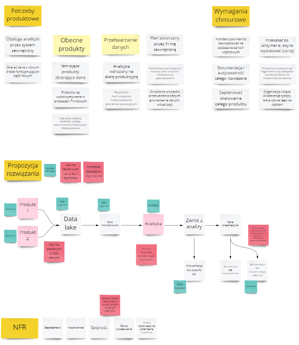
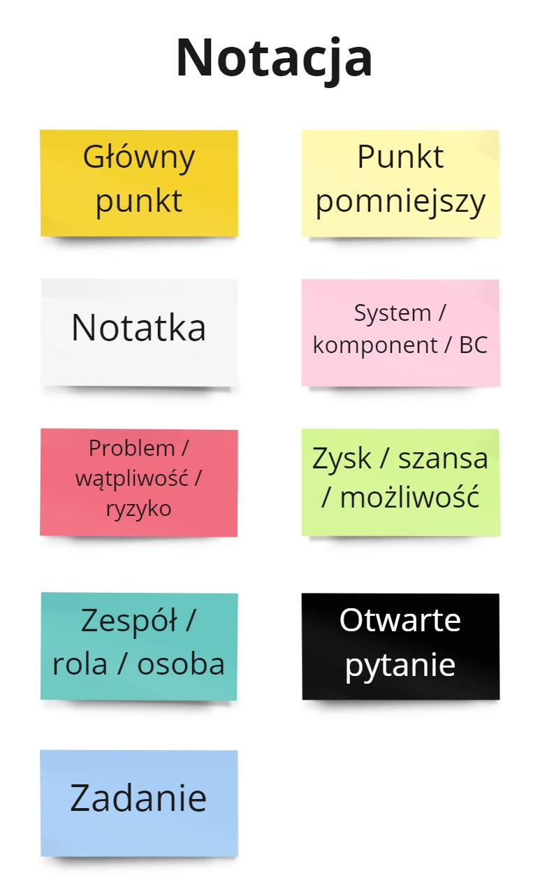

Pandemia spowodowała, że coraz więcej spotkań przenieśliśmy do świata wirtualnego. To spowodowało, że nie możemy wykorzystywać naturalnych narzędzi jakie mieliśmy w biurach - tablic, notatek, rysowania na kartkach. Chciałem zaproponować analogiczne podejście, wykorzystując tablicę wirtualną.

Artykuł jest inspirowany postem Nicka Tune'a [Freestyle Visual Collaboration](https://medium.com/nick-tune-tech-strategy-blog/freestyle-visual-collaboration-5a1e88e041cd), gdzie Nick proponował swoje podejście i notację. 

## Dlaczego pracować wizualnie?

Człowiek jest istotą kierującą się głównie zmysłem wzroku. Psycholog Linda Silverman, w książce [The Visual Spatial Learner](https://www.goodreads.com/book/show/673356.Upside_Down_Brilliance) przytacza badania, że 2/3 osób ma preferencje wizualno-przestrzenne. Naukowiec Colin Ware w swojej pracy [Information Visualization](http://www.ifs.tuwien.ac.at/~silvia/wien/vu-infovis/articles/book_information-visualization-perception-for-design_Ware_Chapter1.pdf) pisał, że około 20% neuronów w naszym mózgu jest odpowiedzialne tylko i jedynie za przetwarzanie obrazu.

Kiedy pokazujemy to, o czym rozmawiamy, naszym rozmówcom łatwiej jest:

- zrozumieć o czym mówimy;
- odnieść się do dyskusji, znaleźć luki;
- dodać istotne brakujące elementy;
- ułożyć sobie cały temat w głowie.

Spotkanie będzie bardziej efektywne i łatwiej dojdziemy do porozumienia 🤝

## Notowanie

Techniką, którą używam podczas większości spotkań zdalnych jest szybkie pokazywanie o czym aktualnie rozmawiamy. Staram się zapisywać główne punkty dyskusji, pokazywać problemy oraz możliwości. Gdy zaczynamy rozmawiać na temat aktualnego / potencjalnego rozwiązania, je również wizualizuję.

## Notacja

Aby cała wizualizacja nie była zbyt chaotyczna wprowadziłem notację kolorystyczną, aby poszczególne fragmenty byly odróżnialne.

Notacja ma kilka zalet, zarówno dla Ciebie, jak i uczestników:

- Przyśpiesza czytanie tablicy.
- Daje proste zasady pracy dla uczestników.
- Gdy podsumowujesz spotkanie, wiadomo na czym się skupić.

## Inne wskazówki

Poniżej parę wskazówek na co zwrócić uwagę gdy wizualizujesz treści na spotkaniu:

### Wykorzystuj znane Ci techniki warsztatowe

Ja dużo korzystam z Impact Mappingu, Event Stormingu, Value Stream Mappingu.

### Dawaj możliwość uczestnikom notować

### Proś o powtórze istotnych kwestii

## Samo Miro nie wystarczy

Gdzieś widziałem taki cytat:
> Jeden Notion zastąpi dziesięć Miro
 
Miro się wykorzystuje aby szybko gromadzić wiedzę. Ale następnie trzeba ją oporządzić. 

Jakie problemy często widzę:
- Ludzie nie spisują zadań do swoich narzędzi
- Nie ma nikgo, kto by prowadzić 