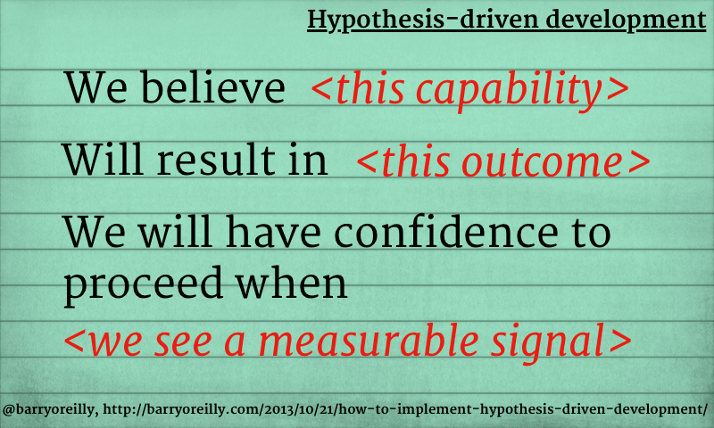
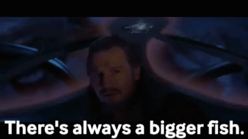
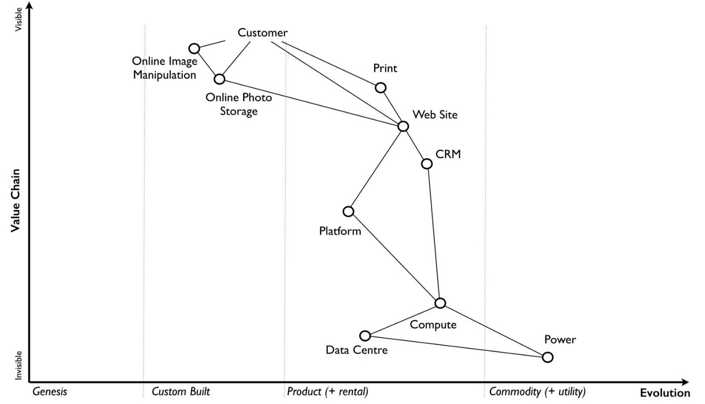
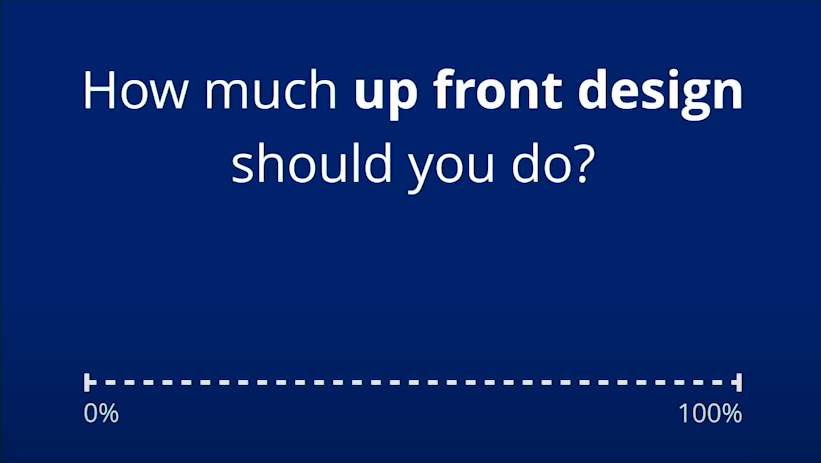

Podejście zwinne stało się de-facto standardem naszej branży technologicznej. Jednak wydaje się, że w pewnych sytuacjach sprawia ono więcej złego, niż dobrego.

Tłem do artykułu będzie artykuł Oskara Dudycza [When Agile is not enough](https://event-driven.io/en/when_agile_is_not_enough/) - Oskar dość stanowczo odniósł się do kilku praktyk pracy zwinnej. Napisałem wtedy kilka tweetów w odpowiedzi na artykuł - dziś na ich bazie przygotowałem szerszą odpowiedź.

## Praca zwinna

(Obrazek z artykułu Henrika Kniberga [Making sense of MVP](https://blog.crisp.se/2016/01/25/henrikkniberg/making-sense-of-mvp))

Część naszej pracy programistycznej wymaga dość płynnego podejścia co do rozwiązania:
- nie jesteśmy do końca pewni, czy rozwiązanie, które chcemy dostarczyć spełni potrzeby klienta, ale
- rozumiemy cel, który chcemy osiągnąć, tworząc dla klienta rozwiązanie.

W takiej sytuacji nie ma wielu (jeśli są w ogóle) przykładów, jak ułożyć nasz pomysł w rzeczywiste strony i formularze. Nie jesteśmy pewni, czy zbieramy wszystkie wymagane informacje. Ale przede wszystkim nie wiemy jak na to zareaguje klient. **Proponowane rozwiązanie to tylko przypuszczenie.**

W tym scenariuszu powinniśmy skoncentrować się na bardzo szybkim przetestowaniu rozwiązania, aby sprawdzić, czy jesteśmy na dobrej drodze. Otrzymujemy informacje zwrotne od użytkowników i odpowiednio dostosowujemy nasze rozwiązanie. Pogłębiamy nasze zrozumienie. Stąd podejście zwinne.

O tym podejściu świetnie pisze Barry Oreilly w artykule [How to implement Hypothesis-Driven Design](https://barryoreilly.com/explore/blog/how-to-implement-hypothesis-driven-development). Barry opisał, jak wykorzystać niepewność, aby uczyć się na nowych przykładach i tworzyć lepsze rozwiązania.

## Praca nie-zwinna

(Obrazek z artykułu Oskara [When Agile is not enough](https://event-driven.io/en/when_agile_is_not_enough/))

Z drugiej strony są problemy, w których mamy przekonanie graniczące z pewnością co musimy dostarczyć. Zwykle dotyczy to bardziej stabilnych obszarów biznesowych, takich jak:
- Rozliczanie czasu pracy - jak praca osoby z konkretną umową jest rozliczana.
- Księgowość - jak obsługiwać faktury i liczyć podatki.
- Dokumenty magazynowe - regulujące jak obracać stanami magazynowymi.
- Zasady prawne specyficzne dla kraju. 
- Wyliczenia matematyczno-fizyczne. 

Mamy określone wejście i wyjście dla naszego procesu.

Lub możemy też chcieć zrealizować odpowiednio duży komponent, który powinien posiadać określone właściwości. David Jeske, były dyrektor w Google, [opisuje takie podejście](https://www.quora.com/Why-do-some-developers-at-strong-companies-like-Google-consider-Agile-development-to-be-nonsense/answer/David-Jeske?share=1) podczas pracy nad ich systemami (i parę słów przeciwko podejściu zwinnemu).

W przypadku tych problemów lepiej podejść do analizy z wyprzedzeniem, aby mieć pewność, że w końcu dostarczymy wymagany mechanizm/proces. **Znajomość całego procesu pomaga nam stworzyć odpowiednie abstrakcje, których nie bylibyśmy w stanie stworzyć, pracując zwinnie.** Lub ich wdrożenie wymagałoby wyrzucenie obecnej pracy do kosza.

Takie metody pracy są coraz bardziej popularne w różnych firmach. Widać to przez:

- Popularyzację podejścia [Shape Up](https://basecamp.com/shapeup) od Basecamp, które zakłada pracę w 6-tygodniowych cyklach. Bardzo wnikliwie opisuje to Rafał Makara na swoim blogu w [cyklu artykułów](https://rmakara.github.io/Shape-Up-Introduction).
- Opisy metod pracy firm typowo technologicznych z artykułu Gergely Orosza [How Big Tech Runs Tech Projects](https://blog.pragmaticengineer.com/project-management-at-big-tech/). W zasadzie te firmy unikają Scruma.
- Rosnącej popularności pracy opartej na dokumentach projektowych jak [Google Design Document](https://www.industrialempathy.com/posts/design-docs-at-google/), czy [Uber RFC](https://blog.pragmaticengineer.com/scaling-engineering-teams-via-writing-things-down-rfcs/).

## Co kiedy wybierać?

W jednym produkcie możemy napotkać różnego rodzaju problemy. Powstaje pytanie, kiedy jakie podejście wybierać. **Nie chcemy stosować jednego podejścia do każdego problemu.** Skończy się to katastrofą.

Do analizy, jakie podejście wybrać do problemu, można zastosować [Mapy Wardley'a](https://radekmaziarka.pl/2020/06/21/narzedzia-pracy-konsultanta-wardley-map/):

Podzielimy nasz obszar biznesowy na mniejsze komponenty, z których się ono składa. Następnie dodamy do tego wymiar stabilności rynkowej. Na tej podstawie można oceniać, jakie rozwiązanie zastosować w danej sytuacji:

- Im bardziej na górze po lewej, tym większy nacisk na podejścia zwinne.
- Im bardziej na dole po prawej, tym większy nacisk na podejścia nie-zwinne.

Innym sposobem podziału może być [Cynefin Framework](https://en.wikipedia.org/wiki/Cynefin_framework):

Gdzie dzielimy nasz obszar biznesowy na 5 domen: Oczywista / Skomplikowana / Złożona / Chaotyczna / Nieuporządkowana. Następnie stosujemy odpowiednie podejście. 

Jednak zauważcie co trzeba zrobić najpierw. **Musimy wykonać analizę naszego obszaru biznesowego, aby zdecydować, że konkretny problem rozwiążemy zwinnie** (lub nie). W przypadku dużego obszaru taka analiza nie będzie szybka. Pytanie czy to jest podejście zwinne, czy nie?

## Brak designu jest jeszcze głupszy

[Simon Brown](https://twitter.com/simonbrown), twórca modelu C4, rozpoczyna swoje [prezentacje o architekturze](https://www.youtube.com/watch?v=z1xLDzx7hgw) cytatem:

> Big design up front is dumb. Doing no design up front is even dumber.

Bardzo podoba mi się to podejście - pokazuje, że nie ma tutaj jednej drogi.  Pytanie jak dużo tego projektowania wykonać? Simon mocno promuje podejście z książki [Just Enough Software Architecture: A Risk-Driven Approach](https://www.goodreads.com/en/book/show/9005772), które można streścić następująco:

- Określ główne ryzyka projektowe.
- Ułóż je wg priorytetów szansy wystąpienia i mocy rażenia.
- Projektuj rozwiązanie tak, aby odpowiadało na główne ryzyka i je zmniejszało.
- Zakończ projektowanie, kiedy koszt zmniejszania ryzyka jest wyższy, niż jego akceptacja.

Takie podejście pozwala nam zastosować bardziej złożone podejścia, gdy sytuacja tego wymaga. Jednak w przypadku prostszych problemów można iść całkowicie zwinnie i skupić się na programowaniu.

## Organizacja - jak trafić do nikąd

I wszystko to co napisałem wyżej może być tylko marzeniem, jeśli wasza organizacja działa tylko w jednym stylu pracy:

- Wszyscy są agile - pracujemy w krótkich dwutygodniowych sprintach, ale później wychodzą drastyczne zmiany, których dało się uniknąć.
- Wszyscy są waterfall - planujemy od A do Z całe rozwiązanie, a później rzeczywistość pięścią w twarz nam wymusza zmiany.

Wtedy, proponując inne podejście będziemy się czuli jak innowiercy.

Aby móc pracować w zróżnicowany sposób, zespół dostarczający produkt lub funkcjonalności (nie tylko programiści - wszystkie role) muszą zaakceptować fakt, że nie ma tutaj jednego domyślnego podejścia. **Czasem trzeba podejść bardziej zwinnie, czasem mniej #ToZależy.**

I myślę, że takiego podejścia jeszcze długo nam będzie brakować. Ale trzeba edukować, co staram się robić tym artykułem 😉