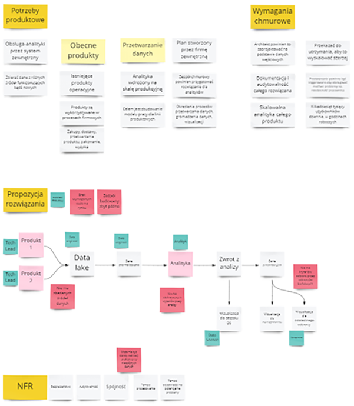
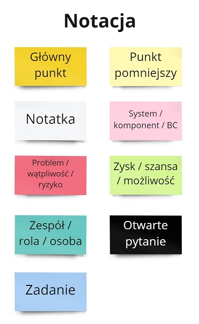

Pandemia spowodowała, że dużą część spotkań przenieśliśmy do świata wirtualnego. To spowodowało, że nie możemy wykorzystywać naturalnych narzędzi, jakie mieliśmy w biurach - tablic, notatek, rysowania na kartkach. Bardzo często spotkania zdalne są pustym rzucaniem słów. Nic nie jest pokazywane naszym rozmówcom.

Aby poradzić sobie z brakiem elementu wizualnego na spotkaniach zacząłem stosować analogiczne techniki wizualne z wykorzystaniem tablicy wirtualnej.

Artykuł jest inspirowany postem Nicka Tune'a [Freestyle Visual Collaboration](https://medium.com/nick-tune-tech-strategy-blog/freestyle-visual-collaboration-5a1e88e041cd), gdzie Nick proponował swoje podejście i notację. 

## Dlaczego pracować wizualnie?

Człowiek jest istotą kierującą się głównie zmysłem wzroku. Psycholog Linda Silverman, w książce [The Visual Spatial Learner](https://www.goodreads.com/book/show/673356.Upside_Down_Brilliance) przytacza badania, że 2/3 osób ma preferencje wizualno-przestrzenne. Naukowiec Colin Ware w swojej pracy [Information Visualization](http://www.ifs.tuwien.ac.at/~silvia/wien/vu-infovis/articles/book_information-visualization-perception-for-design_Ware_Chapter1.pdf) pisał, że około 20% neuronów w naszym mózgu jest odpowiedzialne tylko i jedynie za przetwarzanie obrazu. **Brak wizualizacji istotnie ogranicza nas w tym, jak przyjmujemy treści.**

Kiedy pokazujemy to, o czym rozmawiamy, naszym rozmówcom łatwiej jest:

- zrozumieć o czym mówimy;
- odnieść się do dyskusji, znaleźć luki w rozumowaniu;
- dodać istotne brakujące elementy;
- ułożyć sobie cały temat w głowie.

Spotkanie będzie bardziej efektywne i łatwiej dojdziemy do porozumienia 🤝

## Notowanie ad-hoc

Techniką, którą używam podczas większości spotkań zdalnych jest szybkie pokazywanie, o czym aktualnie rozmawiamy. Staram się zapisywać główne punkty dyskusji, pokazywać problemy oraz możliwości. Gdy zaczynamy rozmawiać na temat aktualnego / potencjalnego rozwiązania, je również wizualizuję.

Poniżej fragment z takiego spotkania, gdzie dyskutowaliśmy potrzeby dla analityki produktowej:

Od razu widać główne klastry informacji oraz informacje poboczne. Możemy odnieść się do poszczególnych fragmentów, bądź zapytać się, czy tak samo rozumiemy dane rozwiązanie.

Takie notowanie nie jest bezkosztowe - wymaga:

- Szybkiego pisania 😀
- Aktywnego słuchania, aby wychwytywać to co ważne.
- Umiejętnego koordynowania dyskusją, by przechodzić po kolejnych tematach.

## Notacja

Aby cała wizualizacja nie była zbyt chaotyczna wprowadziłem notację kolorystyczną, aby poszczególne fragmenty były odróżnialne.

Notacja ma kilka zalet, zarówno dla Ciebie, jak i uczestników:

- Przyśpiesza czytanie i poruszanie się po tablicy.
- Daje proste zasady pracy dla uczestników.
- Gdy podsumowujesz spotkanie, wiadomo na czym się skupić.

## Inne wskazówki

Poniżej parę wskazówek na co zwrócić uwagę gdy wizualizujesz treści na spotkaniu:

### Wykorzystuj notację z technik warsztatowych

W większości przypadków nie ma co wymyślać koła na nowo. Istniejące techniki warsztatowe posiadają gotowe struktury notowani. Możesz je wykorzystać podczas swoich spotkań.

Ja często korzystam z [Impact Mappingu](/2020/05/29/narzedzia-pracy-konsultanta-impact-mapping/), [Event Stormingu](), [Value Stream Mappingu](/2020/05/29/narzedzia-pracy-konsultanta-value-stream-mapping/) i innych technik opisanych w [narzędziach pracy konsultanta](/2020/02/04/narzedzia-pracy-konsultanta-podsumowanie).

### Pozwól uczestnikom notować

Miro (i pewnie pozostałe tablice wirtualne) pozwalają dosyć swobodnie zapraszać osoby do edytowania tablicy. Wobec czego nie musisz być jedyną osobą, która to będzie robiła.

Takie zaproszenie do notowania ma swoje zalety:

- Pozwala szybciej przeprowadzać dyskusję.
- Włącza osoby do dyskusji, pokazuje otwartość.
- Umożliwia szybką poprawę notatek, gdy coś błędnie zrozumiałeś.

### Parafrazuj opisane treści

Aby upewnić się, że całość opisu jest spójna możesz powtórzyć główne punkty na głos. Na tej podstawie sprawdzisz, czy wszystko się ze sobą klei, bądź czy nie brakuje jeszcze jakiejś istotnej kwestii. Alberto Brandolini w książce [Event Storming](https://www.goodreads.com/book/show/28947184-introducing-eventstorming) opisuje "Explicit walk-through", czyli opowiedzienie procesu po kolei jako sposób na wykrywanie niespójności. Przy robieniu notatek takie podejście również się świetnie sprawdza.

Nie chcesz oczywiście powtarzać wszystkich zgromadzonych notatek. Zwykle skupiam się na głównych punktach, zaletach i wadach, zaangażowanych systemach (gdy mówimy o jakimś rozwiązaniu).

## Sama tablica wirtualna nie wystarczy

Swojego czasu natknąłem się na taki cytat:
> Jeden Notion zastąpi dziesięć Miro
 
Miro wykorzystuje się z wielu powodów - głównie po to, aby szybko gromadzić wiedzę w sposób bardzo elastyczny. Ale następnie trzeba tę wiedzę ustrukturyzować. I w dłuższej perspektywie Miro nie jest dobrym miejscem na taką strukturyzację.  

Jakie problemy często widzę w zespołach:
- Nie określamy, gdzie skończyła się praca w toku i jakie posiadamy zaakceptowane elementy naszej pracy (np. kryteria akceptacji dla omawianych User Stories).
- Ustalenia z tablicy wirtualnej nie są transferowane do swoich wymaganych narzędzi. Przez to tracimy Single Source of Truth - wiedza jest rozmyta.
- Nie ma nikogo, kto by wyciągnął główne punkty dyskusji i przesłał następnie jako podsumowanie dla osób nieobecnych.

W mojej ocenie nie robimy tego, ponieważ mało kto lubi taką pracę - nie jest to szczególnie kreatywne zajęcie. Jednak ktoś to musi robić. Bez tego posiadamy bardzo dużo ogólnych materiałów, a bardzo mało zrozumiałej treści.

Także stosuj tablicę wirtualną, ale stosuj też inne narzędzia 😉