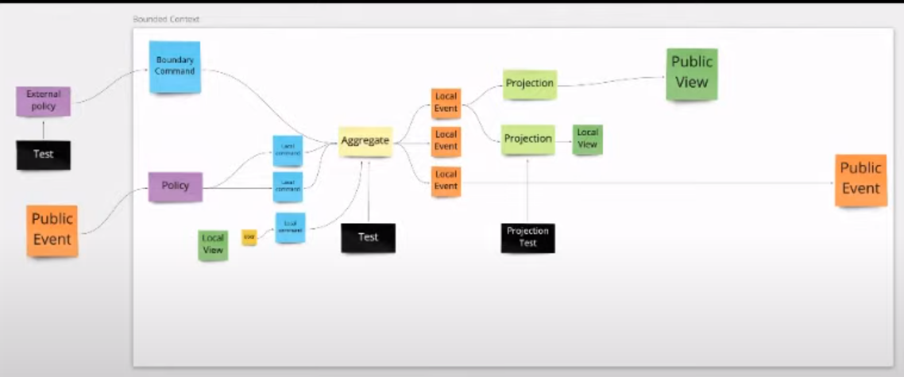
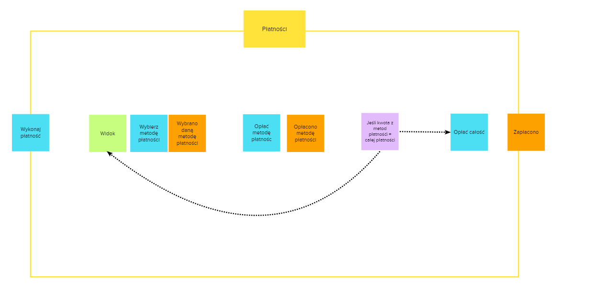

---
title: "Event Storming - Modular Level"
date: 2022-03-06T09:59:30+01:00
draft: true
---

Przez długi czas czułem, że brakuje mi kroku pośredniego pomiędzy Event Storming Process Level a Design Level.

Process Level - przechodzimy przez cały proces rozpisując pracę poszczególnych modułów ze sobą.
Design Level - wchodzimy na pracę poszczególnych agregatów.

Cięzko było bezpośrednio pokazać w którym miejscu mamy rozróżnienie zdarzeń wewnątrz / na zewnątrz danego modułu.

Wiele dało mi pokazanie tego na prezentacji Alberta gdzie pokazał on podział na pracę wewnątrz modułu, a na zewnątrz modułu.
https://www.youtube.com/watch?v=v4xLxmpAFdI

Pomyślałem aby to nazwać inaczej - aby mieć pewną definicję na podstawie której mogę łatwiej rozmawiać z moimi klientami i kolegami.

Stąd powstał Event Storming - Modular Level:
