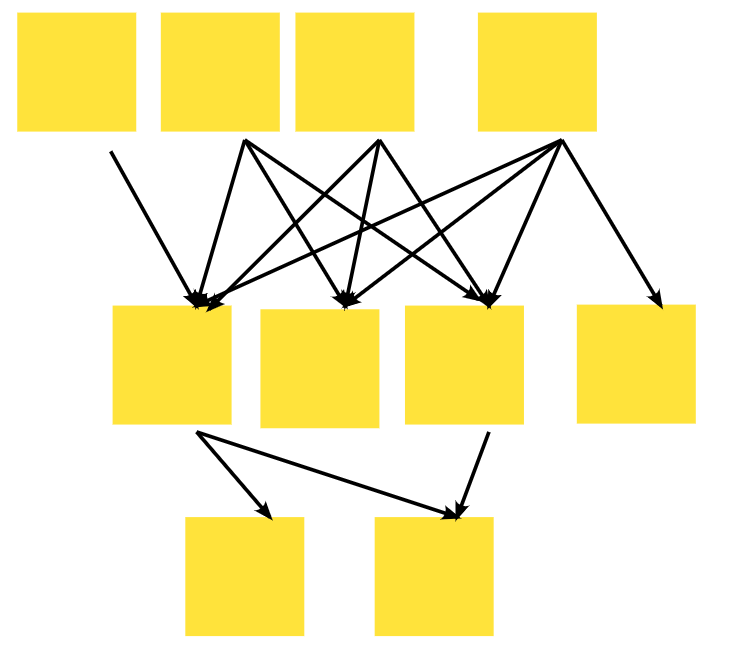

Ostatnio miałem serię warsztatów dotyczących wychodzenia z firmy bagna Legacy. Chciałem następnie wysłać uczestnikom maila z podsumowaniem co zrobiliśmy. Ale zgodnie z artykułem [Your words are wasted](https://www.hanselman.com/blog/your-words-are-wasted) Hanselmana postanowiłem napisać blogposta 😀 

Poniższy artykuł jest artykułem wysokopoziomowym - nie znajdziecie tutaj odpowiedzi na niskopoziomowe tematy, wartości brzegowych. W kolejnych tygodniach postaram się dodać treści rozwijające dane tematy.

Oki, to lecimy!

## Stan początkowy

Stan początkowy to zwykle jest system, gdzie wszystko jest połączone ze wszystkim. Poszczególne funkcjonalności przechodzą przez cały system pobierając i zmieniając dane w sposób nieopisany. Baza danych jest otwarta na wszystko jak idzie. Mamy niską lub zerową widoczność jak przebiegają nasze procesy w kodzie. Rzeczy są łatane na ad-hoc. 

To wszystko ma ogromny wpływ na pracę i ogólne emocje osob.
Ludzie nie wiedzą co i jak działa, dużo się kłócą dlaczego coś zostało zrealizowane w określony sposób. Planowanie pracy jest czasochłonne, estymaty są bardzo ogólne a jednocześnie i tak zwykle prace przeciągają się bardzo znacznie.

## Co można tutaj zrobić?
Ok, to jak sobie poradzić z tą sytuacją? Poniżej zbiór praktyk ode mnie - dostosowujcie je do swojej sytuacji 😊

### Określenie celów

To jest krok kluczowy, aby nasza ogólna praca się powiodła. Dla mnie tutaj pasuje cytat z Alicji z Krainy czarów:

> "Czy nie mógłby pan mnie poinformować, którędy powinnam pójść?" – mówiła dalej.
> 
> "To zależy w dużej mierze od tego, dokąd pragnęłabyś zajść" – odparł Kot-Dziwak.
> 
> "Właściwie wszystko mi jedno."
> 
> "W takim razie również wszystko jedno, którędy pójdziesz."
 
Jeśli chcemy osiągnąć konkretny cel to trzeba najpierw ustalić cel. Na tej podstawie będziemy planować dalszą pracę. Pozwoli nam to również odcinać niepotrzebne obszary, kiedy widzimy że nie przybliżają nas do celu. 

// MIRO screen

Na cele możemy patrzeć z różnej perspektywy:

- Co chcemy zmienić
- Dlaczego chcemy zmienić
- Dla kogo to chcemy zmienić
- Kiedy to chcemy zmienić
- Jak to chcemy zmienić

Najpierw zbieramy cele w postaci brainstormingu. Następnie grupujemy propozycje i wstępnie je przegadujemy. Na końcu odrzucamy te, które są nieprzystające do potrzeb. Ewentualnie możemy je jeszcze posegregować, na podstawie priorytetów danej firmy.

Kończymy z jasną wizją tego co chcemy osiągnąć.

### Podział domeny biznesowej

Ten krok jest opcjonalny, zależny od wielkości systemu z którym się zmagamy. 

W wielu przypadkach taki podział pozwala nam lepiej zaplanować naszą pracę. Dodatkowo buduje wśród uczestników zrozumienie w którym momencie się znajdujemy i ile mamy jeszcze pracy przed sobą. Widząc ogólny podział domeny możemy bardziej kompetentnie podejmować decyzję czy otwierać dany obszar, czy kończymy z eksploracją.

// MIRO screen

Chcemy sobie bardzo ogólnie podzielić 

### Zagłębienie się w Legacy

W tym momencie przechodzimy przez kolejne obszary biznesowe w sposób. Moją ulubioną techniką tutaj jest **Event Storming**

Tutaj możemy sobie dopasowywać strukturę warsztatu do naszych potrzeb. Możemy mieć zdarzenia z różnych poziomów (domenowe, infrastrukturalne, interfejsowe). Ważne jest to by wyciągać wiedzę, przypadki brzegowe, 

// Miro screen

Zbieramy problemy, procesy. Warto też pytać o usprawnienia - pozwala nam zebrać istotne informacje jak stworzyć lepsze rozwiązanie.

### Synteza wiedzy

Mając niskopoziomowe informacje możemy teraz wynieść te informacje wyżej i zbudować bardziej wysokopoziomową wiedzę:

- Jak proces biznesowy przechodzi przez konkretne obszary
- Jakie systemy / moduły są zaangażowane w procesy biznesowe
- Jakie istnieją systemy zewnętrzne, z którymi się komunikujemy
- Czy i jakie mamy zależności pomiędzy obszarami technicznymi
- Jak dane są podzielone przez konkretne obszary
- Kto dane zapisuje, a kto odczytuje
- Kto kieruje procesem, kto się podporządkowuje

// Miro screen

To jest dla nas istotne aby mieć lepsze zrozumienie co się u nas dzieje. 

### Wybór obszaru zmiany

Ten krok możemy wykonać przed, bądź po planowaniu docelowego rozwiązania. To zależy, od tego czy:

- chcemy pójść bardzo wąsko i rozwiązać konkretne problemy, lub
- chcemy pójść szeroko i zobaczyć całość rozwiązania.

Systemy bardzo rzadko mają jednorodną strukture. Zwykle mamy strukturę rozproszonego grafu:

// miro screen bazujacy na

https://www.youtube.com/watch?v=oyY3Iec5IAc&t=1449s

W takiej sytuacji próba zmiany elementów w środku będzie skazana na porażkę. Musimy wybrać mniejszy obszar do zmiany, aby krok po kroku wprowadzać zmiany.

Na jakiej podstawie wybierać nasz obszar zmiany:

- Wybranie czegoś na brzegu
- Risk vs value
- Osiągnięcie mierzalnego celu
- PoC 

W tym momencie nasz problem dzieli się na 2 części:

- Jak zmienić konkretny obszar część
- Jak połączyć nowy obszar z istniejącym rozwiązaniem

### Docelowy podział

Mając głębokie zrozumienie z czym się zmagamy możemy przejść do wysokopoziomowego podziału.

Tutaj bardzo często nie będzie dużych zmian.

- Działy firmowe i struktura organizacyjna
- Proces biznesowy
- Spójność danych
- Ograniczenia techniczne - niezmienna baza danych, wymogi interfejsowe

Można się wzorować następującym artykułem https://radekmaziarka.pl/2022/01/01/dlaczego-bounded-contexty-sa-wazne-jak-wyznaczac/

### Planowanie nowego rozwiązania

Tutaj proponuję 2 metody, w zależności od skali nowego rozwiązania:

- [Event Modeling](https://eventmodeling.org/) - dla mniejszych obszarów i konkretnych procesów
- [Event Storming Process Level](https://radekmaziarka.pl/szkolenia-i-warsztaty/event-storming-projektowanie-systemu) - gdy chcemy zaplanować większą współpracę komponentów

// miro screen - ES PL

Techniki te są uzupełniające - można je stosować równolegle i łączyć wyniki w większą całość. 

Obie te techniki mają konkretną strukturę i wykorzystujemy ją podczas warsztatu. Taka struktura daje nam dużą wartość - pozwala przenosić wyniki pomiędzy grupami, porównywać je, wyciągać najlepsze rozwiązania. Jednak nie jest tak, że musimy się wobec niej zamykać.

// miro screen - ES moduł płatności jako subkomponent

Możemy pokazać pracę na różnych poziomach, zarówno na poziomie systemowym, jak i modułowym / komponentowym. Aby to zwizualizować możemy lekko nagiąć naszą notację np. 

- Chcemy wydzielić Cennik jako osobną, reużywalną strukturę
- Połączenia do niej będą jednak cały czas synchroniczne - pozostałe moduły będą robiły zwykłe wywołanie w kodzie
- Wykorzystujemy do tego osobny kolor kartki, albo wskaźnik w opisie kartki aby pokazać różnicę

### Zbuduj vs zakup

Nie zawsze trzeba budować coś od zera, kiedy robimy modernizacje legacy.
https://medium.com/nick-tune-tech-strategy-blog/core-domain-patterns-941f89446af5

### Faktyczne wdrażanie nowego modułu

O tym obszarze napisano całe książki więc tylko opiszę tematy, które warto wspomnieć:

- tworzenie obszarów bezstanowych
- tworzenie obszarów stanowych
- dekompozycja i migracja danych
- praca równoległa dwóch rozwiązań
- spójność transakcji biznesowych

Więcej informacji można znaleźć w następujących książkach:

- https://www.goodreads.com/book/show/44144499-monolith-to-microservices
- https://www.goodreads.com/book/show/58153482-software-architecture
- https://www.goodreads.com/book/show/55782292-strategic-microservices-and-monoliths