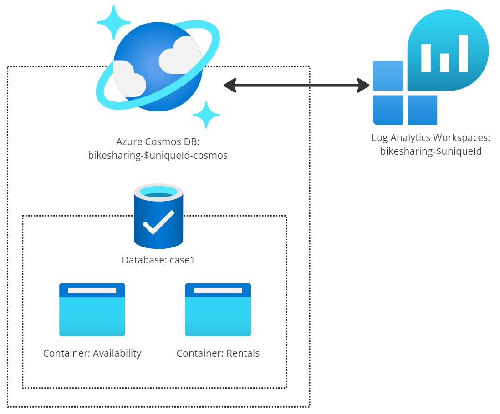
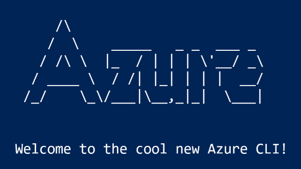
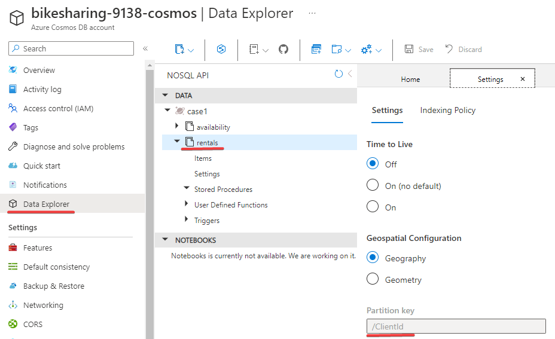

Kontynuujemy cykl o modelowaniu w Cosmos DB. W [poprzednim odcinku](/2022/12/14/cosmos-db-struktury-bazy-do-testów/) wybraliśmy 2 docelowe struktury bazy danych do testów.

W tym odcinku utworzymy infrastrukturę, którą będziemy testować w kolejnych odcinkach.



## Infrastruktura chmurowa

Aby przetestować nasz scenariusz musimy przetestować 2 przypadki bazodanowe. Stworzymy więc odpowiednią architekturę dla obu przypadków. Poniżej przykład dla pierwszego przypadku:

[](infrastructure.jpg)

Skoro testujemy bazę danych, to nasza infrastruktura będzie zawierała:

- **Konto Azure Cosmos DB**. Nazwa zawiera w sobie dynamiczny identyfikator, który wyjaśnię poniżej. 
- **Bazę danych**. Tutaj będą umieszczone nasze kontenery. Nazwa wskazuje na scenariusz biznesowy, który testujemy.
- **Kontenery** - Availability i Rentals. Tutaj będą umieszczone dane.

Dodatkowo, na potrzeby analizy ruchu, wykorzystamy [**Log Analytics Workspace**](https://learn.microsoft.com/en-us/azure/azure-monitor/logs/quick-create-workspace?tabs=azure-portal). Nie jest to kluczowy element do naszych testów wydajności. Jednak testy wydajności wygenerują wykorzystanie bazy danych, które pokażę jak analizować w podsumowaniu serii. 

Zauważcie, że **nie mamy tutaj żadnego serwisu compute**. Jest to celowe - aby uruchomić testy wydajności bazy danych nie musimy do tego posiadać dodatkowej infrastruktury. Wystarczy nam nasz prywatny komputer.

Drugi przypadek jest analogiczny, zmienia się jedynie nazwa bazy danych.

## Tworzenie infrastruktury

W tym momencie powstaje pytanie - jak tworzyć tą infrastrukturę?

Możemy po prostu przejść do tworzenia infrastruktury w panelu Azure. Niestety, **wyklikanie całego rozwiązanie to droga do nikąd**. Nie będziemy w stanie się upewnić, czy nasze infrastruktury są w rzeczywistości identyczne, kiedy tworzymy je manualnie. Dodatkowo jest to bardzo mozolny proces, w którym łatwo o pomyłkę.

**Tworzenie infrastruktury ze skryptów jest o wiele bardziej pewne.** A przy tym niewiele wolniejsze (pod względem pisania). Z racji, że nie piszemy tutaj aplikacji produkcyjnej, to nie musimy się silić na zaawansowane przekazywanie secretów czy rozwiązania w stylu [Terraform](https://www.terraform.io/) czy [Pulumi](https://www.pulumi.com/).



Do automatyzacji tworzenia infrastruktury wykorzystamy Azure Command-Line Interface - w skrócie Azure CLI 😀

Aby tworzyć taką infrastrukturę należy przez to narzędzie potrzebujemy:

- [Zainstalować Azure CLI](https://learn.microsoft.com/en-us/cli/azure/install-azure-cli)
- [Zalogować się do chmury](https://learn.microsoft.com/en-us/cli/azure/authenticate-azure-cli)
- [Poznać składnię dotyczącą CosmosDB](https://learn.microsoft.com/en-us/cli/azure/cosmosdb?view=azure-cli-latest) 

## Skrypty tworzące bazę danych

Poniżej umieściłem kod odpowiadający za tworzenie infrastruktury, podzielony na logiczne sekcje. Cały kod umieszczony jest na moim GitHub, w repozytorium [BikeRentals](https://github.com/rmaziarka/BikeSharing/tree/master/BikeSharing.Infrastructure).

Poniższy kod opisuje pierwszy przypadek - partycjonowanie kontenera _Rentals_ po identyfikatorze klienta. Jest on w 98% identyczny jak drugi przypadek. Małe różnice opisałem w ramach listowania skryptów. Nie będę drugi raz listować tego samego 😉  

### Zmienne lokalne

```sh
# Variables for SQL API resources
uniqueId=$RANDOM
resourceGroupName="bikesharing-$uniqueId"
location='westeurope'
accountName="$resourceGroupName-cosmos"
workspaceName="$resourceGroupName-workspace"
databaseName='case1'

availabilityContainerName='availability'
availabilityPartitionKey='//CityId'

rentalsContainerName='rentals'
rentalsPartitionKey='//ClientId'
```

Aby uprościć nieco skrypty wykorzystamy na samym początku zmienne lokalne. Dzięki temu podczas definicji zasobów nie będziemy musieli powielać tych samych nazw.

**Z rzeczy, które warto wyjaśnić:**

```sh
uniqueId=$RANDOM
```
Dzięki _uniqueId_ będziemy w stanie uruchamiać ten sam skrypt na wiele razy. Nie będziemy konfliktu z nazwami na Azure (nazwy konta CosmosDB są unikatowe).

```sh
databaseName='case1'
```
Tutaj mamy nazwę naszej bazy danych, która wskazuje na pierwszy przypadek testowy. W skrypcie dla drugiego przypadku będziemy mieli _case2_.

```sh
rentalsPartitionKey='//ClientId'
```
W ramach tego przypadku wskazujemy aby partycjonować kontener po identyfikatorze klienta. W skrypcie dla drugiego przypadku będziemy mieli _//CityIdDate_.


### Konto i baza


```sh
## Create a resource group
az group create -n $resourceGroupName -l $location

# Create a Cosmos account for SQL API
az cosmosdb create \
    -n $accountName \
    -g $resourceGroupName \
    --default-consistency-level Session \
    --locations regionName=$location failoverPriority=0 isZoneRedundant=False \
    --capabilities EnableServerless

# Create a SQL API database
az cosmosdb sql database create \
    -a $accountName \
    -g $resourceGroupName \
    -n $databaseName
```

Tworzymy resource groupę, konto i bazę Cosmos DB. Nic szczególnego 😀

### Kontenery

```sh
# Create Availability container
az cosmosdb sql container create \
    -a $accountName \
    -g $resourceGroupName \
    -d $databaseName \
    -n $availabilityContainerName \
    -p $availabilityPartitionKey \
    --idx @cosmos-index-policy.json

# Create Rental container
az cosmosdb sql container create \
    -a $accountName \
    -g $resourceGroupName \
    -d $databaseName \
    -n $rentalsContainerName \
    -p $rentalsPartitionKey \
    --idx @cosmos-index-policy.json
```

Tworzymy dwa kontenery - Availability i Rentals. Dla obu tych kontenerów definicje są identyczne, poza nazwą oraz kluczem partycjonującym.

W pliku @cosmos-index-policy.json mamy następującą definicję indeksu.
```json
{
  "indexingMode": "none",
  "automatic": false
}
```
Czyli po prostu indeksowania nie ma ❌ Pozwoli to uniknąć kosztów indeksowania danych, gdy będziemy zapełniać bazę danych testowymi danymi. Indeksy włączymy ponownie, po wrzuceniu danych. Więcej info na [stronie dokumentacji](https://learn.microsoft.com/en-us/azure/cosmos-db/index-policy#indexing-mode).

### Log Analytics Workspace

```sh
# Create Log Analytics Workspace
az monitor log-analytics workspace create \
    -g $resourceGroupName \
    -n $workspaceName \
    -l $location


subscriptionId=$(az account show --query id --output tsv)
resourceName="//subscriptions\\$subscriptionId\\resourceGroups\\$resourceGroupName\\providers\\Microsoft.DocumentDb\\databaseAccounts\\$accountName"
workspacePath="//subscriptions\\$subscriptionId\\resourcegroups\\$resourceGroupName\\providers\\microsoft.operationalinsights\\workspaces\\$workspaceName"

# Connect Log Analytics Workspace to Cosmos DB
az monitor diagnostic-settings create \
    --resource $resourceName \
    -n 'Cosmos DB' \
    --export-to-resource-specific true \
    --logs "@log-analytics-diagnostic-logs.json" \
    --metrics '[{"category": "Requests","categoryGroup": null,"enabled": true,"retentionPolicy": {"enabled": false,"days": 0}}]' \
    --workspace $workspacePath
```

Tutaj tworzymy Log Analytics Workspace, oraz konfigurujemy konto Cosmos DB, aby logi z bazy spływały do agregatora.

## Co dalej?

Jeśli uruchomimy skrypt dla przypadku pierwszego to powinniśmy zobaczyć taki rezultat na Azure:

[](azure.png)

Wchodząc do bazy danych zobaczymy:

[](azure2.png)

Teraz pozostaje nam zapełnić tą bazę danymi. Ale o tym w kolejnym odcinku 🤩
