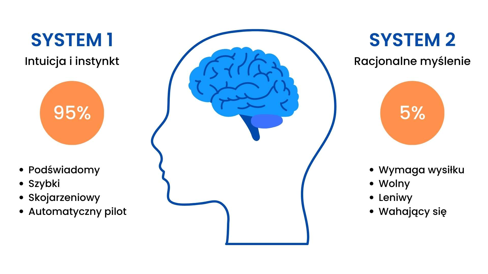

Nieco coachingowe rozpoczęcie roku 😅

Często można spotkać się z stwierdzeniami podobnymi do "gdybym tylko był bardziej zmotywowany to częściej bym ćwiczył" / "nie mam motywacji, by uczyć się języka obcego". Z drugiej strony, często się słyszy (szczególnie na nowy rok) "od tego miesiąca jestem zmotywowany, by szukać nowej pracy". Tak jakby olbrzymia motywacja potrafiła nam zapewnić moc do przenoszenia gór, a jej brak powodował, że stajemy się leniwymi bułami.

**To kłamstwo. Nie da się wprowadzić zmiany w swoim życiu samą motywacją.** A w niektórych sytuacjach motywacja może nam nawet w tym przeszkodzić.

Jednak, zanim do tego dojdziemy - powiedzmy sobie czym jest zmiana.

## Czym jest zmiana

Na potrzeby artykułu wybiorę przykładową zmianę do wdrożenia. Mamy nowy rok, więc strzelam, że zrzucenie wagi znalazłbym w 8/10 postanowień noworocznych 🥳

Załóżmy więc, że chcemy zrzucić wagę. Potrzebujemy:

- mniej jeść, i / lub
- więcej ćwiczyć,

aby bilans kaloryczny był ujemny. Proste jak budowa cepa 😀

Niestety tylko w założeniach. Nie wystarczy mniej jeść i więcej ćwiczyć przez dzień - musimy to robić przez tygodnie, albo i miesiące. Wtedy starania przyniosą efekt.

Duża zmiana składa się więc w z małych zmian. Zamiast wieczoru z chipsami – niepodjadanie po 20:00. Zamiast przeglądania storisków na insta po pracy – bieganie w parku. Pomnożone razy 100 dadzą odpowiedni efekt.

**Wobec czego zmianę (taką długofalową) można określić jako wprowadzenie do swojego życia nowych nawyków.** Jeśli te nawyki utrzymamy odpowiednio długo, to wtedy osiągniemy zamierzony efekt. Z tygodnia na tydzień waga będzie się zmniejszać.

Aby to się jednak stało nawyk musi się zakorzenić w twoim życiu. [Badania w kwestii nawyków](https://www.healthline.com/health/how-long-does-it-take-to-form-a-habit) wskazują, że trwa to średnio 66 dni (rozstrzał w tej kwestii jest duży – od 18 do nawet 254 dni). Jeśli odpuścimy, to nawyk się nie przyjmie. A wtedy wracamy do starych zachowań.

Co jest istotne z powyższego opisu? **Kluczowym aspektem wprowadzenia zmiany jest wytrwałość.** Nie możemy przerwać robienia tego, co robimy, przez odpowiednio długi czas. Dopiero wtedy nowe nawyki stają się naszymi naturalnymi nawykami.

I tutaj na scenę wchodzi motywacja.

## Motywacja kontra wytrwałość

Przede wszystkim - motywacja nie jest połączona z wytrwałością. To, że jesteśmy bardzo zmotywowani, nie oznacza, że będziemy wytrwali w nawykach.

Jeśli nasze działania bazujemy jedynie na motywacji, to mamy dużą pewność, że nie uda nam się wytrwać w nawykach. Łatwo to przedstawić na prostej historyjce:

- Motywujemy się, aby ćwiczyć i mniej jeść na nowy rok.
- Jednak po kilku dniach losowa sytuacja sprawia, że nie ćwiczymy / że więcej jemy.
- To zaś powoduje, że czujemy się źle - przecież mieliśmy robić lepiej, a robimy po staremu.
- Przez co spada nam motywacja, bo tracimy poczucie własnej wartości.
- Z powodu spadku motywacji przestajemy pracować nad wdrożeniem nawyków .

**Motywacja pomoże nam rozpocząć zmianę. Jednak motywacja nie pomoże nam zbudować nawyków.** Głównie dlatego, że nawyki bazują na podświadomej pracy organizmu, a nie tej racjonalnej. A motywacja jest przede wszystkim racjonalna.

Aby to przedstawić musimy się odnieść do Kahnemana i systemów 1 i 2.

## System pierwszy i drugi

Terminy „system 1" i „system 2" zostały opisane przez izraelskiego psychologa Daniela Kahnemana w książkce ["Pułapki myślenia. O myśleniu szybkim i wolnym"](https://en.wikipedia.org/wiki/Thinking,_Fast_and_Slow). Dzieli on pracę naszego mózgu na dwa systemy:

- **System 1** – Podświadomy system, który pracuje szybko i podejmuje większość decyzji. Jest automatyczny, bazuje na emocjach i stereotypach. Wykorzystujemy go, gdy:
    - Leci w nas piłka i się uchylamy.
    - Lokalizujemy źródło dźwięku.
    - Prowadzimy samochód.
    - Czytamy tekst na bilboardzie.
- **System 2** – System, który wymaga naszego świadomego działania. Jest logiczny, powolny, potrzebujemy wysiłku, aby go wykorzystywać. Wykorzystujemy go, gdy:
    - Rozwiązujemy zadanie matematyczne.
    - Planujemy kolejny dzień.
    - Szukamy konkretnej osoby w tłumie.
    - Parkujemy samochód w ciasnym miejscu.

System 1 upraszcza codzienne działanie - bez niego nad wszystkim musielibyśmy się zastanawiać się. **Jednocześnie system 1 powoduje u nas bardzo wiele błędów poznawczych** np.:

- Koncentruje się na najbliższych informacjach i ignoruje dodatkowe informacje - [WYSIATI](https://www.shortform.com/blog/what-you-see-is-all-there-is/).
- Postrzega pewne informacje za bardziej prawdziwe, jeśli nie wymagają od nas dodatkowej pracy związanej z weryfikacją – [cognitive ease](https://medium.com/@drsimonj/thinking-decisions-and-data-chapter-5-cognitive-ease-c66e8a532a87).
- Wyciąga pochopnie wnioski na nikłej podstawie, przekonuje System 2 do jego prawdziwości - [jumping to conclusion](https://tcagley.wordpress.com/2019/06/15/thinking-fast-and-slow-by-daniel-kahneman-re-read-week-8-chapter-7-a-machine-for-jumping-to-conclusions/).
- Racjonalizuje decyzję, nawet jeśli informacje do jej podjęcia były niepełne – [confirmation bias](https://www.theatlantic.com/health/archive/2012/01/study-of-the-day-confirmation-bias-shapes-how-we-read-online/250686/).

Jak się ma to do naszego wątku o motywacji i nawykach?

## Motywacja nie pomaga

Motywacja jest myśleniem na poziomie systemu 2. Jednak główny problem w przeniesieniu celu w nawyki jest na poziomie systemu 1. **Motywacja nie pomoże nam w zmianie naszych podświadomych zachowań.**

Załóżmy sytuację, że zmotywowani planujemy bieganie na 17:00 następnego dnia. Pracujemy od rana. Nadchodzi 17:00. Jak się może zachować nasz organizm?

- Bieganie jest czynnością wymagająca wysiłku.
- Organizm ludzki nie lubi ponosić wysiłku.
- Wobec czego system 1 będzie szukał argumentów za tym, aby jednak nie ćwiczyć.
- Pracujemy od 9:00, więc naturalnie czujemy się trochę zmęczeni.
- Akurat pół godziny widzieliśmy, że rozpoczął się przelotny deszcz.

**I wtedy do gry wchodzi nasz podświadomy system** – może to wyglądać następująco:

- System 1 łatwo przekłada pracę od 9:00 i deszcz na argumenty, by odwołać bieganie – WYSIATI.
- Nie znajduje on za to żadnego argumentu za bieganiem (pamiętaj, że motywacja to system 2) – cognitive ease.
- System 1 posiada tylko argumenty przeciwko bieganiu, podejmuje decyzję, by nie biegać – jump to conclusion.
- Następnie uruchamia mechanizm racjonalizacji podjętej decyzji – przekonuje system 2, że bieganie w deszczu nie jest najlepsze dla zdrowia – confirmation bias.

W następstwie czego uznajemy, że słusznie odwołaliśmy biegania. A to powoduje, że próba utrwalenia nawyku spełznie na niczym.

**System 2 nie miał tutaj nawet prawa głosu**. Motywacja nie została użyta, ponieważ nie myśleliśmy racjonalnie o bieganiu, a jedynie podświadomie. Taka sytuacja powtarzana wiele razy skończy się ostatecznie porażką z wdrażaniem zmiany.

## Co robić, gdy motywacja nie pomaga

Aby zrobić pierwszy krok do zmiany potrzebujemy zadziałać na system 2. **Jednak, aby zmiana była długofalowa, trzeba zacząć działać również na systemie 1.**

Wiele przykładów, w jaki sposób radzić sobie z systemem 1 możemy znaleźć w książkach typu [„Atomowe nawyki"](https://lubimyczytac.pl/ksiazka/4898707/atomowe-nawyki-drobne-zmiany-niezwykle-efekty) czy [„Siła nawyku"](https://lubimyczytac.pl/ksiazka/171834/sila-nawyku-dlaczego-robimy-to-co-robimy-i-jak-mozna-to-zmienic-w-zyciu-i-biznesie). **Warto wyszczególnić kilka praktyk**:

- Sprawmy, aby stosowanie nowego nawyku było proste np. kupmy jedną więcej parę strojów do biegania, aby nie brakowało ich, kiedy chcemy biegać.
- Zaprojektujmy swoje środowisko, tak aby wykonywanie zmiany było automatyczne np. nie kupujmy sobie słodyczy do mieszkania, jeśli lubimy podjadać.
- Połączmy czynność, którą chcemy wykonać z czynnością, którą musimy wykonać np. jeśli dojeżdżamy do pracy, to przesiądźmy się na rower.
- Nagradzajmy siebie za pozytywne zachowanie np. pozwalając sobie na odcinek serialu po ćwiczeniach.

**Jednym ze sposobów jest wzbudzenie przeciwnego błędu poznawczego, który będzie nas zachęcał do trzymania się nawyków.** Załóżmy, że dajemy sobie małe nagrody za trzymanie się nawyków. Wtedy sytuacja opisana wyżej mogłaby wyglądać inaczej:

- Akurat pół godziny widzieliśmy, że rozpoczął się przelotny deszcz.
- System 1 łatwo przekłada to na argument, by odwołać bieganie – WYSIATI.
- Z drugiej strony potencjalna utrata nagrody za utrzymanie nawyku uruchamia w systemie 1 niechęć do straty – [loss aversion](https://www.behavioraleconomics.com/resources/mini-encyclopedia-of-be/loss-aversion/).
- W Systemie 1 dochodzi do sprzeczności – mamy dwie równorzędne myśli, które nie mogą być automatycznie rozwiązane.
- Dochodzi więc do przeniesienia myślenia na system 2, aby podjąć racjonalną decyzję.

To może zaś wzbudzić bardziej rzeczowe spojrzenie na obecną sytuację:

- Może po pracy intelektualnej potrzebujemy trochę wysiłku fizycznego?
- Może ten deszcz w rzeczywistości już przestał padać?
- Może akurat mamy strój do biegania w deszczu?
- Może zamiast biegania w deszczu możemy poćwiczyć?

Nie oznacza to oczywiście, że zawsze podejmiemy lepszą decyzję. Jednak jest większe prawdopodobieństwo, że tak będzie.

## Zbuduj system

I tutaj dochodzimy do ciekawej kwestii. Otóż, **aby wprowadzić w sobie nawyk trzeba racjonalnie podejść do swojej nieracjonalności** 😀

Opieranie się na motywacji skupia nas na tych dniach, kiedy jesteśmy wypoczęci, szczęśliwi i chętni do działania. Kiedy jest „nasz dzień". Ale takich dni w roku jest może kilkanaście. Reszta to dni szarej codzienności, niechęci, marazmu.

Jeśli chcemy wprowadzić zmianę to musimy założyć, że w większość dni będziemy mieć niską chęć do działania. Organizm będzie nas zniechęcał do kontynuacji nawyku. Będziemy postępować nieracjonalnie.

**Dlatego musimy się przygotować na nieracjonalne działanie naszego organizmu.** Często nazywa się to systemem (niestety, identyczne słowo, ale znaczące coś innego). Jest to zbiór praktyk, które stosujemy, by automatyczne reakcje kierować w określoną stronę. Wtedy jesteśmy w stanie wytrwać w nawyku, nawet jeśli organizm nam w tym nie pomaga.

**Aby zbudować taki system praktyk możemy sobie zadać pytania:**

- Co mi na co dzień ułatwia / utrudnia utrzymywanie nawyków?
- Jak mogę dany nawyk uczynić bardziej atrakcyjnym?
- Co lubię robić i przychodzi mi to automatycznie?
- Z czym mogę połączyć potrzebną aktywność?
- Kto może mi pomóc z trzymaniem się nawyków?

Kiedy mamy odpowiedzi na te pytania możemy stopniowo poprawiać nasze nawyki, aby praca z nimi przychodziła nam bardziej automatycznie.

Literatura, która może Ci w tym pomóc:

- [Atomowe nawyki](https://lubimyczytac.pl/ksiazka/4898707/atomowe-nawyki-drobne-zmiany-niezwykle-efekty)
- [Siła nawyku](https://lubimyczytac.pl/ksiazka/171834/sila-nawyku-dlaczego-robimy-to-co-robimy-i-jak-mozna-to-zmienic-w-zyciu-i-biznesie)
- [Getting Things Done, czyli sztuka bezstresowej efektywności](https://lubimyczytac.pl/ksiazka/4805605/getting-things-done-czyli-sztuka-bezstresowej-efektywnosci-wydanie-ii)
- [Pstryk. Jak zmieniać, żeby zmienić](https://lubimyczytac.pl/ksiazka/4996052/pstryk-jak-zmieniac-zeby-zmienic)
- [Twój mózg w działaniu](https://lubimyczytac.pl/ksiazka/218391/twoj-mozg-w-dzialaniu)
- [Pułapki myślenia. O myśleniu szybkim i wolnym](https://lubimyczytac.pl/ksiazka/154212/pulapki-myslenia-o-mysleniu-szybkim-i-wolnym)