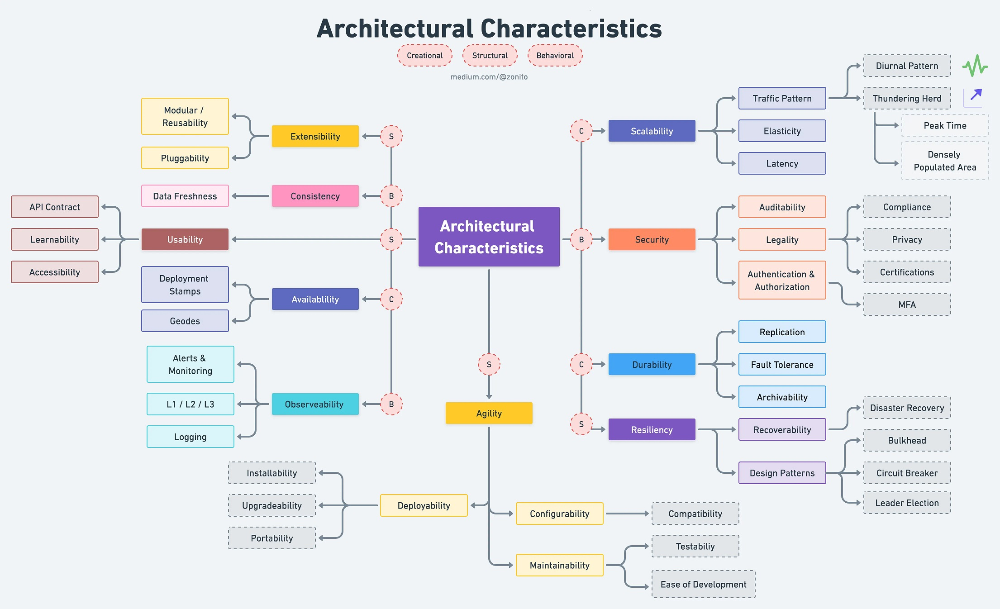

Wiemy już jakie cele biznesowe chcemy spełniać w ramach naszego rozwiązania (nie wiesz? Zerknij [tutaj](/2023/02/18/drivery-biznesowe)). Teraz musimy się skupić na architekturze produktu. Do zadań lidera technicznego należy **spełnienie oczekiwań technicznych wykonywanego projektu**.

Tylko w jaki sposób rozpoznać, pod co optymalizować naszą architekturę? I co jest w zasadzie tą architekturą? O tym opowiemy dzisiaj 😊

Pozostałe artykuły z cyklu Lider Techniczny przeczytasz tu: [link](/category/tech-lead).



## Czym jest architektura systemów?

Kiedy myślimy o architekturze systemów łatwo jest wpaść w pułapkę myślenia o strukturze. Wydaje nam się, że liczy się tylko budowa rozwiązania. **Nie widać połączenia pomiędzy architekturą, a biznesem.** Wtedy też odruchowo myślimy o architekturze jako o odpowiedzialności osób technicznych.

**Myślenie strukturą o architekturze produktu to błąd.** Część podejmowanych decyzji wpływa na architekturę, nawet jeśli nie są typowo strukturalne. Wystarczy, że zdecydujemy by różne procesy biznesowe wykorzystywały te same informacje. Wtedy obszar A będzie wpływał na obszar B, nawet jeśli tego początkowo nie chcieliśmy. To utrudni nam istotne zmiany architektoniczne.

Dlatego też o wiele bardziej pasują mi do opisu architektury słowa [Grady'ego Boocha](https://twitter.com/Grady_Booch/status/1459007228954832896):

> „Architektura reprezentuje ważne decyzje projektowe, które kształtują system,
gdzie ważność jest mierzona kosztem zmiany."

To pokazuje, że architekturę powinniśmy postrzegać bardzo szeroko – jako szereg czynników, które wpływają na ostateczny produkt. A czym jest ten czynniki? Jest to właśnie **Driver Architektoniczny**.

## Czym są Drivery Architektoniczne 

Rozpoczynając projektowanie i implementację nowego systemu bądź funkcjonalności, z pomocą przychodzą drivery architektoniczne. Jest to zestaw aspektów, które tworzą ramy dla danego rozwiązania. Sterują rozwiązaniem w określonym kierunku.

**Drivery są określane indywidualnie dla danego problemu i stanowią fundament architektury oprogramowania.**

Wyodrębniamy cztery kategorie driverów architektonicznych w projektowaniu systemów:

1. Główne funkcjonalności.
2. Atrybuty jakościowe.
3. Ograniczenia.
4. Praktyki techniczne i architektoniczne.

Powyższy podział pochodzi z [„Software Architecture for Developers"](https://softwarearchitecturefordevelopers.com/) Simona Brown.

### Główne funkcjonalności

Każdy nowy projekt warto rozpocząć od przeanalizowania i określania głównych funkcjonalności realizowanego systemu. Żeby ułatwić sobie ten proces, można odpowiedzieć na poniższe uniwersalne pytania:

_Co trzeba dowieźć, aby zrealizować główne cele? Dla jakich ról musimy te funkcje dowieźć? Jakie jest nasze główne MVP? Jakie większe funkcje są dalej w planie realizacji?_

Przykładowo: jeden z naszych klientów w swoim e-commerce chciał umożliwić klientom samodzielne logowanie się do systemu, w celu dokonania zakupu. Jako Tech Lead wraz z zespołem musiałem zaprojektować i stworzyć system uwierzytelniania. To kazało nam się zastanowić jakie opcje dostarczenia możemy tutaj mieć:

1. Pisany ręcznie – jednocześnie czasochłonny;
2. Off-the-shelf – wymagający dużo konfiguracji;
3. SaaS – uzależniony od zewnętrznego dostawcy.

**Każde z tych rozwiązań ma wady i zalety. I tak będzie w przypadku głównych funkcjonalności - niezależnie od powierzonego nam zadania.**

Określając główne funkcjonalności w driverach architektonicznych, musimy podjąć decyzję, która z opcji jest najkorzystniejsza dla danego procesu. Jednocześnie pamiętając, że **nie ma mechanizmu idealnego**: w każdym przypadku będziemy zmuszeni iść na kompromis.

Określenie głównych funkcjonalności to fundamentalny etap każdego projektu. Od niego często zależy sukces całego przedsięwzięcia. Skupiając się na nim, tworzymy bazę do dalszych działań.

### Atrybuty jakościowe

Po wybraniu głównych funkcjonalności projektowanego systemu przechodzimy do kolejnego etapu, czyli wyznaczenia atrybutów jakościowych. **Kluczowe jest wybranie konkretnych wskaźników i określenie dla nich miar.**

Samych atrybutów jakościowych można zdefiniować bardzo wiele, co widać na grafice z [artykułu](https://blog.devgenius.io/top-10-architecture-characteristics-non-functional-requirements-with-cheatsheat-7ad14bbb0a9b) Love Sharma:

(Często atrybuty jakościowe nazywa się również charakterystykami architektury, aczkolwiek ja nie lubię tej nazwy.)

W tym momencie projektowania największą trudnością jest liczba driverów architektonicznych. **Liczba możliwości może być przytłaczająca, a poszczególne atrybuty mogą wzajemnie się wykluczać.** Dla ułatwienia procesu należy wybrać określone atrybuty, a pozostałe porzucić. To skupi nas na problemie i zwęzi przestrzeń działania.

Np. projektując strukturę sklepu internetowego, możemy go zoptymalizować pod prędkość działania. Zyskujemy wtedy: wydajność, elastyczność i dostępność. Natomiast, jeśli zdecydujemy się NIE optymalizować prędkości, możemy wtedy zyskać: odzyskiwalność, konfigurowalność i audytowalność.

Każda opcja jest dobra. **Musimy wybrać tę, która jest lepsza dla danego projektu i pasuje do określonego na początku działań.** Decydując się na jedne wskaźniki – musimy poświęcić inne. Podobno da się zjeść ciastko i mieć ciastko, ale nie w tym przypadku 😊.

### Ograniczenia projektowe

Po określeniu głównych funkcjonalności i atrybutów jakościowych czas na racjonalne spojrzenie na projektowany system. Są nimi ograniczenia. **Rzeczywistość zweryfikuje nasze dotychczasowe działania, a ograniczenia wymuszą konkretne realizacje.**

Ograniczenia to driver architektoniczny niezbędny w procesie projektowania. Szczególnie jeśli wydaje się łatwym etapem, powinniśmy zatrzymać się przy nim na dłużej i wnikliwie przeanalizować.

Dla ułatwienia tego zadania ograniczenia i ich określenie możemy podzielić na trzy części:

1. Technologiczne – _jakie wymogi techniczne musimy spełnić? Jakie technologie są dozwolone? Jaki kształt ma zespół?_
2. Organizacyjne – _jakie wymogi ma organizacja? Co jest standardem organizacyjnym? Jakie procesy musimy wziąć pod uwagę?_
3. Środowiskowe – _co nakłada na nas świat zewnętrzny? Jakie ograniczenia nakładają firmy, z którymi współpracujemy?_

Zwykle istotnym ograniczenem jest czas. Musimy znać deadline, aby móc się do niego dostosować w ramach pracy. Przykładowo: dostarczenie funkcjonalności po Black Friday przyniesie niski zysk. Więc trzeba się skupić, aby zdążyć przed piątkiem i wdrożyć już w czwartek 😅.

**Często jest tak, że nie biorąc pod uwagę ograniczeń projektowych nie osiągniemy celów, nawet jeśli dostarczymy nowe funkcje.** Poznając ograniczenia projektowe poznajemy lepiej system, nad którym pracujemy. Wypracowujemy potencjalne trudności, które mogą pojawić się późniejszych etapach.

### Własne praktyki 

Praktykami w architekturze projektowania określamy zbiór zasad, którymi kieruje się zespół, opracowując dane rozwiązanie. **Są one specyficzne dla projektu, który realizujemy**. Dobre i złe praktyki określamy samodzielnie i wykorzystujemy w celu udoskonalenia standardów pracy i spełnienia wytyczonych wcześniej celów.

Praktyki możemy jeszcze podzielić na programistyczne (skupione na kodzie) i architektoniczne (skupione na budowie rozwiązania).

**Praktyki wpływają na spójność tworzonego rozwiązania.** Pomagają podejmować decyzje, w ramach zespołu. Jak wykorzystać je w swoim produkcie? Na przykład w ten sposób:

- Programistyczne
  - Język - Piszemy w C#.
  - Testy - Piszemy testy jednostkowe, integracyjne i komponentowe.
  - Analiza kodu - Stosujemy lintery.
- Architektoniczne np.
  - Struktura - Tworzymy moduły na poszczególne obszary biznesowe.
  - Bezstanowość - Na froncie tworzymy bezstanowe komponenty. 
  - Mikroserwisy - Nie łączymy się przez bazę danych, a przez wystawiane API.

## Dlaczego warto określać drivery architektoniczne?

Przede wszystkim otrzymamy konkretne informacje, w którą stronę powinien się rozwijać produkt. **Rozwiązywane przez nas na tym etapie problemy są rzeczywiste, a nie hipotetyczne.**

Określając kryteria oceniania tego co dostarczamy wiemy, na których elementach skupić się w trakcie pracy. Trudniej jest również zrobić over-engineering. Widzimy, że optymalizacja pod wydajność nie jest kluczowa, gdy mamy ledwie kilkaset klientów.

Długofalowo w zespole budujemy też zrozumienie różnych aspektów pracy produktu. Nawet osoby produktowe zaczynają rozumieć, że nie można się optymalizować pod wszystko naraz.. 

## Interesują Cię drivery architektoniczne?

Więcej o driverach architektonicznych i ich wykorzystaniu w architekturze projektowania przeczytasz w takich książkach jak: [„Software Architecture for Developers"](https://softwarearchitecturefordevelopers.com/) Simona Brown, czy [„Fundamentals of Software Architecture"](https://www.oreilly.com/library/view/fundamentals-of-software/9781492043447/) Marka Richardsa i Neala Forda.